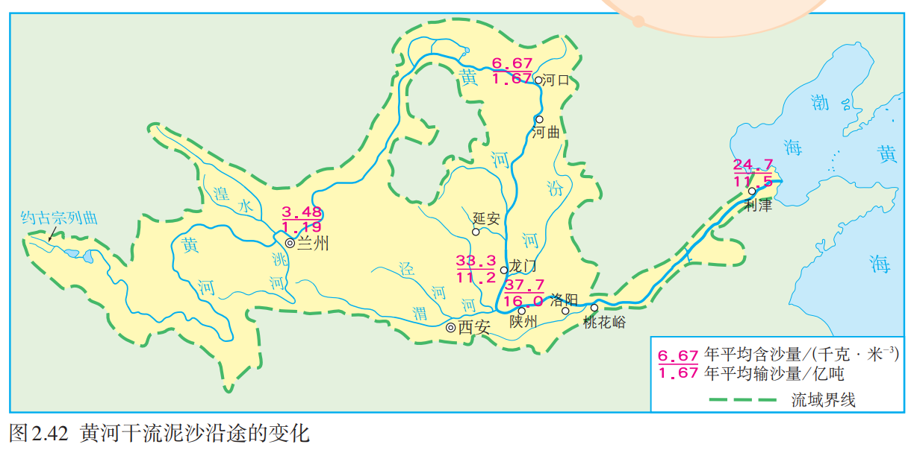

## 八上

### 第一章 从世界看中国

#### 第1节 疆域

##### 一、优越的地理位置

###### 1. 描述中国的地理位置

- 半球位置：东半球、北半球
- 纬度位置：$4\degree\text{N}\sim 53\degree\text{N}$（大部分位于北温带）
- 海陆位置：亚欧大陆东部，太平洋西岸

###### 2. 评价中国的地理位置

> 此处为大致逻辑

- 优势
    - 纬度位置 $\Rightarrow$ 光照、热量 $\Rightarrow$ 气候 $\Rightarrow$ 农业（种植、养殖）
    - 海陆位置 $\Rightarrow$ 降水 $\Rightarrow$ 气候、河流 $\Rightarrow$ 农业、交通
        - 交通 $\Rightarrow$ 发展战略（如一带一路）
- 劣势（台风等）

##### 二、海路兼备的大国

###### 1. 领土

- 领陆：约 $960$ 万 $\text{km}^2$
- 领海：领海基线向海上延伸 $12$ 海里
- 领空：领陆和领海上空

###### 2. 领土四至点

- 最南端：海南省南沙群岛中的曾母暗沙
- 最北端：黑龙江省漠河市北端的黑龙江主航道中心线上
- 最西端：新疆维吾尔自治区的帕米尔高原上
- 最东端：黑龙江省黑龙江与乌苏里江主航道中心线的汇合处

###### 3. 疆界与陆上邻国

$$
\left. \begin{array}{rrr}
4 \degree \text{N} \sim 53 \degree \text{N} \space \approx5500 \text{km} \\
73 \degree \text{E} \sim 135 \degree \text{E} \space \approx5200 \text{km}
\end{array} \right\}
\text{“纵横一万里”}
\Rightarrow
\left\{ \begin{array}{lll}
\text{气候复杂，南北温差大} \\
\text{时间差异大}
\end{array} \right.
$$

- 陆上国境线：$2.2$ 万多千米
- 陆上邻国：$14$ 个

###### 4. 海洋

- 临海：渤海、黄海、东海、南海、太平洋
- 领海：领海基线向海上延伸 $12$ 海里
- 内海：渤海、琼州海峡
- 海峡：台湾海峡、琼州海峡
- 岛屿：台湾岛、海南岛、崇明岛、舟山群岛、南海诸岛、钓鱼岛
- 半岛：辽东半岛、山东半岛、雷州半岛
- 海岸线：大陆： $1.8$ 万多千米；岛屿：$1$ 万多千米
- 隔海相望的国家：$6$ 个

##### 三、行政区划

###### 1. 三级行政区划（一般情况）

- 省级：省、自治区、直辖市、特别行政区
- 县级：县、市、自治县
- 乡级：乡、镇、民族乡

补充：
$$
\text{市}
\begin{cases}
\text{直辖市} \\
\text{地级市（省级、县级之间）} \\
\text{乡级市} \\
\end{cases}
$$

###### 2. 34个省级行政区划

| 名称             | 简称   | 行政中心 |
| ---------------- | ------ | -------- |
| 北京市           | 京     | 北京     |
| 天津市           | 津     | 天津     |
| 河北省           | 冀     | 石家庄   |
| 山西省           | 晋     | 太原     |
| 内蒙古自治区     | 内蒙古 | 呼和浩特 |
| 辽宁省           | 辽     | 沈阳     |
| 吉林省           | 吉     | 长春     |
| 黑龙江省         | 黑     | 哈尔滨   |
| 上海市           | 沪     | 上海     |
| 江苏省           | 苏     | 南京     |
| 浙江省           | 浙     | 杭州     |
| 安徽省           | 皖     | 合肥     |
| 福建省           | 闽     | 福州     |
| 江西省           | 赣     | 南昌     |
| 山东省           | 鲁     | 济南     |
| 河南省           | 豫     | 郑州     |
| 湖北省           | 鄂     | 武汉     |
| 湖南省           | 湘     | 长沙     |
| 广东省           | 粤     | 广州     |
| 广西壮族自治区   | 桂     | 南宁     |
| 海南省           | 琼     | 海口     |
| 重庆市           | 渝     | 重庆     |
| 四川省           | 川或蜀 | 成都     |
| 贵州省           | 贵或黔 | 贵阳     |
| 云南省           | 云或滇 | 昆明     |
| 西藏自治区       | 藏     | 拉萨     |
| 陕西省           | 陕或秦 | 西安     |
| 甘肃省           | 甘或陇 | 兰州     |
| 青海省           | 青     | 西宁     |
| 宁夏回族自治区   | 宁     | 银川     |
| 新疆维吾尔自治区 | 新     | 乌鲁木齐 |
| 香港特别行政区   | 港     | 香港     |
| 澳门特别行政区   | 澳     | 澳门     |

#### 第2节 人口

##### 一、世界上人口最多的国家

>现在已经是第二哩  ; )

###### 1. 人口总数

- $14.12$ 亿（2020 年第七次人口普查，不含港澳台）

###### 2. 人口增长趋势及其原因

>人口增长速度指标：人口自然增长率

- 1949 年前，人口增长速度较慢
- 1949 年后，人口增长速度加快
- 原因：社会稳定、经济发展、医疗卫生条件改善

###### 3. 人口特点

- 人口基数大，出生人口多

###### 4. 人口多的影响

- 人既是生产者，又是消费者
- 利：提供充足的劳动力和消费市场
- 弊：需求量大，对资源、环境、社会经济的压力沉重

###### 5. 计划生育

- 20 世纪 70 年代开始实施计划生育

    - 目的：控制人口数量，提高人口素质

    - 结果：人口自然增长率从 $2.58 \%$ （1970 年）下降至 $0.15\%$ （2020 年）

        > 2022 年人口自然增长率已经是负数了 ; )

- 近年来，陆续实施二胎、三胎政策

    - 目的：应对人口老龄化，促进人口与社会经济长期均衡发展

##### 二、人口分布

###### 1. 人口密度

- 2020 年，平均人口密度为 $147$ 人/平方千米（世界平均 60）

###### 2. 分布特点

> 原因去看全解吧（逃
>
> 把全解抄过来哩（喜
>
> | 条件     | 西部                                   | 东部                                     |
> | -------- | -------------------------------------- | ---------------------------------------- |
> | 地形     | 多高原、山地                           | 多平原、丘陵                             |
> | 气候     | 温带大陆性气候、高原山地气候，降水稀少 | 温带、亚热带季风气候，雨热同期，降水较多 |
> | 交通     | 交通路线少                             | 交通路线密度大，海陆运输遍历             |
> | 经济发展 | 经济较落后                             | 工农业发达                               |
> | 开发历史 | 晚                                     | 早                                       |

- 分布不均
- 人口地理界限：==黑河（黑龙江省）—— 腾冲（云南省）线==，东密西疏

#### 第3节 民族

##### 一、中华民族大家庭

###### 1. 民族概况

- 共 $56$ 个民族
- 人口最多的民族：汉族（约占 $91 \%$）
- 人口最多的少数民族：壮族（超过 $1600$ 万人）

###### 2. 民族文化

> 又是抄全解的一天（悲

| 民族     | 乐器   | 重大节日活动或传统活动 |
| -------- | ------ | ---------------------- |
| 朝鲜族   | 长鼓   | 跳板、长鼓舞           |
| 蒙古族   | 马头琴 | 那达慕大会（节）       |
| 哈萨克族 | 冬不拉 | 古尔邦节、肉孜节       |
| 傣族     | 两面鼓 | 泼水节                 |
| 壮族     | 合欢萧 | ”三月三“歌节           |
| 藏族     | 神鼓   | 雪顿节                 |
| 苗族     | 芦笙   | 芦笙节                 |
| 彝族     | 葫芦笙 | 火把节                 |
| 回族     | 口弦   | 开斋节                 |

##### 二、民族分布

- 民族分布特点：大杂居、小聚居、交错居住
    - 汉族分布特点：遍布全国各地
    - 少数民族分布特点：主要分布在西南、西北、东北地区

### 第二章 中国的自然环境

#### 第1节 地形和地势

##### 一、地形：地形类型多样，山区面积广大
> 区分山地和山脉：
>
> ​	山地：海拔 $\geq 500$ 米，坡度陡
>
> ​	山脉：山地呈条带状分布，沿一定方向延伸

###### 1. 概况

- 地形类型多样：山地、高原、盆地、平原、丘陵
- 纵横交错的山脉，构成我国地形的”脊梁“

###### 2. 主要山脉

> 看图记忆吧

###### 3. 主要地形区及其特点

- 四大高原：内蒙古高原、黄土高原、青藏高原、云贵高原
    - 内蒙古高原：地面坦荡，一望无际
    - 黄土高原：千沟万壑，支离破碎；水土流失严重
    - 青藏高原：”远看是山，近看成川“（海拔高）
    - 云贵高原：地面崎岖，喀斯特地貌发育
- 四大盆地：四川盆地、柴达木盆地、塔里木盆地、准噶尔盆地
    - 四川盆地：西部四川平原农业发达
    - 柴达木盆地：内部多戈壁、沙漠，东部多沼泽和盐湖；”聚宝盆“（矿产多）；地势最高
    - 塔里木盆地：周围高山环绕，内部平坦，沙漠广布，边缘多绿洲；面积最大
    - 准噶尔盆地：周围高山环绕，内部平坦，沙漠广布，边缘多绿洲；维度最高
- 三大平原：东北平原、华北平原、长江中下游平原
    - 东北平原：以黑土著称，面积最大
    - 华北平原：面积第二大
    - 长江中下游平原：”鱼米之乡“，面积第三大
- 三大丘陵：辽东丘陵、山东丘陵、东南丘陵

###### 4. 山区面积广大

- 山区：山地 + 丘陵 + 崎岖的高原，约占全国 $\frac{2}{3}$
- 利：旅游、矿产、水能等资源丰富；森林、草场、耕地适合多种经营（发展林业、牧业、旅游业、采矿业等）
- 弊：耕地较少、交通不便、自然灾害容易发生、基础设施建设难度大（不利于耕作、交通）

##### 二、地势：地势西高东低，呈阶梯状分布

###### 1. 概况

- 地势：地表高低起伏的总趋势
- 我国地势西高东低，呈阶梯状分布

###### 2. 三级地势阶梯

| 阶梯       | 海拔                | 主要地形   | 主要地形区                                                   |
| ---------- | ------------------- | ---------- | ------------------------------------------------------------ |
| 第一级阶梯 | $4000$ 米以上       | 高原、盆地 | 青藏高原、柴达木盆地                                         |
| 第二级阶梯 | $1000 \sim 2000$ 米 | 高原、盆地 | 准噶尔盆地、塔里木盆地、内蒙古高原、黄土高原、四川盆地、云贵高原 |
| 第三级阶梯 | $500$ 米以下        | 平原、丘陵 | 东北平原、华北平原、长江中下游平原、东南丘陵（、辽东丘陵、山东丘陵） |

- 分界线

    - 第一、二级阶梯：昆仑山脉、祁连山脉、横断山脉
    - 第二、三级阶梯：大兴安岭、太行山脉、巫山、雪峰山

###### 3. 地势的影响

- 对气候（降水）：便于海上湿润气流深内陆，使我国东部地区形成丰沛的降水，适宜农业
- 对河流
    - 流向：大多自西向东入海，水运沟通东西交通
    - 流速：阶梯交界处落差大、流速快，水能丰富

#### 第2节 气候

##### 一、气温：冬季南北温差大，夏季普遍高温

###### 1. 气温分布规律

- 冬季：南北温差大，由南向北气温递减
    - 1 月 $0\textcelsius$​ 等温线：==淮河——秦岭==——青藏高原的东南边缘
    - 最冷：黑龙江漠河

- 夏季：南北普遍高温（除青藏高原等少数地区）
    - 最热：新疆吐鲁番

###### 2. 温度带的分布及其对农作物的影响

- 亚热带、暖温带分界线：==秦岭——淮河==一线

| 温度带             | 作物熟制          | 主要农作物或水果         |
| ------------------ | ----------------- | ------------------------ |
| 寒温带             | 一年一熟          | 春小麦、大麦、马铃薯     |
| 中温带             | 一年一熟          | 春小麦、大豆、玉米、甜菜 |
| 暖温带             | 两年三熟/一年两熟 | 冬小麦、玉米、苹果、梨   |
| 亚热带             | 一年两熟到三熟    | 水稻、油菜、甘蔗、柑橘   |
| 热带               | 一年三熟          | 水稻、芒果、香蕉         |
| 青藏高原垂直温度带 | 一年一熟          |                          |

##### 二、降水：东西干湿差异显著

###### 1. 降水的空间分布

- 降水量分布不均匀，自东南沿海向西北内陆递减（西北的部分地区降水较多，因为天山山脉抬升和拦截西风带水汽）
- $800\text{mm}$​ 等降水线：==秦岭——淮河==一线
- 最多：台湾火烧寮；最少：新疆托克逊

原因：
$$
\left. \begin{array}{rrr}
    \text{海陆位置}
    \left\{
        \begin{array}{rrr}
            \text{距海远，降水多} \\
            \text{距海近，降水少}
     	\end{array}
     \right. \\
    \text{夏季风}
    \left\{
        \left. 
        	\begin{array}{rrr}
            \text{东南季风} \\
            \text{西南季风}
        	\end{array}
        \right\}
    \right.
    \text{带来降水}
\end{array} \right\}
\text{降水由东南沿海向西北内陆递减}
$$

###### 2. 降水的时间分配

- 降水的时间分配不均匀，降水集中在夏季
- 南方雨季长，北方雨季短
- 降水量的年际变化大

###### 3. 干湿地区

- 湿润区与半湿润区的分界线：==秦岭——淮河==一线

| 干湿区   | 干湿状况                                             | 主要植被   | 农牧业           |
| -------- | ---------------------------------------------------- | ---------- | ---------------- |
| 湿润区   | 年降水量 $>800\text{mm}$，降水量 $>$ 蒸发量          | 森林       | 水田为主         |
| 半湿润区 | 年降水量 $400 \sim 800 \text{mm}$，降水量 $>$ 蒸发量 | 森林、草原 | 旱地为主         |
| 半干旱区 | 年降水量 $200 \sim 400 \text{mm}$，降水量 $<$ 蒸发量 | 草原       | 灌溉农业、畜牧业 |
| 干旱区   | 年降水量 $< 200 \text{mm}$，降水量 $<$ 蒸发量        | 荒漠       | 绿洲农业、牧业   |

##### 三、我国气候的主要特征

###### 1. 气候复杂多样的原因

$$
\left. \begin{array}{rrr}
\text{地域辽阔} 
\left\{
\left. \begin{array}{mmm}
\text{南北跨度广} \Rightarrow \text{气温差异大} \\
\text{海陆位置差异大} \Rightarrow \text{降水差异大}
\end{array} \right\}
\right.
\text{众多温度带和干湿地区} \\
\text{山地地区气候垂直变化，增加气候多样性}
\end{array} \right\}
气候复杂多样
$$

###### 2. 主要气候类型

| 气候类型       | 气候特点                       |
| -------------- | ------------------------------ |
| 热带季风气候   | 全年高温，分旱、雨两季         |
| 亚热带季风气候 | 夏季高温多雨，冬季温和少雨     |
| 温带季风气候   | 夏季高温多雨，冬季寒冷干燥     |
| 温带大陆性气候 | 夏热冬冷，降水较，气温年较差大 |
| 高原山地气候   | 高寒，全年降水较少             |

###### 3. 季风气候显著

- 我国东部地区为世界上典型的季风气候区
- 季风气候显著，雨热同期，利于农业生产
- 夏季风活动不稳定，易发生旱涝灾害

##### 四、影响我国气候的主要因素

###### 1. 纬度位置

- 自南向北，得到的太阳光热减少，气温降低

###### 2. 海陆位置 $\Rightarrow$ 季风

| 季风类型 | 源地               | 风向         | 性质     | 影响                           |
| -------- | ------------------ | ------------ | -------- | ------------------------------ |
| 夏季风   | 太平洋、印度洋     | 东南、西南风 | 温暖湿润 | 大量降水，雨热同期             |
| 冬季风   | 蒙古、西伯利亚一带 | 西北、东北风 | 寒冷干燥 | 加剧北方的严寒，使得南北温差大 |

###### 3. 地形因素

- 海拔 $\Rightarrow$ 影响气温
- 坡向 $\Rightarrow$ 影响降水

#### 第3节 河流

##### 一、概述：以外流河为主

###### 1. 内流河与外流河

| 河流   | 定义                   | 补给水源 | 主要分布区 |
| ------ | ---------------------- | -------- | ---------- |
| 内流河 | 最终未能流入海洋的河流 | 冰雪融水 | 西北内陆   |
| 外流河 | 最终流入海洋的河流     | 大气降水 | 东南部     |

###### 2. 内流区与外流区

| 流域   | 定义         | 占全国总面积的比例 | 特点                      |
| ------ | ------------ | ------------------ | ------------------------- |
| 内流区 | 内流河的流域 | 约 $\frac{1}{3}$   | 河流少，水量小（$<5\%$）  |
| 外流区 | 外流河的流域 | 约 $\frac{2}{3}$   | 河流多，水量大（$>95\%$） |

###### 3. 外流河的水文特征

- 共同特征：

| 时期   | 时间         | 水文特征         | 成因                                           |
| ------ | ------------ | ---------------- | ---------------------------------------------- |
| 汛期   | 夏季风盛行时 | 水量大，水位上涨 | 受夏季风影响，雨带由南向北推移，东南部降水丰沛 |
| 枯水期 | 冬季风盛行时 | 水量小，水位下降 | 冬季风加强，雨带南撤，降水量小                 |

- 不同特征：

| 地区           | 流量                                 | 汛期               | 含沙量 | 结冰期 |
| -------------- | ------------------------------------ | ------------------ | ------ | ------ |
| 东北           | 丰富（流经湿润、半湿润区，蒸发量小） | 较长（春汛、夏汛） | 小     | 长     |
| 秦岭——淮河以北 | 较小（流经半湿润区、半干旱区）       | 短（雨季短）       | 大     | 短     |
| 秦岭——淮河以南 | 丰富（降水量大，流经湿润区）         | 长（雨季长）       | 小     | 无     |

- 特殊：
    - 植被覆盖率低及土质疏松的区域，河流含沙量大
    - 春汛：东北地区的河流在春季出现涨水现象，原因为季节性积雪融水
    - 凌汛：在秦岭—淮河一线以北地区，自较低纬向较高纬流的河流会出现凌汛现象

###### 4. 内流河的水文特征

- 水量较小（河水主要来自高山冰雪融水和山地降水）
- 汛期短（夏季气温高，冰雪融水量大，山地降水较多，降水集中；部分河流冬季断流，属季节性河流）

###### 5. 影响河流水文特征的主要因素

$$
影响因素
\left\{ \begin{array}{rrr}
地势 &\Rightarrow 河流流向、流速 \\
气温 &\Rightarrow 河流结冰状况 \\
降水 &\Rightarrow 河流流量、水位、汛期、枯水期 \\
\left. \begin{array}{rrr}
地形 \\
植被覆盖率
\end{array} \right\}
&\Rightarrow 河流含沙量
\end{array} \right\}
河流的水文特征
$$

##### 二、长江的治理与开发

###### 1. 概况

- 基本信息
    - 发源地：青藏高原上的唐古拉山脉的各拉丹东峰
    - 源头：沱沱河
    - 注入海洋：东海
    - 流向：自西向东
    
- 是中国第一大河：流程最长、流域面积最广、水量最大
    - 全长：$6300$ 千米
    - 流域面积：$180$ 多万平方千米，约占我国陆地面积的 $20\%$​
    - 水量：年径流量 $9500$​ 多亿立方米
    
- 流经区域

    - 流经地形区：青藏高原、横断山脉、云贵高原、四川盆地、巫山、长江中下游平原
    - 干流流经省级行政区：青海、四川、西藏、云南、重庆、湖北、湖南、江西、安徽、江苏、上海
    - 流经干湿地区：湿润区、半湿润区

- 主要支流、湖泊

    - 主要支流：雅砻江、岷江（支流：大渡河）、嘉陵江、乌江、湘江、汉江、赣江
    - 主要湖泊：洞庭湖、鄱阳湖、巢湖、太湖

- 各河段特点

    | 河段 | 范围              | 流经区域                   | 特点                                       |
    | ---- | ----------------- | -------------------------- | ------------------------------------------ |
    | 上游 | 源头 $\to$ 宜昌   | 山区                       | 多峡谷，落差大，水流湍急，水能资源非常丰富 |
    | 中游 | 宜昌 $\to$ 湖口   | 长江中下游平原             | 地势低平，河道弯曲，水面宽阔，流速缓慢     |
    | 下游 | 湖口 $\to$ 入海口 | 长江中下游平原、长江三角洲 | 地势更低平，江面更宽阔，水网如织，水乡泽国 |

###### 2. 长江的开发

- “水能宝库”——水能丰富

    

    - 原因：落差大，水流急
    - 分布：水能资源主要集中在上游河段
    - 总量：水能资源蕴藏量占全国的 $\frac{1}{3}$​，可开发利用的水能资源约占全国的一半

- “黄金水道”——航运价值高

    

    - 自然条件
        - 地势平坦，落差小，水流平稳
        - 水量大，水位高，船舶吃水深
        - 无结冰期，全年通航
        - 干流贯通东西，支流分列南北，形成庞大的水运网
    - 经济发展条件
        - 干流航线和多条铁路及京杭运河相交，水陆联通
        - 沿江地区人口多，经济发达，运量需求大
    - 总量：干支流通航里程近 $8$ 万千米，货运量占全国内河货运总量的 $60\%$

###### 3. 长江的问题与治理

| 河段   | 问题     | 原因                                                         | 治理                                |
| ------ | -------- | ------------------------------------------------------------ | ----------------------------------- |
| 川江   | 滩多流急 |                                                              | 三峡工程 $\Rightarrow$ 提升通航能力 |
| 荆江   | 水流不畅 | 河道弯曲、河床高、地势低洼、降水集中                         | 裁弯取直、建蓄洪区、加固堤防        |
| 上游   | 水土流失 |                                                              | 恢复植被                            |
| 中下游 | 洪涝灾害 | 降水丰富、支流众多；地势低洼，不易排水； 河道弯曲；围湖造田 | 修建水库、裁弯取直、退田还湖        |

##### 三、黄河的治理与开发

###### 1. 概况

- 概况

    - 发源地：青藏高原上的巴颜喀拉山脉
    - 流向：自西向东
    - 注入海洋：渤海

- 是中国第二长河

    - 长度：$5465$ 千米
    - 流域面积：约 $75$​ 万平方千米
    - 年径流量：$660$ 多亿平方千米

- 流经区域

    - 流经地形区：青藏高原、内蒙古高原、黄土高原、华北平原
    - 干流流经省级行政区：青海、四川、甘肃、宁夏、内蒙古、陕西、陕西、河南、山东
    - 流经温度带：青藏高原垂直温度带、中温带、暖温带
    - 流经干湿地区：干旱区、半干旱区、半湿润区

- 主要支流：洮河、湟水、汾河、渭河

- 各河段特点

    | 河段 | 范围              | 流经区域                 | 特点                                                         |
    | ---- | ----------------- | ------------------------ | ------------------------------------------------------------ |
    | 上游 | 源头 $\to$ 河口   | 地势第一、二级阶梯交界处 | 多峡谷，落差大，水能资源丰富                                 |
    | 中游 | 河口 $\to$ 桃花峪 | 黄土高原                 | 多泥沙                                                       |
    | 下游 | 桃花峪 $\to$ 海口 | 华北平原                 | 河床宽坦，水流缓慢，泥沙淤积，河床抬高 $\Rightarrow$ “地上河” |

- 水文特征
    - 冬季结冰
    - 主汛期短，有凌汛
    - 含沙量大
    - 流量较小

###### 2. 黄河的贡献

- 水能发电：主要上游
- 塑造平原：宁夏平原、河套平原、华北平原
- 提供灌溉水源：宁夏平原、河套平原

###### 3. 黄河的忧患与治理

- “地上河”（河床高出地面）

    
    
    
    
    | 河段 | 问题                 | 原因                                                         | 治理                               |
    | ---- | -------------------- | ------------------------------------------------------------ | ---------------------------------- |
    | 上游 | 草地退化，荒漠化严重 |                                                              | 加强生态环境建设                   |
    | 中游 | 水土流失严重         | 土层疏松、支流较多、降水集中；植被破坏严重                   | 水土保持（造林种草、修建水利枢纽） |
    | 下游 | “地上河”，黄河泛滥   | 落差变小，流速变缓 $\Rightarrow$ 泥沙淤积 $\Rightarrow$ 河床抬升，堤坝提高；过量取水 | 调水调沙、加固大堤                 |

- 凌汛
    - 定义：河水结冰形成的冰坝阻塞河道，造成水位急剧上升的现象
    - 条件：有结冰期，低纬度流向高纬度
    - 出现河段：宁夏、内蒙古、山东境内的部分河段
    - 解决措施：用破冰船破冰或用飞机、大炮炸开冰坝；水电站控制水量，减少凌峰形成，避免冰坝的产生

#### 第4节 自然灾害

##### 一、常见的自然灾害

###### 1. 概念

- 自然环境发生异常变化，造成资源破坏、财产损失、人员伤亡等危害，叫做自然灾害

###### 2. 分类

- 气象灾害
    - 干旱：长时期降水异常偏少甚至无降水，造成农作物减产、人畜饮水困难等
    - 洪涝：连续性的暴雨或短时间的大暴雨，可能形成洪涝
    - 台风：一种发源于热带洋面的大气涡旋，常带来狂风和特大暴雨等，形成灾害
    - 寒潮：强冷空气迅速入侵造成大范围的剧烈降温现象，并伴有大风、雨雪、冰冻等，形成灾害
- 地质灾害（山区发生频率较高）
    - 地震：地球内部巨大能量释放导致地表震动，并产生地震波，形成灾害
    - 滑坡：坡地上的不稳定块体在重力作用下整体向下滑动的现象，危害巨大
    - 泥石流：在坡度较陡的沟谷中形成的饱含石块和泥土的特殊洪流，具有强大的破坏力

##### 二、我国自然灾害频发

###### 1. 我国自然灾害的特点

- 种类多
- 分布广
- 频率高
- 受灾重

###### 2. 我国自然灾害的分布及其原因

| 自然灾害     | 主要分布区                 | 原因                                                         |
| ------------ | -------------------------- | ------------------------------------------------------------ |
| 台风         | 东南沿海地区               | 临近热带海洋，登陆后逐渐减弱以至消失                         |
| 洪涝         | 南方地区，尤其是河流中下游 | 降水量大且集中；地势低平，排水不畅                           |
| 干旱         | 华北地区                   | 气温回升快，蒸发量大；降水少，春旱严重； 农业灌溉用水多，人口城市密集 |
| 寒潮         | 西北、华北、东北           | 临近冬季风的源地                                             |
| 滑坡、泥石流 | 西南地区                   | 夏季降水集中多暴雨；多山、坡陡                               |
| 地震         |                            | 我国位于环太平洋地震带和地中海-喜马拉雅地震带上              |

##### 三、防灾减灾

###### 1. 国家：防灾减灾

- 防灾：预报灾害、防灾工程
- 减灾：救灾物资储备与人员调动

###### 2. 个人：避灾

- 当地震发生时，如果条件允许，应及时、有序撤到安全的空旷地带；如果不能及时撤离，可以暂时躲在小开间的墙角
- 当发生泥石流时，应向垂直于泥石流流动方向的山坡上跑

### 第三章 中国的自然资源

#### 第1节 自然资源的基本特征

##### 一、自然资源的概念及分类

###### 1. 自然资源的概念

- 自然界中天然存在、未经人类加工，对人类活动有价值的物质或能量

###### 2. 自然资源的分类

- 可再生资源：可以更新、再生或可以循环利用
- 非可再生资源：形成、再生过程缓慢

###### 3. 合理利用河保护自然资源

- 可再生资源：合理利用、注意保护和培育
- 非可再生资源：珍惜和节约、开发替代性的新能源

##### 二、我国自然资源的情况

###### 1. 我国自然资源的特点

- 总量丰富，人均不足
- 种类齐全

###### 2. 我国自然资源利用现状

- 人均占有量继续减少
- 破坏与浪费严重
- 需求持续增长

#### 第2节 土地资源

##### 一、土地资源的分类

- 农业用地
    - 耕地：种植业
    - 林地：林业
    - 草地：畜牧业
- 建设用地
    - 城乡建设用地
    - 交通用地
    - 工矿用地
- 通常情况下难以利用的土地：永久积雪、冰川、戈壁、沙漠、石山、高寒荒漠等

##### 二、我国土地资源的特点

###### 1. 数量特点

- 总量丰富，人均不足

###### 2. 构成特点

- 土地类型齐全 $\Rightarrow$ 有利于因地制宜发展农、林、牧、渔、工矿业生产和城乡建设
- 耕地少，难以利用的土地较多，后备耕地不足

###### 3. 分布特点

- 土地资源地区分布不均

##### 三、土地资源的分布

| 土地利用类型 | 主要干湿地区 | 主要地形类型     |
| ------------ | ------------ | ---------------- |
| 耕地-水田    | 湿润区       | 平原、丘陵       |
| 耕地-旱地    | 半湿润区     | 平原、高原、丘陵 |
| 草地         | 半干旱区     | 高原、山地       |
| 林地         | 湿润区       | 山地、丘陵       |
| 难以利用土地 | 干旱区       | 高原、山地、丘陵 |

##### 四、合理利用每一寸土地

###### 1. 我国土地资源利用面临的问题

- 水土流失
- 土地荒漠化
- 乱占耕地
- 土地污染

###### 2. 基本国策

- ==“十分珍惜、合理利用土地和切实保护耕地”==

###### 3. 保护措施

- 制定法律、法规
- $18$ 亿亩耕地红线
- 建设人工草场，保护天然草场
- 营造防护林，治理沙化、盐碱化

#### 第3节 水资源

##### 一、水资源概况

###### 1. 水资源

- 通常把地球上的淡水资源称为水资源

    - 主要淡水资源：河流水、淡水湖泊水

$$
水
    \begin{cases}
    海洋水-96.53\% \\
    淡水-2.53\%
        \begin{cases}
        冰川、深层地下水-98\% \\
        可直接利用的淡水资源-0.3\%
        \end{cases}
    \end{cases}
$$

###### 2. 衡量水资源的指标

- 河流径流量（水量）

##### 二、水资源的时空分布

###### 1. 空间分布特点

- 南丰北缺，东多西少

###### 2. 时间分布特点

- 夏秋多，冬春少
- 年际变化大

###### 3. 对社会经济发展的影响

- 南北方农业土地利用方式差异明显
- 水旱灾害频繁，农业生产不稳定
- 西北干旱地区，水资源不足制约社会经济发展

> 拓展：华北地区严重缺水的原因
>
> - 自然原因
>     - 降水较少且季节分配不均，年际变化大
>     - 水资源与土地资源配置不合理
> - 经济发展原因
>     - 城市和人口密集，工农业较发达，蓄水量大
>     - 水资源污染和浪费现象严重

##### 三、合理利用与保护水资源

###### 1. 解决我国水资源时空分布不均问题的措施

| 问题               | 解决措施   | 例子                           |
| ------------------ | ---------- | ------------------------------ |
| 水资源季节变化大   | 兴建水库   | 三峡工程、小浪底水利枢纽       |
| 水资源地区分布不均 | 跨流域调水 | 南水北调、引滦入津、引黄入晋等 |

南水北调：

- 东线工程：从长江下游扬州江都抽引长江水，主要利用京杭运河输送，北达山东与天津
- 中线工程：目前从丹江口水库引水，沿线开挖渠道，自流北上，北达北京
- 西线方案：把长江上游的水引入黄河，补充西北地区的水资源

###### 2. 节约用水、保护水资源的具体措施

| 场景     | 节约用水措施                                                 | 减少污染措施                         |
| -------- | ------------------------------------------------------------ | ------------------------------------ |
| 农业生产 | 改变灌溉方式：漫灌 $\to$ 喷灌、滴灌 改变作物品种：耐旱、耗水少的作物 | 减少农药、化肥使用 使用低残留农药 |
| 工业生产 | 工业用水重复、循环利用 降低生产耗水，提高利用效率         | 达标排污 污水处理                 |
| 日常生活 | 一水多用 推广节水器具                                     | 少使用洗涤剂和清洁剂                 |

### 第四章 中国的经济发展

#### 第1节 交通运输

##### 一、交通运输方式的选择

###### 1. 交通运输

- 把人或物从一个地方运输到另一个地方
- “经济发展的先行官”

###### 2. 交通运输方式的选择

| 运输方式 | 运输工具 | 运量 | 运费 | 运速 | 其它                                 | 适合运输的货物                                               |
| -------- | -------- | ---- | ---- | ---- | ------------------------------------ | ------------------------------------------------------------ |
| 铁路运输 | 火车     | 较大 | 较低 | 较快 | 造价高，建设周期长                   | 大宗、笨重货物，长途运输                                     |
| 公路运输 | 汽车     | 较小 | 较高 | 较快 | 机动灵活，装卸方便                   | 短途运输、量小的货物  （鲜活的或容易变质的货物，运距较近） |
| 水路运输 | 船舶     | 最大 | 最低 | 最慢 | 灵活性差                             | 大宗、远途、时间要求不高的货物                               |
| 航空运输 | 飞机     | 较小 | 最高 | 最快 |                                      | 急需、贵重、数量少、质量小的货物                             |
| 管道运输 | 管道     |      | 大   |      | 受自然因素影响小 投资大，灵活性差 | 石油、天然气等液体、气体货物                                 |

##### 二、我国铁路干线的分布

> 这部分应该不用背吧

###### 1. 影响铁路建设的因素

- 自然条件：地形地势、海陆分布等
- 社会经济条件：人口、技术、资金等

###### 2. 分布特点

| 地区 | 铁路建设时间 | 发展速度 | 铁路网 |
| ---- | ------------ | -------- | ------ |
| 东部 | 较早         | 较快     | 密集   |
| 西部 | 较晚         | 较慢     | 稀疏   |

###### 3. 八纵八横高速铁路网

###### 4. 主要铁路干线

#### 第2节 农业

##### 一、农业及其重要性

###### 1. 主要农业部门

- 种植业：在耕地上种植农作物
- 林业：种植、养育、保护、采伐林木及对林产品进行采集和加工
- 渔业：在水域中进行天然捕捞，或者人工养殖有价值的水生生物
- 畜牧业：靠放牧或饲养牲畜及家禽等而获得产品

###### 2. 农业的重要性

- 农业是我国国民经济的基础，支撑国民经济建设与发展

##### 二、我国农业的地区分布

###### 1. 西部与东部的差异

- 分界线：$400$​ 毫米年等降水线
- 西部：畜牧业、种植业
    - 畜牧业：四大牧区（新疆牧区、内蒙古牧区、青海牧区、西藏牧区）
    - 种植业：在有灌溉水源的平原、河谷、绿洲发展灌溉农业、河谷农业、绿洲农业

- 东部：种植业、林业、渔业
    - 种植业：湿润、半湿润的平原地区
    - 林业：东北林区（天然林）、西南林区（天然林）、东南林区（人工林）
    - 渔业：沿海地区（海洋渔业基地）、南方地区（淡水渔业发达）

###### 2. 东部地区北方与南方农业生产的差异

- 分界线：$800$ 毫米等降水线（秦岭——淮河一线）

| 地区 | 耕地类型 | 农作物熟制        | 粮食作物   | 油料作物   | 糖料作物 | 纤维作物 |
| ---- | -------- | ----------------- | ---------- | ---------- | -------- | -------- |
| 北方 | 旱田     | 一年一熟/两年三熟 | 小麦、玉米 | 大豆、花生 | 甜菜     | 棉花     |
| 南方 | 水田     | 一年两熟/一年三熟 | 水稻       | 油菜       | 甘蔗     | 棉花     |

- 棉花：新疆、华北平原、长江中下游平原三大棉区

##### 三、因地制宜发展农业

###### 1. 影响农业生产的因素

- 自然条件：光照、热量、水分、地形、土壤
- 社会经济条件：交通、市场、科技、政策、劳动力

###### 2. 因地制宜发展农业

- ”宜粮则粮“：地形平坦，土壤肥沃， 水源丰富，利于耕作的地区可以发展粮食生产
- ”宜林则林“：地形陡峭，水土容易流失的地区可以发展林业，保持水土
- ”宜牧则牧“：降水较少，但牧草生长良好的地区适宜发展畜牧业
- ”宜渔则渔“：河湖较多的地区适宜发展渔业
- 市郊：种植蔬菜、花卉，发展肉、乳、禽、蛋生产

##### 四、走科技强农之路

- 良种化
- 机械化、专业化
- 水利建设
- 绿色农业

#### 第3节 工业

##### 一、矿产资源

###### 1. 分类

$$
矿产资源
    \begin{cases}
    金属矿产
    	\begin{cases}
    		黑色金属 \\
    		有色金属
    	\end{cases} \\
    非金属矿产
    \end{cases}
$$

###### 2. 特点

- 总量丰富、种类齐全、人均不足
- 分布广泛，相对集中
- 贫矿多，富矿少，伴生矿多

##### 二、工业及其重要性

###### 1. 概念

- 开采资源资源、对原材料进行加工和再加工

###### 2. 分类

- 轻工业：以提供生活资料为主的工业，产品 $\to$ 消费者
- 重工业：以提供生产资料为主的产业，产品 $\to$ 工业部门、产业

###### 3. 重要性

- 现代工业为社会经济各部门提供先进的工具和设备、原材料和动力等生产必需的物质条件

##### 三、我国工业的分布

###### 1. 我国工业分布的基本格局

- 东部沿海地区工业中心密集，集中了主要的工业基地
- 中部地区工业中心较多
- 西部地区工业中心较少，分布稀疏

###### 2. 四大工业基地

> 顺序自北向南

| 工业基地   | 性质和地位                   | 发展条件                                                     |
| ---------- | ---------------------------- | ------------------------------------------------------------ |
| 辽中南     | 全国最大的重工业基地         | 丰富的矿产资源 便利的交通                               |
| 京津唐     | 北方最大的综合性工业基地     | 丰富的矿产资源 科技力量雄厚 交通便利 靠近山西能源基地 |
| 长江三角洲 | 全国最大的综合性工业基地     | 历史悠久，工业基础雄厚 科技力量雄厚 消费市场广阔 水陆交通运输广阔 |
| 珠江三角洲 | 以轻工业为主的综合性工业基地 | 靠近香港、澳门 紧邻东南亚，多侨乡，可利用外资发展工业   |

##### 四、蓬勃发展的高新技术产业

###### 1. 高新技术产业的内容

- 电子信息、生物技术、新材料、新能源等

###### 2. 我国高新技术产业分布

- 国家级高新技术产业开发区多依附于大中城市
- 聚集地区：环渤海地区、长江三角洲、珠江三角洲

###### 3. 影响高新技术产业发展的主要因素

- 科技、人才

##### 五、影响工业发展的因素

- 自然因素：地形、矿产资源、水资源
- 社会经济因素：市场、交通、劳动力、政策、科技

#### （补充）海洋资源

$$
海洋资源
    \begin{cases}
    海洋生物资源
    	\begin{cases}
    		养殖 \\
    		自然
    	\end{cases} \\
    海洋空间资源
    	\begin{cases}
    		交通运输 \\
    		存储
    	\end{cases} \\
    海洋能源资源 - 风、潮汐、波浪 \\
    矿产资源 \\
    化学资源 - 海盐 \\
   	海洋水资源 \\
    \end{cases}
$$

