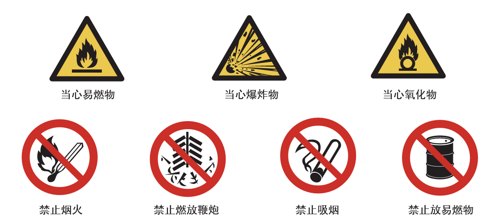

## 第六单元 碳及碳的氧化物

> 注：本单元的课题按照物质分类，和课本上的略有不同

#### 课题1 碳单质

##### 一、物理性质和用途

| 物质         | 物理性质           | 用途             |
| ------------ | ------------------ | ---------------- |
| 金刚石       | 自然界最硬、熔点高 | 切割             |
| 石墨         | 有滑腻感，能导电   | 做润滑剂、做电极 |
| 木炭、活性炭 | 有吸附性           | 净化、吸附       |
| 炭黑         |                    | 做墨             |
| $\ce{C60}$   |                    | 超导、润滑等     |

- 性质不同的原因：原子的排列方式不同（结构决定性质）
- 性质决定用途

##### 二、化学性质

- 常温下，碳的化学性质稳定
- 高温下，碳具有可燃性
    - 完全燃烧：$\ce{C + O2 ->T[点燃] CO2}$（红色火焰，放热）
    - 不完全燃烧：$\ce{2C + O2 ->T[点燃] 2CO}$
- 高温下，碳具有还原性
    - $\ce{C + 2CuO ->T[高温] 2Cu + CO2 ^}$（黑色固体变为红色固体）

#### 课题2 一氧化碳

##### 一、物理性质

- 无色、无味的气体
- 密度略小于空气
- 难溶于水

##### 二、化学性质

- 毒性（$\Rightarrow$ 需有尾气处理）
    - $\ce{CO}$ 极易与血红蛋白结合，导致缺氧
- 可燃性
    - $\ce{2CO + O_2 ->T[点燃] 2CO2}$（有蓝色火焰，放热）
- 还原性
    - $\ce{CO + CuO ->[\Delta] Cu + CO2}$（黑色固体变为红色固体）
    - $\ce{3CO + Fe2O3 ->T[高温] 2Fe + 3CO2}$（红色固体变为黑色固体）

#### 课题3 二氧化碳

##### 一、物理性质

- 无色、无味的气体
- 密度大于空气
- 能溶于水

##### 二、化学性质

- 不可燃、不助燃
- 能与水反应
    - $\ce{CO2 + H2O -> H2CO3}$
    - 碳酸能使干燥石蕊试纸变红
    - 碳酸不稳定，易分解为 $\ce{H2O}$ 和 $\ce{CO2}$
- 能与石灰水反应
    - $\ce{CO2 + Ca(OH)2 -> CaCO3 v + H2O}$（澄清石灰水变浑浊）

##### 三、用途

|   用途   |            所用性质             |
| :------: | :-----------------------------: |
|   灭火   |   不可燃不助燃，密度大于空气    |
| 人工降雨 | 固体 $\ce{CO2}$（干冰）升华吸热 |
| 碳酸饮料 |     能溶于水，且能与水反应      |
| 气体肥料 |     $\ce{CO2}$ 参加光合作用     |

##### 四、制备

1. 原理：$\ce{CaCO3 + 2HCl -> CaCl2 + H2O + CO2 ^}$
2. 药品：大理石、稀盐酸
3. 装置
    - 发生装置：长颈漏斗（添加液体）、锥形瓶
    - 收集装置：集气瓶、玻璃片（向上排空气）

## 第七单元  燃料及其应用

#### 课题1 燃烧与灭火

##### 一、燃烧

###### 1. 燃烧

   - 通常情况下，可燃物与助燃物（通常为氧气）发生的一种发光、放热的剧烈氧化反应

###### 2. 燃烧的条件

   - 可燃物
    
   - 与氧气接触
    
   - 达到燃烧所需的最低温度（着火点）

##### 二、灭火

|      原理      |          方法          |
| :------------: | :--------------------: |
|   清除可燃物   | 关闭燃气阀门、隔离带等 |
|    隔绝氧气    |   盖上锅盖、灭火器等   |
| 降温至着火点下 |        用水扑灭        |

##### 三、易燃物和易爆物

###### 1. 爆炸

- 短时间内聚积大量的热，使气体的体积迅速膨胀而引起爆炸

###### 2. 化学爆炸的条件

- 有限空间

- 急剧燃烧

###### 3. 安全措施、有关图标

#### 课题2 燃料的合理利用与开发

##### 一、化学反应中的能量变化

- 放热反应
    - 燃烧、$\ce{CO2} $与 $\ce{H2}$ 反应、金属与酸反应、缓慢氧化等

- 吸热反应
    - $\ce{C}$ 与 $\ce{CO2}$ 反应、氯化铵与氢氧化钡反应等

##### 二、化石燃料

###### 1. 概念

- 由古代生物的遗骸经一系列变化形成的不可再生能源

###### 2. 煤

1. 主要成分：$\ce{C}$

2. 综合利用
    - 方式：干馏（化学变化）——隔绝空气加强热
    - 产物：焦炭、煤焦油、煤气

###### 3. 石油

1. 主要成分：$\ce{C}$、$\ce{H}$

2. 综合利用
    - 方式：分馏（物理变化）——利用石油中各成分的沸点不同
    - 产物：沥青、石蜡、润滑油、柴油、煤油、航空煤油、汽油、溶剂油

###### 4. 天然气

1. 主要成分：$\ce{CH4}$（甲烷）

2. 物理性质

    - 无色、无味的气体

    - 密度比空气小

    - 极难溶于水

3. 化学性质
    - 可燃性（燃烧前需验纯）
        - $\ce{CH4 + 2O2 ->T[点燃] CO2 + 2H2O}$（淡蓝色火焰，放热）

##### 三、燃料的充分燃烧

###### 1. 条件

- 有足够的空气

- 燃料与空气有足够大的接触面

###### 2. 不充分燃烧的危害

- 降低燃料的利用率，浪费资源

- 污染空气

##### 四、使用燃料对环境的影响

- 燃料中的杂质燃烧产生污染物
    - 煤燃烧排出的 $\ce{SO2}$、$\ce{NO2}$ 导致酸雨

- 燃料燃烧不充分产生污染物
    - $\ce{C}$ 不充分燃烧产生 $\ce{CO}$

- 未燃烧的碳氢化合物及炭粒、尘粒等形成浮沉

##### 五、能源的利用与开发

###### 1. 乙醇

1. 成分：$\ce{C2H5OH}$
2. 物理性质

    - 无色、特殊香味的液体

    - 密度比水小

    - 与水以任意比例互溶
3. 化学性质
    - 可燃性
        - $\ce{C2H5OH + 3O2 ->T[点燃] 3H2O + 2CO2}$（淡蓝色火焰，放热）

###### 2. 氢气

1. 物理性质

    - 无色、无味的气体

    - 相同状况下密度最小的气体

    - 难溶于水
2. 化学性质

    - 可燃性
        - $\ce{2H2 + O2 ->T[点燃] 2H2O}$（有淡蓝色火焰，放热）
    - 还原性
        - $\ce{CuO + H2 ->T[高温] Cu + H2O}$（黑色固体变为红色固体）
3. 制备

    - 原理：$\ce{Zn + H2SO4 -> H2 ^ + ZnSO4}$
      
    - 药品：锌粒、稀硫酸
      
    - 装置

        - 发生装置：启普发生器

        - 收集装置：集气瓶、玻璃片（向下排空气）/ 水槽、集气瓶（排水法）

###### 3. 其他新能源

- 太阳能、核能、风能、地热能、生物质能、水能等

## 第八单元 金属材料

#### 课题1 金属材料

##### 一、金属材料的发展史

- 商朝，开始使用青铜器
- 春秋时期，铁
- $100$ 多年前，铝
- 现在年产量：铁 > 铝 > 铜

##### 二、金属的物理性质

###### 1. 金属的物理性质

| 共性（通常情况下） |         特例         |
| :----------------: | :------------------: |
|    常温下为固体    |       汞为液态       |
| 银白色，有金属光泽 | 铜为紫红色，金为黄色 |
|     熔沸点较高     |                      |
|   密度和硬度较大   |                      |
| 良好的导电、导热性 |                      |
|    良好的延展性    |                      |

###### 2. “金属之最”

- 地壳中含量最高：铝（$\ce{Al}$）
- 人体中含量最高：钙（$\ce{Ca}$）
- 世界年产量最高：铁（$\ce{Fe}$）
- 导电导热性最好：银（$\ce{Ag}$）
- 密度最大：锇（$\ce{Os}$）密度最小：锂（$\ce{Li}$）
- 熔点最高：钨（$\ce{W}$）熔点最低：汞（$\ce{Hg}$）
- 硬度最大：铬（$\ce{Cr}$）

##### 三、合金

###### 1. 合金

- 在金属中加热熔合金属或非金属，形成的具有金属特性的物质
- 合金是混合物，各物质以单质形式存在

###### 2. 性质（相较于原来的金属）

- 熔点低
- 强度、硬度大
- 抗腐蚀性能强

###### 3. 常见的合金

- 生铁：含碳 $2\% \sim 4.3\%$；机械性能硬而脆、无韧性、可铸不可锻
- 钢：含碳 $0.03\% \sim 2\%$；坚硬、强度高、韧性好、易加工
- 铝合金：密度小、硬度大、抗腐蚀性强
- 钛合金：熔点高、密度小、可塑性好、易于加工、强度大、抗腐蚀性能非常好

#### 课题2 金属的化学性质

##### 一、与氧气反应

- 镁、铝在常温下就能与氧气反应
    - $\ce{2Mg + O2 -> 2MgO}$
    - $\ce{4Al + 3O2 -> 2Al2O3}$
        - 氧化铝为一层致密的薄膜，防止铝被进一步氧化
- 铁、铜在常温下几乎不与氧气反应，但在高温时能与氧气反应
    - $\ce{3Fe + 2O2 ->T[点燃] Fe3O4}$
    - $\ce{2Cu + O2 -> 2CuO}$
- 金即使在高温时也不与氧气反应

##### 二、与酸（盐酸/稀硫酸）反应

| 与酸反应的物质 |                       反应的化学方程式                       |                       反应现象                       |
| :------------: | :----------------------------------------------------------: | :--------------------------------------------------: |
|       镁       | $\ce{Mg + 2HCl -> MgCl2 + H2 ^}$  $\ce{Mg + H2SO4 -> MgSO4 + H2 ^}$ |           固体变少，迅速产生大量气泡，放热           |
|       锌       | $\ce{Zn + 2HCl -> ZnCl2 + H2 ^}$  $\ce{Zn + H2SO4 -> ZnSO4 + H2 ^}$ |                固体变少，产生大量气泡                |
|       铁       | $\ce{Fe + 2HCl -> FeCl2 + H2 ^}$  $\ce{Fe + H2SO4 -> FeSO4 + H2 ^}$ | 固体变少，产生少量气泡， 溶液逐渐由无色变为浅绿色 |
|       铜       |                          不发生反应                          |                      无明显现象                      |

- 结论：$\ce{Mg}$、$\ce{Zn}$、$\ce{Fe}$ 能置换出盐酸里的氢，$\ce{Cu}$ 不能；金属活动性：$\ce{Mg} > \ce{Zn} > \ce{Fe} > \ce{Cu}$

##### 三、与盐溶液反应

###### 1. 常见反应

|            反应的化学方程式            |                   反应现象                   |
| :------------------------------------: | :------------------------------------------: |
|    $\ce{Fe + CuSO4 -> Cu + FeSO4}$     | 铁丝表面有红色固体析出，溶液由蓝色变为浅绿色 |
|  $\ce{Cu + 2AgNO3 -> Cu(NO3)2} + 2Ag$  | 铜丝表面有银白色固体析出，溶液由无色变为蓝色 |
| $\ce{2Al + 3CuSO4 -> 3Cu + Al2(SO4)3}$ |  铝丝表面有红色固体析出，溶液由蓝色变为无色  |
|               不发生反应               |                  无明显现象                  |

###### 2. 特殊颜色

|              物质              |  颜色  |
| :----------------------------: | :----: |
| $\ce{\overset{+2}{Cu}}$ 盐溶液 |  蓝色  |
| $\ce{\overset{+2}{Fe}}$ 盐溶液 | 浅绿色 |
| $\ce{\overset{+3}{Fe}}$ 盐溶液 |  黄色  |

##### 四、金属活动性

|    钾    |    钙     |    钠     |    镁     |    铝     |    锌     |    铁     |    锡     |    铅     |    氢    |    铜     |    汞     |    银     |    铂     |    金     |
| :------: | :-------: | :-------: | :-------: | :-------: | :-------: | :-------: | :-------: | :-------: | :------: | :-------: | :-------: | :-------: | :-------: | :-------: |
| $\ce{K}$ | $\ce{Ca}$ | $\ce{Na}$ | $\ce{Mg}$ | $\ce{Al}$ | $\ce{Zn}$ | $\ce{Fe}$ | $\ce{Sn}$ | $\ce{Pb}$ | $\ce{H}$ | $\ce{Cu}$ | $\ce{Hg}$ | $\ce{Ag}$ | $\ce{Pt}$ | $\ce{Au}$ |

- 金属的位置越靠前，它的活动性就越强
- 位于氢前面的金属能置换出盐酸、稀硫酸中的氢（反应剧烈程度不同，活动性强的剧烈）
- 位于前面的金属能把位于后面的金属从它们的盐溶液中置换出来（反应剧烈程度相同）
- 当一种金属单质同时与多种金属的盐溶液发生反应时，推断盐溶液中金属活动性最弱的先发生反应

##### 五、置换反应

- 由一种单质与一种化合物反应，生成另一种单质和另一种化合物的反应

#### 课题3 金属资源的利用与保护

##### 一、金属的存在形式

- 单质（游离态）：极少数很不活泼的金属，如金、银
- 化合物（化合态）：大多数金属
    - 赤铁矿：$\ce{Fe2O3}$；磁铁矿：$\ce{Fe3O4}$；菱铁矿：$\ce{FeCO3}$；铝土矿：$\ce{Al2O3}$；黄铜矿：$\ce{CuFeS2}$；辉铜矿：$\ce{Cu2S}$

##### 二、铁的冶炼

###### 1. 实验室还原铁

1. 原理：$\ce{Fe2O3 + 3CO ->T[高温] 2Fe + 3CO2}$
2. 装置：玻璃管（放 $\ce{Fe2O3}$）、导管（通 $\ce{CO}$，导出 $\ce{CO2}$），澄清石灰水（验证是否有 $\ce{CO2}$ 生成）、酒精喷灯（加热）、酒精灯（点燃 $\ce{CO}$，尾气处理）
3. 步骤
    1. 先通 $\ce{CO}$，再点燃尾气处理的酒精灯（防止爆炸）、再点燃酒精喷灯（防止爆炸）
    2. 先熄灭酒精喷灯，再停止通 $\ce{CO}$（防止石灰水倒吸、铁粉再次被氧化）
4. 现象：红色固体变黑，澄清石灰水变浑浊

###### 2. 工业炼铁

1. 原料：铁矿石、焦炭、石灰石、空气
    - 焦炭：提供 $\ce{CO}$ 和热量
    - 石灰石：炉渣，将矿石中的 $\ce{SiO2}$ 转化为炉渣
2. 设备：高炉
3. 原理
    - $\ce{C + O2 ->T[点燃] CO2}$
    - $\ce{CO2 + C ->T[高温] 2CO}$
    - $\ce{Fe2O3 + 3CO ->T[高温] 2Fe + 3CO2}$

##### 三、金属的腐蚀与防护

###### 1. 铁制品生锈的条件——实验

- 控制变量，对比试验

    | 实验编号 | 有无 $\ce{O2}$ | 有无 $\ce{H2O}$ |  现象  |
    | :------: | :------------: | :-------------: | :----: |
    |    1     |       有       |       有        |  生锈  |
    |    2     |       无       |       有        | 不生锈 |
    |    3     |       有       |       无        | 不生锈 |

- $n$ 个变量，$n + 1$ 次实验
    - $1,2$ $\Rightarrow$ 需要 $\ce{O2}$
    - $1,3$ $\Rightarrow$ 需要 $\ce{H2O}$

###### 2. 金属锈蚀的条件

- 有能发生反应的物质，反应物互相接触
- 生成物不会对反应起阻碍作用

###### 3. 防止金属锈蚀的方法

- 保持表面干燥、清洁
- 在表面覆盖保护层（如刷漆、浸油、镀耐腐蚀的金属）
- 改变其内部结构（如制成合金）

##### 四、金属资源保护

###### 1. 必要性

- 金属资源储量有限，且不能再生
- 废弃金属的随意丢弃不仅会浪费金属，还会污染环境

###### 2. 方法

- 防止金属的腐蚀
- 回收利用金属
- 合理开采矿物
- 寻找金属的代用品

## 第九单元 溶液

#### 课题1 溶液的形成

##### 一、溶液

###### 1. 概念

- 一种或几种物质分散到另一种物质里，形成==均一==的、==稳定==的==混合物==

###### 2. 组成

- 溶质：被溶解的物质 —— 气体、液体、固体
- 溶剂：能溶解其他物质的物质 —— 通常是水，一般还有酒精、汽油

###### 3. 溶液、溶质、溶剂的关系

- $\text{m}_{溶液} = \text{m}_{溶质} + \text{m}_{溶剂}$
- $\text{V}_{溶液}<\text{V}_{溶质}+\text{V}_{溶剂}$

###### 4. 溶质与溶剂的判断

| 体系          | 溶剂       |
| ------------- | ---------- |
| 固/气+液      | 液体       |
| 液+液（有水） | 水         |
| 液+液（无水） | 量多的液体 |

###### 5. 形成

- 在溶剂分子的作用下，溶质的==分子==（或==离子==）均匀分散到溶剂分子之间

##### 二、溶解时的温度变化

###### 1. 例子

- 无明显现象：$\ce{NaCl}$
- 吸热：$\ce{NH4NO3}$（硝酸铵）
- 放热：$\ce{NaOH}$

###### 2. 原因（自主拓展）

- 吸热：维持晶体结构的作用力被打断，分子或离子向溶液中扩散，这个过程消耗能量（解离能）
- 放热：溶质中的分子或离子跟溶剂分子结合，这个过程放出能量（溶剂化能）

##### 三、乳化现象

- 乳浊液：不溶性小液滴分散到液体里形成的不稳定的混合物
- 乳化作用：将不溶性大油珠分散成细小的液滴，而不聚集成油珠
- 乳化剂：能防止小液滴聚集的物质，具有乳化作用

#### 课题2 溶解度

##### 一、饱和溶液与不饱和溶液

###### 1. 定义

- 饱和溶液：在==一定的温度==下，向==一定量的溶剂==中加入某种物质，当溶质不能继续溶解时，所得到的溶液叫做该溶质的饱和溶液
- 不饱和溶液：在==一定的温度==下，向==一定量的溶剂==中加入某种物质，当溶质还能继续溶解时，所得到的溶液叫做该溶质的不饱和溶液

###### 2. 判断

- 看有无不溶溶质
- 继续加少量该溶质，看是否能溶解

###### 3. 溶液的互相转化

- 不饱和溶液 $\to$ 饱和溶液：蒸发溶剂、改变温度（一般降温）、蒸发溶剂
- 饱和溶液 $\to$ 不饱和溶液：增加溶剂、改变温度（一般升温）

- 例外：$\ce{Ca(OH)2}$ 温度越高，溶解越少

###### 4. 结晶

- 结晶：溶液中的溶质以晶体形式析出的过程
- 方式
    - 蒸发结晶：冷却热饱和溶液
        - 举例：海水晒盐
    - 降温结晶：蒸发溶剂
        - 举例：$\ce{KNO3}$

###### 5. 溶解性

- 物质溶解在溶剂中的能力
- 内因：溶质的种类
- 外因：溶剂的种类、温度

##### 二、固体溶解度

###### 1. 定义

- 在==一定温度==下，某固态物质在 ==$100\text{g}$ 溶剂==里达到==饱和==状态时所溶解的==质量==(单位：$\text{g}$）

###### 2. 溶解度与溶解性的关系

| 溶解性                              | 易溶          | 可溶         | 微溶         | 难溶            |
| ----------------------------------- | ------------- | ------------ | ------------ | --------------- |
| 溶解度（$20\textcelsius/\text{g}$） | $>10\text{g}$ | $>1\text{g}$ | $<1\text{g}$ | $<0.01\text{g}$ |

###### 3. 受温度的影响

- 大多数固体物质的溶解度随温度的升高而增大，如 $\ce{KNO3}$
- 少数固体物质的溶解度受温度的影响较小，如 $\ce{NaCl}$
- 极少数固体物质的溶解度随温度的升高而减小，如 $\ce{Ca(OH)2}$​

###### 4. 应用

- 判断选用什么方式进行结晶
    - 降温结晶：溶解度随温度升高而增大溶解度的物质
    - 蒸发结晶：溶解度受温度影响不大的物质

###### 5. 溶解度曲线包含的信息

- 曲线：曲线越陡，溶解度受温度影响越大
- 点：某物质在该温度下的溶解度
- 交点：两种物质在该温度下的溶解度相同
- 平移：溶液的转化

##### 三、气体的溶解度

###### 1. 定义

- 在压强为 ==$101\text{KPa}$== 和==一定温度==时，气体溶解度在 ==$1$​ 体积水==里达到==饱和==状态时的气体==体积== 

###### 2. 影响气体溶解性的因素

- 温度 $\uparrow$，溶解性 $\downarrow$
- 压强 $\uparrow$，溶解性 $\uparrow$

#### 课题3 溶液的浓度

##### 一、溶质的质量分数

###### 1. 感知溶液的浓与稀

$$
\begin{cases}
无色
	\begin{cases}
		\text{溶剂质量相同，溶质越多，溶液越浓（未饱和时）} \\
		\text{溶剂质量相同，溶剂越少，溶液越浓（未饱和时）}
	\end{cases} \\
有色 \quad \text{颜色越深，溶液越浓}
\end{cases}
$$

###### 2. 溶质的质量分数

- $c\% = \dfrac{\text{m}_{溶质}}{\text{m}_{溶液}} \times 100\% = \dfrac{\text{m}_{溶质}}{\text{m}_{溶质}+\text{m}_{溶剂}} \times 100\%$

###### 3. 饱和溶液中的溶质的质量分数

- $c\% = \dfrac{S}{S+100\text{g}} \times 100\%$

##### 二、配置溶液

###### 1. 实验原理

- $c\% = \dfrac{\text{m}_{溶质}}{\text{m}_{溶液}} \times 100\% = \dfrac{\text{m}_{溶质}}{\text{m}_{溶质}+\text{m}_{溶剂}} \times 100\%$

###### 2. 实验步骤

1. 计算：想要的 $c\%,\text{m}_{溶液}$ $\Rightarrow$ $\text{m}_{溶剂},\text{m}_{溶质}$
2. 称量，量取：用天平称量溶质，量筒量取溶剂，加入烧杯中（先固后液）
3. 溶解：用玻璃棒不断搅拌，加快溶解
4. 装瓶贴标签

###### 3. 误差分析

- $\text{m}_{溶质} \downarrow \space \Rightarrow \space c\downarrow$
- $\text{m}_{溶剂} \downarrow \space \Rightarrow \space c\uparrow$

## 第十单元 酸和碱

#### 课题1 常见的酸和碱

##### 一、酸和碱

###### 1. 酸

- 常见：盐酸 $\ce{HCl}$，硫酸 $\ce{H2SO4}$，硝酸 $\ce{HNO3}$，碳酸 $\ce{H2CO3}$，醋酸 $\ce{CH3COOH}$
- 组成：$\ce{H+}$ + 酸根（阳离子只有 $\ce{H+}$）

###### 2. 碱

- 常见：氢氧化钠 $\ce{NaOH}$，氢氧化钙 $\ce{Ca(OH)2}$，氢氧化钙 $\ce{KOH}$、氢氧化钡 $\ce{Ba(OH)2}$、二水合氨 $\ce{NH3*H2O}$
- 组成：金属/铵根离子 + $\ce{OH-}$

##### 二、酸碱指示剂

###### 1. 概念

- 能跟酸或碱的溶液起作用而显示不同颜色的物质

###### 2. 常见指示剂及其变色规律

| 指示剂       | 酸性溶液 | 中性溶液 | 碱性溶液 |
| ------------ | -------- | -------- | -------- |
| 紫色石蕊溶液 | 红色     | 紫色     | 蓝色     |
| 无色酚酞溶液 | 无色     | 无色     | 红色     |

##### 三、溶液的导电性

- 酸和碱溶液均可导电，因为有带电微粒（阴、阳离子）

##### 四、常见的酸

###### 1. 浓盐酸（$\ce{HCl}$）

1. 成分
    - 氯化氢（$\ce{HCl}$）气体的水溶液
2. 物理性质
    - 无色、有刺激性气味的液体
    - 具有挥发性（稀盐酸没有）
        - 敞口放置在空气中，会挥发出氯化氢气体，与水蒸气结合结合成盐酸小液滴，瓶口出现白雾
        - 溶液的质量下降，溶质的质量分数下降
        - 需密闭保存
3. 用途
    - 用于金属表面除锈等
    - 用于制造药物等
    - 人体胃液中含有盐酸，可以帮助消化

###### 2. 浓硫酸（$\ce{H2SO4}$）

1. 成分
    - 浓度为 $98\%$ 的 $\ce{H2SO4}$ 溶液
2. 物理性质
    - 无色的粘稠油状液体
    - 具有吸水性（稀盐酸没有）
        - 敞口放置在空气中，会吸收空气中的水蒸气
        - 溶液的质量上升，溶质的质量分数下降
        - 需密封保存
3. 化学性质
    - 具有脱水性
        - 能使纸、布、木材、皮肤等有机物脱水炭化
        - 若不慎将浓硫酸沾到皮肤或衣服上，应立即用大量水冲洗，然后再涂上 $3\% \sim 5\%$ 的碳酸氢钠（$\ce{NaHCO3}$） 溶液
4. 用途
    - 用于生产化肥、农药、火药、染料以及冶炼金属、精炼石油、金属除锈等
    - 常用做干燥剂
        - 不能干燥碱性碱性气体
5. 稀释
    - 现象：稀释时会放大量热
    - 操作：应将浓硫酸沿着烧杯的内壁慢慢注入水中，并用玻璃棒不断搅拌，在烧杯中进行

##### 五、酸的化学性质

1. 与酸碱指示剂作用

    - 紫色石蕊遇酸变红
    - 无色酚酞遇酸不变色

2. 与氢前金属反应生成盐和氧气（反应条件：金属活动性顺序表中氢前的金属与盐酸、稀硫酸）

    - $\ce{Fe + 2HCl -> FeCl2 + H2 ^}$
    - $\ce{Zn + H2SO4 -> ZnSO4 + H2 ^}$

3. 与金属氧化物反应生成盐和水

    - $\ce{Fe2O3 + 6HCl -> 2FeCl3 + 3H2O}$（铁钉逐渐溶解，溶液由无色变黄）

    - $\ce{CuO + 2HCl -> CuCl2 + H2O}$

    -	$\ce{CuO + H2SO4 -> CuSO4 + H2O}$
4. 与碳酸盐反应生成盐、水和二氧化碳
    - $\ce{CaCO3 + 2HCl -> CaCl2 + H2O + CO2 ^}$
    - $\ce{Na2CO3 + 2HCl -> 2NaCl + H2O + CO2 ^}$
    - $\ce{CaCO3 + H2SO4 -> CaSO4 + H2O + CO2 ^}$
    - $\ce{Na2CO3 + H2SO4 -> Na2SO4 + H2O + CO2 ^}$

##### 六、常见的碱

###### 1. 氢氧化钠（$\ce{NaOH}$）

1. 俗名
    - 烧碱、火碱、苛性钠
2. 物理性质
    - 白色片状固体
    - 易溶于水（溶于水放热）
    - 易吸收空气中的水分而潮解
3. 化学性质
    - 具有很强的腐蚀性
        - 称量时需盛放在玻璃器皿中
        - 如果不慎将氢氧化钠沾到皮肤上，要立即用大量水冲洗，再涂上硼酸（$\ce{H2BO3}$​）溶液
4. 用途
    - 广泛应用于肥皂、石油、造纸、纺织、印染等工业
    - 去除油污
    - 常用作干燥剂
        - 不能干燥酸性气体

###### 2. 氢氧化钙（$\ce{Ca(OH)2}$）

1. 俗名
    - 消石灰、熟石灰
    - （其水溶液是澄清石灰水、 当石灰水中存在较多未溶解的固体时，称为石灰乳、石灰浆）
2. 物理性质
    - 白色粉末状固体
    - 微溶于水，溶解度随温度的升高而降低
3. 用途
    - 配置农药波尔多液
    - 树木防冻防虫
    - 改良酸性土壤
    - 用作建筑材料
4. 制取
    - $\ce{CaO + H2O -> Ca(OH)2}$（放热）

##### 七、碱的化学性质

1. 与酸碱指示剂作用

    - 紫色石蕊遇碱变蓝
    - 无色酚酞遇碱变红

2. 与非金属氧化物反应生成盐和水

    - $\ce{CO2 + Ca(OH)2 -> CaCO3 v + H2O}$（澄清石灰水变浑浊）

        - 用于检验 $\ce{CO2}$
        - 氢氧化钙能与空气中的 $\ce{CO2}$​ 反应而变质，所以氢氧化钙要密封保存

    - $\ce{CO2 + 2NaOH -> Na2CO3 + H2O}$（无明显现象）

        - 检验反应发生：$\ce{Na2CO3 + 2HCl -> 2NaCl + H2O + CO2 ^}$（产生气泡）

        - 用于吸收 $\ce{CO2}$
        - 氢氧化钠固体不仅易吸收空气中的水分，还可以吸收空气中的 $\ce{CO2}$​ 而变质，所以氢氧化钠必须密封保存

    - $\ce{SO2 + Ca(OH)2 -> CaSO3 + H2O}$

    - $\ce{SO2 + 2NaOH -> Na2SO3 + H2O}$

    - $\ce{SO3 + 2NaOH -> Na2SO4 + H2O}$

#### 课题2 酸碱中和反应

##### 一、酸碱中和反应

###### 1. 实验

- 酸滴碱，验证 $\ce{NaOH}$ 的消耗
- $\ce{NaOH}$ $\large \xrightarrow{加酚酞}$ 变红 $\large \xrightarrow[震荡]{逐滴加盐酸}$ 恰好由红色变为无色

###### 2.  定义

- 酸和碱反应生成盐和水

###### 3. 微观实质

- $\ce{H+ + OH- -> H2O}$

###### 4. 能量变化

- 放热

###### 5. 应用

- 农业：用熟石灰改良酸性土壤
- 工业：处理酸性或碱性的工业废水
- 医药：用含碱性药物（氢氧化铝）治疗胃酸过多
- 生活：蚊虫叮咬涂稀氨水或肥皂水

###### 6. 举例

- $\ce{NaOH + HCl -> NaCl + H2O}$
- $\ce{2NaOH + H2SO4 -> Na2SO4 + 2H2O}$
- $\ce{Ca(OH)2 + 2HCl -> CaCl2 + 2H2O}$
- $\ce{Ca(OH)2 + H2SO4 -> CaSO4 + 2H2O}$

##### 二、溶液酸碱度的表示法——pH

###### 1. pH 值与酸碱度对应

- 范围：通常 $0 \sim 14$
- 酸性溶液：$<7$ （越小酸性越强）
- 中性溶液：$=7$
- 碱性溶液：$>7$ （越大碱性越强）

###### 2. 测定方法

1. pH 试纸测定法
    - 不润湿， 不伸入待测液
    - 玻璃棒蘸取试液到试纸
2. pH 计

## 第十一单元 盐 化肥

#### 课题1 生活中常见的盐

##### 一、盐

- 一类组成里含有金属离子和酸根离子的化合物

##### 二、常见的盐

###### 1. 氯化钠（$\ce{NaCl}$）

- 俗名：食盐
- 物理性质：白色固体，易溶于水，有咸味
- 化学性质：水溶液呈中性
- 用途：调味品、生理盐水、融雪剂等
- 粗盐提纯：溶解、过滤、蒸发
    - 溶解：玻璃棒搅拌，加快溶解
    - 过滤：玻璃棒引流，防止飞溅
    - 蒸发：蒸发皿；玻璃棒搅拌，均匀受热，防止飞溅；较多固体析出时，停止加热，余热烘干，防止飞溅

###### 2. 碳酸钠（$\ce{Na2CO3}$）

- 俗名：纯碱、苏打
- 物理性质：白色晶体，风化成粉末，易溶于水
- 化学性质：水溶液呈碱性
- 用途：玻璃、造纸、纺织、洗涤、印染

###### 3. 碳酸氢钠（$\ce{NaHCO3}$）

- 俗名：小苏打
- 物理性质：白色粉末，能溶于水
- 化学性质：水溶液有弱碱性，受热易分解
    - $\ce{2NaHCO3 ->[\Delta] Na2CO3 + H2O + CO2 ^}$
- 用途：治疗胃酸过多、做发酵粉

###### 4. 碳酸钙（$\ce{CaCO3}$）

- 大理石、石灰石的主要成分
- 物理性质：多为灰白色矿物，纯净物为白色矿物；不溶于水，能溶于酸
- 用途：建筑材料、补钙剂

##### 三、碳酸盐的化学性质

1. 与盐酸反应
    - $\ce{Na2CO3 + 2HCl -> 2 NaCl + H2O + CO2 ^}$（产生大量气泡，固体很快溶解，澄清石灰水变浑浊）
    - $\ce{NaHCO3 + HCl -> NaCl + H2O + CO2 ^}$（现象同上）
2. 与澄清石灰水反应
    - $\ce{Na2CO3 + Ca(OH)2 -> CaCO3 v + 2NaOH}$（澄清石灰水变浑浊）
        - 纯碱制烧碱

##### 四、复分解反应

###### 1. 定义

- 两种化合物互相交换成分，生成另外两种化合物的反应

###### 2. 表达式

- $\text{AB} + \text{CD} \to \text{AD} + \text{CB}$

###### 3. 条件

- 两种化合物互相交换成分，有沉淀或有气体或有水生成

​	（附表：部分酸、碱和盐的溶解性表（室温），人教版化学书 P114）

###### 4. 性质

- 化合价不变

