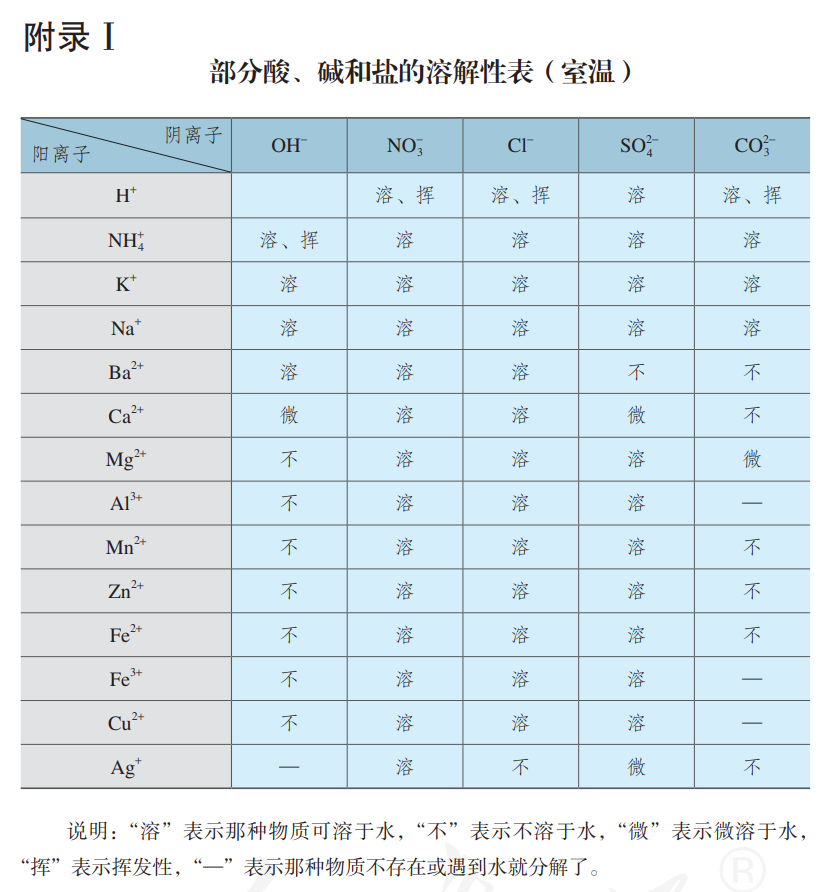

# 初中部分

## 第六单元 碳及碳的氧化物

> 注：本单元的课题按照物质分类，和课本上的略有不同

#### 课题1 碳单质

##### 一、物理性质和用途

- 性质决定用途

| 物质         | 物理性质           | 用途             |
| ------------ | ------------------ | ---------------- |
| 金刚石       | 自然界最硬、熔点高 | 切割             |
| 石墨         | 有滑腻感，能导电   | 做润滑剂、做电极 |
| 木炭、活性炭 | 有吸附性           | 净化、吸附       |
| 炭黑         |                    | 做墨             |
| $\ce{C60}$   |                    | 超导、润滑等     |

- 性质不同的原因：原子的排列方式不同（结构决定性质）

##### 二、化学性质

- 常温下，碳的化学性质稳定
- 高温下，碳具有可燃性
    - 完全燃烧：$\ce{C + O2 ->[点燃] CO2}$（红光，放热）
    - 不完全燃烧：$\ce{2C + O2 ->[点燃] 2CO}$
- 高温下，碳具有还原性
    - $\ce{C + 2CuO ->[高温] 2Cu + CO2 ^}$（黑色固体变为红色固体）

#### 课题2 一氧化碳

##### 一、物理性质

- 无色、无味的气体
- 密度略小于空气
- 难溶于水

##### 二、化学性质

- 毒性（$\Rightarrow$ 需有尾气处理）
    - $\ce{CO}$ 极易与血红蛋白结合，导致缺氧
- 可燃性
    - $\ce{2CO + O_2 ->[点燃] 2CO2}$（蓝色火焰，放热）
- 还原性
    - $\ce{CO + CuO ->[\Delta] Cu + CO2}$（黑色固体变为红色固体）
    - $\ce{3CO + Fe2O3 ->[高温] 2Fe + 3CO2}$（红色固体变为黑色固体）

#### 课题3 二氧化碳

> 二氧化碳不能供给呼吸，在进入久未开启的菜窖或干涸的深井前，要先做灯火实验

##### 一、物理性质

- 无色、无味的气体
- 密度大于空气
- 能溶于水

##### 二、化学性质

- 不可燃、不助燃
- 能与水反应
    - $\ce{CO2 + H2O -> H2CO3}$
    - 碳酸能使干燥石蕊试纸变红
    - 碳酸不稳定，易分解为 $\ce{H2O}$ 和 $\ce{CO2}$
- 能与石灰水反应
    - $\ce{CO2 + Ca(OH)2 -> CaCO3 v + H2O}$（澄清石灰水变浑浊）

##### 三、用途

|   用途   |            所用性质             |
| :------: | :-----------------------------: |
|   灭火   |   不可燃不助燃，密度大于空气    |
| 人工降雨 | 固体 $\ce{CO2}$（干冰）升华吸热 |
| 碳酸饮料 |     能溶于水，且能与水反应      |
| 气体肥料 |     $\ce{CO2}$ 参加光合作用     |

##### 四、制取

###### 1. 工业制取

$\ce{CaCO3 ->[高温] CaO + CO2 ^}$

###### 2. 实验室制取

1. 原理：$\ce{CaCO3 + 2HCl -> CaCl2 + H2O + CO2 ^}$
2. 药品：大理石、稀盐酸
3. 装置
    - 发生装置：长颈漏斗（添加液体）、锥形瓶
    - 收集装置：集气瓶、玻璃片（向上排空气）

## 第七单元  燃料及其应用

#### 课题1 燃烧与灭火

##### 一、燃烧

###### 1. 燃烧

   - 通常情况下，可燃物与助燃物（通常为氧气）发生的一种发光、放热的剧烈氧化反应

###### 2. 燃烧的条件

   - 可燃物
    
   - 与氧气接触
    
   - 达到燃烧所需的最低温度（着火点）

##### 二、灭火

|      原理      |          方法          |
| :------------: | :--------------------: |
|   清除可燃物   | 关闭燃气阀门、隔离带等 |
|    隔绝氧气    |   盖上锅盖、灭火器等   |
| 降温至着火点下 |        用水扑灭        |

##### 三、易燃物和易爆物

###### 1. 爆炸

- 短时间内聚积大量的热，使气体的体积迅速膨胀而引起爆炸

###### 2. 化学爆炸的条件

- 有限空间

- 急剧燃烧

###### 3. 安全措施、有关图标

#### 课题2 燃料的合理利用与开发

##### 一、化学反应中的能量变化

- 放热反应
    - 燃烧、$\ce{CO2} $与 $\ce{H2}$ 反应、金属与酸反应、缓慢氧化等

- 吸热反应
    - $\ce{C}$ 与 $\ce{CO2}$ 反应、氯化铵与氢氧化钡反应等

##### 二、化石燃料

###### 1. 概念

- 由古代生物的遗骸经一系列变化形成的不可再生能源

###### 2. 煤

1. 主要成分：$\ce{C}$

2. 综合利用
    - 方式：干馏（化学变化）——隔绝空气加强热
    - 产物：焦炭、煤焦油、煤气

###### 3. 石油

1. 主要成分：$\ce{C}$、$\ce{H}$

2. 综合利用
    - 方式：分馏（物理变化）——利用石油中各成分的沸点不同
    - 产物：沥青、石蜡、润滑油、柴油、煤油、航空煤油、汽油、溶剂油

###### 4. 天然气

1. 主要成分：$\ce{CH4}$（甲烷）

2. 物理性质

    - 无色、无味的气体

    - 密度比空气小

    - 极难溶于水

3. 化学性质
    - 可燃性（燃烧前需验纯）
        - $\ce{CH4 + 2O2 ->[点燃] CO2 + 2H2O}$（淡蓝色火焰，放热）

##### 三、燃料的充分燃烧

###### 1. 条件

- 有足够的空气

- 燃料与空气有足够大的接触面

###### 2. 不充分燃烧的危害

- 降低燃料的利用率，浪费资源

- 污染空气

##### 四、使用燃料对环境的影响

- 燃料中的杂质燃烧产生污染物
    - 煤燃烧排出的 $\ce{SO2}$、$\ce{NO2}$ 导致酸雨

- 燃料燃烧不充分产生污染物
    - $\ce{C}$ 不充分燃烧产生 $\ce{CO}$

- 未燃烧的碳氢化合物及炭粒、尘粒等形成浮沉

##### 五、能源的利用与开发

###### 1. 乙醇

1. 成分：$\ce{C2H5OH}$
2. 物理性质

    - 无色、特殊香味的液体

    - 密度比水小

    - 与水以任意比例互溶
3. 化学性质
    - 可燃性
        - $\ce{C2H5OH + 3O2 ->[点燃] 3H2O + 2CO2}$（淡蓝色火焰，放热）

###### 2. 氢气

1. 物理性质

    - 无色、无味的气体

    - 相同状况下密度最小的气体

    - 难溶于水
2. 化学性质

    - 可燃性
        - $\ce{2H2 + O2 ->[点燃] 2H2O}$（淡蓝色火焰，放热）
    - 还原性
        - $\ce{CuO + H2 ->[\Delta] Cu + H2O}$（黑色固体变为红色固体）
3. 制取

    - 原理：$\ce{Zn + H2SO4 -> H2 ^ + ZnSO4}$
      
    - 药品：锌粒、稀硫酸
      
    - 装置

        - 发生装置：启普发生器

        - 收集装置：集气瓶、玻璃片（向下排空气）/ 水槽、集气瓶（排水法）

###### 3. 其他新能源

- 太阳能、核能、风能、地热能、生物质能、水能等

## 第八单元 金属材料

#### 课题1 金属材料

##### 一、金属材料的发展史

- 商朝，开始使用青铜器
- 春秋时期，铁
- $100$ 多年前，铝
- 现在年产量：铁 > 铝 > 铜

##### 二、金属的物理性质

###### 1. 金属的物理性质

| 共性（通常情况下） |         特例         |
| :----------------: | :------------------: |
|    常温下为固体    |       汞为液态       |
| 银白色，有金属光泽 | 铜为紫红色，金为黄色 |
|     熔沸点较高     |                      |
|   密度和硬度较大   |                      |
| 良好的导电、导热性 |                      |
|    良好的延展性    |                      |

###### 2. “金属之最”

- 地壳中含量最高：铝（$\ce{Al}$）
- 人体中含量最高：钙（$\ce{Ca}$）
- 世界年产量最高：铁（$\ce{Fe}$）
- 导电导热性最好：银（$\ce{Ag}$）
- 密度最大：锇（$\ce{Os}$）密度最小：锂（$\ce{Li}$）
- 熔点最高：钨（$\ce{W}$）熔点最低：汞（$\ce{Hg}$）
- 硬度最大：铬（$\ce{Cr}$）

##### 三、合金

###### 1. 合金

- 在金属中加热熔合金属或非金属，形成的具有金属特性的物质
- 合金是混合物，各物质以单质形式存在

###### 2. 性质（相较于原来的金属）

- 熔点低
- 强度、硬度大
- 抗腐蚀性能强

###### 3. 常见的合金

- 生铁：含碳 $2\% \sim 4.3\%$；机械性能硬而脆、无韧性、可铸不可锻
- 钢：含碳 $0.03\% \sim 2\%$；坚硬、强度高、韧性好、易加工
- 铝合金：密度小、硬度大、抗腐蚀性强
- 钛合金：熔点高、密度小、可塑性好、易于加工、强度大、抗腐蚀性能非常好

#### 课题2 金属的化学性质

##### 一、与氧气反应

- 镁、铝在常温下就能与氧气反应
    - $\ce{2Mg + O2 -> 2MgO}$
    - $\ce{4Al + 3O2 -> 2Al2O3}$
        - 氧化铝为一层致密的薄膜，防止铝被进一步氧化
- 铁、铜在常温下几乎不与氧气反应，但在高温时能与氧气反应
    - $\ce{3Fe + 2O2 ->[点燃] Fe3O4}$
    - $\ce{2Cu + O2 ->[\Delta] 2CuO}$
- 金即使在高温时也不与氧气反应

##### 二、与酸（盐酸/稀硫酸）反应

| 与酸反应的物质 |                       反应的化学方程式                       |                       反应现象                       |
| :------------: | :----------------------------------------------------------: | :--------------------------------------------------: |
|       镁       | $\ce{Mg + 2HCl -> MgCl2 + H2 ^}$  $\ce{Mg + H2SO4 -> MgSO4 + H2 ^}$ |           固体变少，迅速产生大量气泡，放热           |
|       锌       | $\ce{Zn + 2HCl -> ZnCl2 + H2 ^}$  $\ce{Zn + H2SO4 -> ZnSO4 + H2 ^}$ |                固体变少，产生大量气泡                |
|       铁       | $\ce{Fe + 2HCl -> FeCl2 + H2 ^}$  $\ce{Fe + H2SO4 -> FeSO4 + H2 ^}$ | 固体变少，产生少量气泡， 溶液逐渐由无色变为浅绿色 |
|       铜       |                          不发生反应                          |                      无明显现象                      |

- 结论：$\ce{Mg}$、$\ce{Zn}$、$\ce{Fe}$ 能置换出盐酸里的氢，$\ce{Cu}$ 不能；金属活动性：$\ce{Mg} > \ce{Zn} > \ce{Fe} > \ce{Cu}$

##### 三、与盐溶液反应

###### 1. 常见反应

|            反应的化学方程式            |                   反应现象                   |
| :------------------------------------: | :------------------------------------------: |
|    $\ce{Fe + CuSO4 -> Cu + FeSO4}$     | 铁丝表面有红色固体析出，溶液由蓝色变为浅绿色 |
|  $\ce{Cu + 2AgNO3 -> Cu(NO3)2 + 2Ag}$  | 铜丝表面有银白色固体析出，溶液由无色变为蓝色 |
| $\ce{2Al + 3CuSO4 -> 3Cu + Al2(SO4)3}$ |  铝丝表面有红色固体析出，溶液由蓝色变为无色  |
|               不发生反应               |                  无明显现象                  |

###### 2. 特殊颜色

|              物质              |  颜色  |
| :----------------------------: | :----: |
| $\ce{\overset{+2}{Cu}}$ 盐溶液 |  蓝色  |
| $\ce{\overset{+2}{Fe}}$ 盐溶液 | 浅绿色 |
| $\ce{\overset{+3}{Fe}}$ 盐溶液 |  黄色  |

##### 四、金属活动性

|    钾    |    钙     |    钠     |    镁     |    铝     |    锌     |    铁     |    锡     |    铅     |    氢    |    铜     |    汞     |    银     |    铂     |    金     |
| :------: | :-------: | :-------: | :-------: | :-------: | :-------: | :-------: | :-------: | :-------: | :------: | :-------: | :-------: | :-------: | :-------: | :-------: |
| $\ce{K}$ | $\ce{Ca}$ | $\ce{Na}$ | $\ce{Mg}$ | $\ce{Al}$ | $\ce{Zn}$ | $\ce{Fe}$ | $\ce{Sn}$ | $\ce{Pb}$ | $\ce{H}$ | $\ce{Cu}$ | $\ce{Hg}$ | $\ce{Ag}$ | $\ce{Pt}$ | $\ce{Au}$ |

- 金属的位置越靠前，它的活动性就越强
- 位于氢前面的金属能置换出盐酸、稀硫酸中的氢（反应剧烈程度不同，活动性强的剧烈）
- 位于前面的金属能把位于后面的金属从它们的盐溶液中置换出来（反应剧烈程度相同）
- 当一种金属单质同时与多种金属的盐溶液发生反应时，推断盐溶液中金属活动性最弱的先发生反应

##### 五、置换反应

- 由一种单质与一种化合物反应，生成另一种单质和另一种化合物的反应

#### 课题3 金属资源的利用与保护

##### 一、金属的存在形式

- 单质（游离态）：极少数很不活泼的金属，如金、银
- 化合物（化合态）：大多数金属
    - 赤铁矿：$\ce{Fe2O3}$；磁铁矿：$\ce{Fe3O4}$；菱铁矿：$\ce{FeCO3}$；铝土矿：$\ce{Al2O3}$；黄铜矿：$\ce{CuFeS2}$；辉铜矿：$\ce{Cu2S}$

##### 二、铁的冶炼

###### 1. 实验室还原铁

1. 原理：$\ce{Fe2O3 + 3CO ->[高温] 2Fe + 3CO2}$
2. 装置：玻璃管（放 $\ce{Fe2O3}$）、导管（通 $\ce{CO}$，导出 $\ce{CO2}$），澄清石灰水（验证是否有 $\ce{CO2}$ 生成）、酒精喷灯（加热）、酒精灯（点燃 $\ce{CO}$，尾气处理）
3. 步骤
    1. 先通 $\ce{CO}$，再点燃尾气处理的酒精灯（防止爆炸）、再点燃酒精喷灯（防止爆炸）
    2. 先熄灭酒精喷灯，再停止通 $\ce{CO}$（防止石灰水倒吸、铁粉再次被氧化）
4. 现象：红色固体变黑，澄清石灰水变浑浊

###### 2. 工业炼铁

1. 原料：铁矿石、焦炭、石灰石、空气
    - 焦炭：提供 $\ce{CO}$ 和热量
    - 石灰石：将矿石中的 $\ce{SiO2}$ 转化为炉渣
2. 设备：高炉
3. 原理
    - $\ce{C + O2 ->[点燃] CO2}$
    - $\ce{CO2 + C ->[高温] 2CO}$
    - $\ce{Fe2O3 + 3CO ->[高温] 2Fe + 3CO2}$

##### 三、金属的腐蚀与防护

###### 1. 铁制品生锈的条件——实验

- 控制变量，对比试验

    | 实验编号 | 有无 $\ce{O2}$ | 有无 $\ce{H2O}$ |  现象  |
    | :------: | :------------: | :-------------: | :----: |
    |    1     |       有       |       有        |  生锈  |
    |    2     |       无       |       有        | 不生锈 |
    |    3     |       有       |       无        | 不生锈 |

- $n$ 个变量，$n + 1$ 次实验
    - $1,2$ $\Rightarrow$ 需要 $\ce{O2}$
    - $1,3$ $\Rightarrow$ 需要 $\ce{H2O}$

###### 2. 金属锈蚀的条件

- 有能发生反应的物质，反应物互相接触
- 生成物不会对反应起阻碍作用

###### 3. 防止金属锈蚀的方法

- 保持表面干燥、清洁
- 在表面覆盖保护层（如刷漆、涂油、镀耐腐蚀的金属）
- 改变其内部结构（如制成合金）

##### 四、金属资源保护

###### 1. 必要性

- 金属资源储量有限，且不能再生
- 废弃金属的随意丢弃不仅会浪费金属，还会污染环境

###### 2. 方法

- 防止金属的腐蚀
- 回收利用金属
- 合理开采矿物
- 寻找金属的代用品

## 第九单元 溶液

#### 课题1 溶液的形成

##### 一、溶液

###### 1. 概念

- 一种或几种物质分散到另一种物质里，形成==均一==的、==稳定==的==混合物==

###### 2. 组成

- 溶质：被溶解的物质 —— 气体、液体、固体
- 溶剂：能溶解其他物质的物质 —— 通常是水，一般还有酒精、汽油

###### 3. 溶液、溶质、溶剂的关系

- $\text{m}_{溶液} = \text{m}_{溶质} + \text{m}_{溶剂}$
- $\text{V}_{溶液}<\text{V}_{溶质}+\text{V}_{溶剂}$

###### 4. 溶质与溶剂的判断

| 体系          | 溶剂       |
| ------------- | ---------- |
| 固/气+液      | 液体       |
| 液+液（有水） | 水         |
| 液+液（无水） | 量多的液体 |

###### 5. 形成

- 在溶剂分子的作用下，溶质的==分子==（或==离子==）均匀分散到溶剂分子之间

##### 二、溶解时的温度变化

###### 1. 例子

- 无明显现象：$\ce{NaCl}$
- 吸热：$\ce{NH4NO3}$（硝酸铵）
- 放热：$\ce{NaOH}$

###### 2. 原因（拓展）

- 吸热：维持晶体结构的作用力被打断，分子或离子向溶液中扩散，这个过程消耗能量（解离能）
- 放热：溶质中的分子或离子跟溶剂分子结合，这个过程放出能量（溶剂化能）

##### 三、乳化现象

| 类别   | 分散质             | 特征           |
| ------ | ------------------ | -------------- |
| 溶液   | 分子或离子         | 均一、稳定     |
| 乳浊液 | 不溶性的小液滴     | 不均一、不稳定 |
| 悬浊液 | 不溶性的固体小颗粒 | 不均一、不稳定 |

- 乳化作用：将不溶性大油珠分散成细小的液滴，而不聚集成油珠，乳浊液稳定性增强
- 乳化剂：能防止小液滴聚集的物质，具有乳化作用

#### 课题2 溶解度

##### 一、饱和溶液与不饱和溶液

###### 1. 定义

- 饱和溶液：在==一定的温度==下，向==一定量的溶剂==中加入某种物质，当溶质不能继续溶解时，所得到的溶液叫做该溶质的饱和溶液
- 不饱和溶液：在==一定的温度==下，向==一定量的溶剂==中加入某种物质，当溶质还能继续溶解时，所得到的溶液叫做该溶质的不饱和溶液

###### 2. 判断

- 看有无不溶溶质
- 继续加少量该溶质，看是否能溶解

###### 3. 溶液的互相转化

- 不饱和溶液 $\to$ 饱和溶液：蒸发溶剂、改变温度（一般降温）、增加溶质
- 饱和溶液 $\to$ 不饱和溶液：增加溶剂、改变温度（一般升温）

- 例外：$\ce{Ca(OH)2}$ 温度越高，溶解越少

###### 4. 结晶

- 结晶：溶液中的溶质以晶体形式析出的过程
- 方式
    - 蒸发结晶：海水晒盐
    - 降温结晶：$\ce{KNO3}$

###### 5. 溶解性

- 物质溶解在溶剂中的能力
- 内因：溶质的种类
- 外因：溶剂的种类、温度

##### 二、固体溶解度

###### 1. 定义

- 在==一定温度==下，某固态物质在 ==$100\text{g}$ 溶剂==里达到==饱和==状态时所溶解的==质量==(单位：$\text{g}$）

###### 2. 溶解度与溶解性的关系

| 溶解性                                | 易溶          | 可溶         | 微溶         | 难溶            |
| ------------------------------------- | ------------- | ------------ | ------------ | --------------- |
| 溶解度/$\text{g}$（$20\textcelsius$） | $>10\text{g}$ | $>1\text{g}$ | $<1\text{g}$ | $<0.01\text{g}$ |

###### 3. 受温度的影响

- 大多数固体物质的溶解度随温度的升高而增大，如 $\ce{KNO3}$
- 少数固体物质的溶解度受温度的影响较小，如 $\ce{NaCl}$
- 极少数固体物质的溶解度随温度的升高而减小，如 $\ce{Ca(OH)2}$​

###### 4. 应用

- 判断选用什么方式进行结晶
    - 降温结晶：先加热溶液，蒸发溶剂成饱和溶液，再降低热饱和溶液的温度
    - 蒸发结晶：持续蒸发溶剂

###### 5. 溶解度曲线包含的信息

- 曲线：曲线越陡，溶解度受温度影响越大
- 点：某物质在该温度下的溶解度
- 交点：两种物质在该温度下的溶解度相同
- 平移：溶液的转化

##### 三、气体的溶解度

###### 1. 定义

- 在压强为 ==$101\text{KPa}$== 和==一定温度==时，气体溶解度在 ==$1$​ 体积水==里达到==饱和==状态时的气体==体积== 

###### 2. 影响气体溶解性的因素

- 温度 $\uparrow$，溶解性 $\downarrow$
- 压强 $\uparrow$，溶解性 $\uparrow$

#### 课题3 溶液的浓度

##### 一、溶质的质量分数

###### 1. 感知溶液的浓与稀

$$
\begin{cases}
无色
	\begin{cases}
		\text{溶剂质量相同，溶质越多，溶液越浓（未饱和时）} \\
		\text{溶剂质量相同，溶剂越少，溶液越浓（未饱和时）}
	\end{cases} \\
有色 \quad \text{颜色越深，溶液越浓}
\end{cases}
$$

###### 2. 溶质的质量分数

- $c\% = \dfrac{\text{m}_{溶质}}{\text{m}_{溶液}} \times 100\% = \dfrac{\text{m}_{溶质}}{\text{m}_{溶质}+\text{m}_{溶剂}} \times 100\%$

###### 3. 饱和溶液中的溶质的质量分数

- $c\% = \dfrac{S}{S+100\text{g}} \times 100\%$

##### 二、配置溶液

###### 1. 实验原理

- $c\% = \dfrac{\text{m}_{溶质}}{\text{m}_{溶液}} \times 100\% = \dfrac{\text{m}_{溶质}}{\text{m}_{溶质}+\text{m}_{溶剂}} \times 100\%$

###### 2. 实验步骤

1. 计算：想要的 $c\%,\text{m}_{溶液}$ $\Rightarrow$ $\text{m}_{溶剂},\text{m}_{溶质}$
2. 称量，量取：用天平称量溶质，量筒量取溶剂，加入烧杯中（先固后液）
3. 溶解：用玻璃棒不断搅拌，加快溶解
4. 装瓶贴标签

###### 3. 误差分析

- $\text{m}_{溶质} \downarrow \space \Rightarrow \space c\downarrow$
- $\text{m}_{溶剂} \downarrow \space \Rightarrow \space c\uparrow$

## 第十单元 酸和碱

#### 课题1 常见的酸和碱

##### 一、酸和碱

###### 1. 酸

- 常见：盐酸 $\ce{HCl}$，硫酸 $\ce{H2SO4}$，硝酸 $\ce{HNO3}$，碳酸 $\ce{H2CO3}$，醋酸 $\ce{CH3COOH}$
- 组成：$\ce{H+}$ + 酸根（阳离子只有 $\ce{H+}$）

###### 2. 碱

- 常见：氢氧化钠 $\ce{NaOH}$，氢氧化钙 $\ce{Ca(OH)2}$，氢氧化钙 $\ce{KOH}$、氢氧化钡 $\ce{Ba(OH)2}$、二水合氨 $\ce{NH3*H2O}$
- 组成：金属/铵根离子 + $\ce{OH-}$

##### 二、酸碱指示剂

###### 1. 概念

- 能跟酸或碱的溶液起作用而显示不同颜色的物质

###### 2. 常见指示剂及其变色规律

|    指示剂    | 酸性溶液 | 中性溶液 | 碱性溶液 |
| :----------: | :------: | :------: | :------: |
| 紫色石蕊溶液 |   红色   |   紫色   |   蓝色   |
| 无色酚酞溶液 |   无色   |   无色   |   红色   |

##### 三、溶液的导电性

- 酸和碱溶液均可导电，因为有带电微粒（阴、阳离子）

##### 四、常见的酸

###### 1. 浓盐酸（$\ce{HCl}$）

1. 成分
    - 氯化氢（$\ce{HCl}$）气体的水溶液
2. 物理性质
    - 无色、有刺激性气味的液体
    - 具有挥发性（稀盐酸没有）
        - 敞口放置在空气中，会挥发出 $\ce{HCl}$ 气体，与水蒸气结合结合成盐酸小液滴，瓶口出现白雾
        - 溶液的质量下降，溶质的质量分数下降
        - 需密闭保存
3. 用途
    - 用于金属表面除锈等
    - 用于制造药物等
    - 人体胃液中含有盐酸，可以帮助消化

###### 2. 浓硫酸（$\ce{H2SO4}$）

1. 成分
    - 浓度为 $98\%$ 的 $\ce{H2SO4}$ 溶液
2. 物理性质
    - 无色的粘稠油状液体
    - 具有吸水性（稀硫酸没有）
        - 敞口放置在空气中，会吸收空气中的水蒸气
        - 溶液的质量上升，溶质的质量分数下降
        - 需密封保存
3. 化学性质
    - 具有脱水性（腐蚀性）
        - 能使纸、布、木材、皮肤等有机物脱水炭化
        - 若不慎将浓硫酸沾到皮肤或衣服上，应立即用大量水冲洗，然后再涂上 $3\% \sim 5\%$ 的 $\ce{NaHCO3}$ 溶液
4. 用途
    - 用于生产化肥、农药、火药、染料以及冶炼金属、精炼石油、金属除锈等
    - 常用做干燥剂
        - 不能干燥碱性碱性气体
5. 稀释
    - 现象：稀释时会放大量热
    - 操作：应将浓硫酸沿着烧杯的内壁慢慢注入水中，并用玻璃棒不断搅拌，在烧杯中进行

##### 五、酸的化学性质

1. 与酸碱指示剂作用

    - 紫色石蕊遇酸变红
    - 无色酚酞遇酸不变色

2. 与氢前金属反应生成盐和氧气（反应条件：金属活动性顺序表中氢前的金属与盐酸、稀硫酸）

    - $\ce{Fe + 2HCl -> FeCl2 + H2 ^}$
    - $\ce{Zn + H2SO4 -> ZnSO4 + H2 ^}$

3. 与金属氧化物反应生成盐和水

    - $\ce{Fe2O3 + 6HCl -> 2FeCl3 + 3H2O}$（铁钉逐渐溶解，溶液由无色变黄）

    - $\ce{CuO + 2HCl -> CuCl2 + H2O}$

    -	$\ce{CuO + H2SO4 -> CuSO4 + H2O}$
4. 与碳酸盐反应生成盐、水和二氧化碳
    - $\ce{CaCO3 + 2HCl -> CaCl2 + H2O + CO2 ^}$
    - $\ce{Na2CO3 + 2HCl -> 2NaCl + H2O + CO2 ^}$
    - $\ce{CaCO3 + H2SO4 -> CaSO4 + H2O + CO2 ^}$
    - $\ce{Na2CO3 + H2SO4 -> Na2SO4 + H2O + CO2 ^}$

##### 六、常见的碱

###### 1. 氢氧化钠（$\ce{NaOH}$）

1. 俗名
    - 烧碱、火碱、苛性钠
2. 物理性质
    - 白色片状固体
    - 易溶于水，溶于水放热
    - 易吸收空气中的水分而潮解
3. 化学性质
    - 具有很强的腐蚀性
        - 称量时需盛放在玻璃器皿中
        - 如果不慎将氢氧化钠沾到皮肤上，要立即用大量水冲洗，再涂上硼酸（$\ce{H2BO3}$​）溶液
4. 用途
    - 广泛应用于肥皂、石油、造纸、纺织、印染等工业
    - 去除油污
    - 常用作干燥剂
        - 不能干燥酸性气体

###### 2. 氢氧化钙（$\ce{Ca(OH)2}$）

1. 俗名
    - 消石灰、熟石灰
    - （其水溶液是澄清石灰水、 当石灰水中存在较多未溶解的固体时，称为石灰乳、石灰浆）
2. 物理性质
    - 白色粉末状固体
    - 微溶于水，溶解度随温度的升高而降低
3. 用途
    - 配置农药波尔多液
    - 树木防冻防虫
    - 改良酸性土壤
    - 用作建筑材料
4. 制取
    - $\ce{CaO + H2O -> Ca(OH)2}$（放热）

##### 七、碱的化学性质

1. 与酸碱指示剂作用

    - 紫色石蕊遇碱变蓝
    - 无色酚酞遇碱变红

2. 与非金属氧化物反应生成盐和水

    - $\ce{CO2 + Ca(OH)2 -> CaCO3 v + H2O}$（澄清石灰水变浑浊）

        - 用于检验 $\ce{CO2}$
        - 氢氧化钙能与空气中的 $\ce{CO2}$​ 反应而变质，所以氢氧化钙要密封保存

    - $\ce{CO2 + 2NaOH -> Na2CO3 + H2O}$（无明显现象）

        - 检验反应发生：$\ce{Na2CO3 + 2HCl -> 2NaCl + H2O + CO2 ^}$（产生气泡）

        - 用于吸收 $\ce{CO2}$
        - 氢氧化钠固体不仅易吸收空气中的水分，还可以吸收空气中的 $\ce{CO2}$​ 而变质，所以氢氧化钠必须密封保存

    - $\ce{SO2 + Ca(OH)2 -> CaSO3 + H2O}$

    - $\ce{SO2 + 2NaOH -> Na2SO3 + H2O}$

    - $\ce{SO3 + 2NaOH -> Na2SO4 + H2O}$

#### 课题2 酸碱中和反应

##### 一、酸碱中和反应

###### 1. 实验

- 酸滴碱，验证 $\ce{NaOH}$ 的消耗
- $\ce{NaOH}$ $\large \xrightarrow{加酚酞}$ 变红 $\large \xrightarrow[震荡]{逐滴加盐酸}$ 恰好由红色变为无色

###### 2.  定义

- 酸和碱反应生成盐和水

###### 3. 微观实质

- $\ce{H+ + OH- -> H2O}$

###### 4. 能量变化

- 放热

###### 5. 应用

- 农业：用熟石灰改良酸性土壤
- 工业：处理酸性或碱性的工业废水
- 医药：用含碱性药物（氢氧化铝）治疗胃酸过多
- 生活：蚊虫叮咬涂稀氨水或肥皂水

###### 6. 举例

- $\ce{NaOH + HCl -> NaCl + H2O}$
- $\ce{2NaOH + H2SO4 -> Na2SO4 + 2H2O}$
- $\ce{Ca(OH)2 + 2HCl -> CaCl2 + 2H2O}$
- $\ce{Ca(OH)2 + H2SO4 -> CaSO4 + 2H2O}$

##### 二、溶液酸碱度的表示法——pH

###### 1. pH 值与酸碱度对应

- 范围：通常 $0 \sim 14$
- 酸性溶液：$<7$ （越小酸性越强）
- 中性溶液：$=7$
- 碱性溶液：$>7$ （越大碱性越强）

###### 2. 测定方法

1. pH 试纸测定法
    - 不润湿， 不伸入待测液
    - 玻璃棒蘸取试液到试纸
2. pH 计

## 第十一单元 盐 化肥

#### 课题1 生活中常见的盐

##### 一、盐

- 一类组成里含有金属离子和酸根离子的化合物

##### 二、常见的盐

###### 1. 氯化钠（$\ce{NaCl}$）

- 俗名：食盐
- 物理性质：白色固体，易溶于水，有咸味
- 化学性质：水溶液呈中性
- 用途：调味品、生理盐水、融雪剂等
- 粗盐的精制：溶解、过滤、蒸发
    - 溶解：玻璃棒搅拌，加快溶解
    - 过滤：玻璃棒引流，防止飞溅
    - 蒸发：蒸发皿；玻璃棒搅拌，均匀受热，防止飞溅；较多固体析出时，停止加热，余热烘干，防止飞溅

###### 2. 碳酸钠（$\ce{Na2CO3}$）

- 俗名：纯碱、苏打
- 物理性质：白色晶体，风化成粉末，易溶于水
- 化学性质：水溶液呈碱性
- 用途：玻璃、造纸、纺织、洗涤、印染

###### 3. 碳酸氢钠（$\ce{NaHCO3}$）

- 俗名：小苏打
- 物理性质：白色粉末，能溶于水
- 化学性质：水溶液有弱碱性，受热易分解
    - $\ce{2NaHCO3 ->[\Delta] Na2CO3 + H2O + CO2 ^}$
- 用途：治疗胃酸过多、做发酵粉

###### 4. 碳酸钙（$\ce{CaCO3}$）

- 大理石、石灰石的主要成分
- 物理性质：多为灰白色矿物，纯净物为白色矿物；不溶于水，能溶于酸
- 用途：建筑材料、补钙剂

##### 三、碳酸盐的化学性质

1. 与盐酸反应
    - $\ce{Na2CO3 + 2HCl -> 2 NaCl + H2O + CO2 ^}$（产生大量气泡，固体很快溶解，澄清石灰水变浑浊）
    - $\ce{NaHCO3 + HCl -> NaCl + H2O + CO2 ^}$（现象同上）
2. 与澄清石灰水反应
    - $\ce{Na2CO3 + Ca(OH)2 -> CaCO3 v + 2NaOH}$（澄清石灰水变浑浊）
        - 纯碱制烧碱

##### 四、复分解反应

###### 1. 定义

- 两种化合物互相交换成分，生成另外两种化合物的反应

###### 2. 表达式

- $\text{AB} + \text{CD} \to \text{AD} + \text{CB}$

###### 3. 性质

- 化合价不变

###### 4. 条件

- 两种化合物互相交换成分，有沉淀、气体或水生成

​	（附表：部分酸、碱和盐的溶解性表（室温），人教版化学书 P114）

**常见沉淀**

- 五白：$\ce{CaCO3},\ce{BaSO4},\ce{BaCO3},\ce{AgCl},\ce{Mg(OH)2}$​
    - $\ce{AgCl},\ce{BaSO4}$ 不溶于硝酸

- 一红：$\ce{Fe(OH)3}$
- 一蓝：$\ce{Cu(OH)2}$​

###### 5. 实质

- 离子相互结合成水、气体或沉淀等物质的过程

##### 五、实验：粗盐的精制

###### 1. 粗盐成分及其转化

$$
粗盐
\begin{cases}
	杂质
	\begin{cases}
		难溶性 \\
		\text{可溶性：}\ce{CaCl2},\ce{MgCl2},\ce{Na2SO4}
	\end{cases} \\
	\ce{NaCl}
\end{cases}
$$

- $\ce{CaCl2 + Na2CO3 -> CaCO3 v + 2NaCl}$
- $\ce{MgCl2 + 2NaOH -> Mg(OH)2 v + 2NaCl}$
- $\ce{Na2SO4 + BaCl2 -> BaSO4 v + 2NaCl}$
- $\ce{BaCl2 + Na2CO3 -> BaCO3 v + 2NaCl}$
- $\ce{Na2CO3 + 2HCl -> H2O + CO2 ^ + 2NaCl}$
- $\ce{NaOH + HCl -> H2O + NaCl}$

###### 2. 完整过程

>  后面过滤可以合并

$$
粗盐 
\xrightarrow[过滤]{溶解}
\begin{cases}
\text{滤渣：难溶性杂质} \\
\text{滤液：} \ce{NaCl}(\ce{CaCl2,MgCl2,Na2SO4})
	\xrightarrow[过滤]{过量\ce{BaCl2}溶液}
	\begin{cases}
	\text{滤渣：} \ce{BaSO4 v}\\
	\text{滤液：} \ce{NaCl}(\ce{CaCl2,MgCl2,BaCl2})
	\end{cases}
\end{cases} \\
\xrightarrow[过滤]{过量\ce{Na2CO3}溶液}
\begin{cases}
\text{滤渣：} \ce{CaCO3 v,BaCO3 v}\\
\text{滤液：} \ce{NaCl}(\ce{MgCl2,Na2CO3})
	\xrightarrow[过滤]{过量\ce{NaOH}溶液}
	\begin{cases}
	\text{滤渣：} \ce{Mg(OH)2 v} \\
	\text{滤液：} \ce{NaCl}(\ce{NaOH,Na2CO3})
	\end{cases}
\end{cases} \\
\xrightarrow[足量\ce{HCl}]{蒸发} \ce{NaCl}固体
$$

#### 课题2 化学肥料

##### 一、化肥

###### 1. 分类

- 氮肥：含 $\ce{N}$，如 $\ce{CO(NH2)2}$
- 磷肥：含 $\ce{P}$，如 $\ce{Ca3(PO4)2}$
- 钾肥：含 $\ce{K}$，如 $\ce{K2SO4}$
- 复合肥：同时含有两种及以上营养元素

###### 2. 各类肥料的主要作用

> [!TIP]
>
> 排除氮肥、钾肥，剩下的都是磷肥，主要记氮肥、钾肥的作用部位

| 肥料类型 | 主要作用部位 | 主要作用                           | 缺乏症                         |
| -------- | ------------ | ---------------------------------- | ------------------------------ |
| 氮肥     | 叶           | 促进植物茎、叶生长茂盛，叶色浓绿   | 叶片发黄                       |
| 磷肥     | 果、根       | 促进植物根系发达、穗粒增多，饱满   | 生长迟缓，产量降低，根系不发达 |
| 钾肥     | 茎           | 促使作物生长健壮、茎秆粗硬，抗倒伏 | 叶尖发黄，易倒伏               |

###### 3. 合理施用农药、化肥

##### 二、化肥的鉴别

- $\ce{Ca(OH)2 + 2NH4Cl -> CaCl + 2NH3 ^ + 2H2O}$
- 铵态氮肥不能和碱性物质混用

## 第十二单元 化学与生活

#### 课题1 人类重要的营养物质

六大基本营养素：蛋白质、糖类、油脂、维生素、无机盐、水

##### 一、能源物质

> 化学好像没这么分类，从生物那抄过来的（bushi

###### 1. 蛋白质

**功能：**

- 构成细胞的基本物质，机体生长及修补受损组织的主要原料
- 重要的营养物质，成人每天需摄取 $60\sim70\text{g}$​

**构成：**由多种氨基酸（如甘氨酸、丙氨酸等）构成的极为复杂的化合物

**存在：**

- 动物肌肉、皮肤、毛发、蹄、角、蛋清等的主要成分
- 植物种子（如大豆、花生）

**代谢：**（渲染问题在[其它编辑器](https://katex.org/?data=%7B%22displayMode%22%3Atrue%2C%22leqno%22%3Afalse%2C%22fleqn%22%3Afalse%2C%22throwOnError%22%3Atrue%2C%22errorColor%22%3A%22%23cc0000%22%2C%22strict%22%3A%22warn%22%2C%22output%22%3A%22htmlAndMathml%22%2C%22trust%22%3Afalse%2C%22macros%22%3A%7B%22%5C%5Cf%22%3A%22%231f(%232)%22%7D%2C%22code%22%3A%22%E8%9B%8B%E7%99%BD%E8%B4%A8%20%7B%5C%5Clarge%5C%5Cxrightarrow%7B%E8%83%83%E8%82%A0%E9%81%93%E6%B0%B4%E8%A7%A3%7D%7D%E6%B0%A8%E5%9F%BA%E9%85%B8%5Cn%5C%5Cbegin%7Bcases%7D%5Cn%7B%5C%5Clarge%5C%5Cxrightarrow%7B%E6%B0%A7%E5%8C%96%7D%7D%20%E5%B0%BF%E7%B4%A0%E3%80%81%5C%5Cce%7BCO2%7D%E3%80%81%5C%5Cce%7BH2O%7D%EF%BC%8C%E6%94%BE%E5%87%BA%E8%83%BD%E9%87%8F%20%5C%5C%5C%5C%5Cn%7B%5C%5Clarge%5C%5Cxrightarrow%7B%E5%90%88%E6%88%90%7D%7D%20%E4%BA%BA%E4%BD%93%E6%89%80%E9%9C%80%E5%90%84%E7%A7%8D%E8%9B%8B%E7%99%BD%E8%B4%A8%5Cn%5C%5Cend%7Bcases%7D%22%7D)应该可以解决）
$$
蛋白质 {\large\xrightarrow{胃肠道水解}}氨基酸
\begin{cases}
{\large\xrightarrow{氧化}} 尿素、\ce{CO2}、\ce{H2O},放出能量 \\
{\large\xrightarrow{合成}} 人体所需各种蛋白质
\end{cases}
$$
**变性（不可逆）：**破坏蛋白质的结构，使其变质

- 物理因素：高温、紫外线等
- 化学因素：强酸、强碱、甲醛、重金属盐等
- 应用：用甲醛水溶液（福尔马林）制作动物标本，使标本长期保存

**常见蛋白质：**

- 血红蛋白
    - 构成：血红素（含 $\ce{Fe^2+}$）、蛋白质
    - 作用： $\ce{O2,CO2}$ 的载体
    - 中毒：血红蛋白与 $\ce{CO}$ 结合能力比与 $\ce{O2}$ 结合能力强 $200 \sim 300$ 倍，导致人体缺氧窒息而死
- 酶：生物催化剂，具有高效性、选择性、专一性

###### 2. 糖类

**功能：**生命活动的主要供能物质（$60\% \sim 70\%$）

**组成：**由 $\ce{C,H,O}$ 三种元素组成（又叫做碳水化合物）

**常见糖类：**

- 淀粉：$\ce{(C6H10O5)_n}$
    - 存在：植物种子或块茎中（如稻、麦、玉米、马铃薯等）
    - $\ce{(C6H10O5)n ->[酶][水] C6H12O6 ->[肠壁吸收进入血液] 血糖}$​
- 葡萄糖：$\ce{C6H12O6}$
    - 呼吸作用：$\ce{C6H12O6 + 6O2 ->[酶] 6CO2 + 6H2O}$，放出能量，供机体活动和维持体温需要
    - 光合作用：$\ce{6CO2 + 6H2O ->[叶绿素][光照] C6H12O6 + 6O2}$
- 蔗糖：$\ce{C12H22O11}$
    - 存在：某些植物（如甘蔗、甜菜）
    - 白糖、红糖、冰糖中的主要成分

###### 3. 油脂

**功能：**重要的营养物质，提供大量能量（$20\% \sim 25\%$），每日摄入 $50\text{g} \sim 60\text{g}$

- 人体内储存约占质量 $10\% \sim 20\%$ 的脂肪，是维持生命活动的备用能源

**存在：**花生油、豆油、菜子油、牛油、奶油

**分类：**

- 植物油脂：油
- 动物油脂：脂肪

##### 二、非能源物质

###### 1. 维生素

**功能：**调节新陈代谢、预防疾病、维持身体健康

- 缺 $\ce{V_A}$：夜盲症；缺 $\ce{V_C}$：坏血病

**存在（多数在人体内不能直接合成，需从食物摄取）：**蔬菜、水果、鱼类、种子食物、动物肝脏、蛋类、牛奶、鱼肝油

#### 课题2 化学元素与人体健康

$$
人体内的元素
\begin{cases}
常量元素:在人体内含量 >0.01\% \quad 11种 \space \ce{O>C>H>N>Ca>P>K>S>Na>Cl>Mg} \\
微量元素:在人体内含量 <0.01\% \quad \ce{Fe,Zn,Se,I,F} 等
\end{cases}
$$

##### 一、常量元素

###### 1. 钙

**分布：**$99\%$ 在骨骼、牙齿中，成人体内约含钙 $1.2\text{kg}$

**功能：**使得骨骼和牙齿具有坚硬的结构支架

**来源：**奶、奶制品、绿色蔬菜、水产品、肉类、豆类

**摄入量异常：**

- 过多：结石、骨骼变粗
- 过少：青少年佝偻病、发育不良；老年人骨质疏松，容易骨折

###### 2. 纳和钾

**分布：**

- $\ce{Na+}$ 存在于细胞外液，人体内含钠 $80\text{g} \sim 120\text{g}$
- $\ce{K+}$ 存在于细胞内液，成人每千克含钾约 $2\text{g}$

**功能：**维持人体内的水分、维持体液恒定的 pH

##### 二、微量元素

###### 1. 必需元素

| 元素 | 对人体的作用                   | 摄入量过高、过低对人体健康的影响                             |
| ---- | ------------------------------ | ------------------------------------------------------------ |
| 铁   | 血红蛋白的成分，帮助氧气的运输 | 少：贫血                                                     |
| 锌   | 影响人体发育                   | 少：食欲不振、生长迟缓、发育不良                             |
| 硒   | 有防癌、抗癌作用               | 少：表皮角质化、癌症 多：中毒                           |
| 碘   | 甲状腺激素的中药成分           | 少：甲状腺肿大；幼儿会影响生长发育，造成思维迟钝 多：甲状腺肿大 |
| 氟   | 能防治龋齿                     | 少：龋齿 多：氟斑牙、氟骨病                             |

###### 2. 有害元素

- 汞（$\ce{Hg}$）、铅（$\ce{Pb}$）、镉（$\ce{Cd}$​）等

#### 课题3 有机合成材料

##### 一、有机化合物

###### 1. 化合物的分类

- 无机化合物：不含碳的化合物
- 有机化合物（有机物）：含碳的化合物（不包括 $\ce{CO,CO2}$ 和一些碳酸盐）

###### 2. 有机物数目庞大的原因

- 原子的排列方式不同

###### 3. 有机物的分类

- 根据相对分子质量
- 有机小分子化合物：$\ce{CH4,C2H5OH,CH3COOH,C6H12O6}$ 等
- 有机高分子化合物（聚合物）：淀粉、蛋白质等

##### 二、 有机合成材料

###### 1. 有机高分子材料

- 概念：用有机高分子化合物制成的材料
- 分类：
    - 天然有机高分子材料：棉花、羊毛、蚕丝、天然橡胶等
    - 合成有机高分子材料（合成材料）：塑料、合成纤维（涤纶、绵纶、晴纶）、合成橡胶

##### 2. 不同结构高分子材料的性质

- 链状：热塑性，如聚乙烯塑料
    - 加热时熔化，冷却后变成固体，加热后又可以熔化
- 网状：热固性，如酚醛塑料、脲醛塑料
    - 一经加工成型，受热也不再熔化

###### 3. 鉴别

- 聚乙烯塑料与聚氯乙烯塑料塑料：点燃，有刺激性气味的为聚氯乙烯塑料
- 羊毛线与合成纤维线
    - 物理方法：用力拉，易断的为羊毛线
    - 化学方法：点燃，产生焦羽毛气味，不易结球的为羊毛线

##### 三、白色污染

###### 1. 塑料的危害

- 大部分塑料在自然环境中很难降解，长期堆积会破坏土壤，污染地下水，危害海洋生物的生存
- 如果焚烧含氯塑料会产生有刺激性气味的氯化氢等气体，从而对空气造成污染

###### 2. 解决措施

- 减少使用不必要的塑料制品，如用布袋代替塑料袋等
- 重复使用某些塑料制品，如塑料袋、塑料盒等
- 使用一些新型的、可降解的塑料，如微生物降解塑料和光降解塑料等
- 回收各种废弃塑料
    - 不仅可以减少废弃塑料的数量，而且节约资源
    - 塑料的分类是回收和再利用的一大障碍
        - 不同种类的塑料，其再利用的途径是不同的

# 高中部分

## 第二章 元素与物质世界

### 第1节 元素与物质分类

#### 1.1.1 物质的分类

##### 一、复习

- 纯净物：同种物质组成
    - 有化学式，有固定熔沸点
- 混合物：不同种物质组成
    - 无化学式，无固定熔沸点
- 单质：同种元素组成的纯净物
- 化合物：不同种元素组成的纯净物

$$
物质
\begin{cases}
混合物 \\
纯净物 
    \begin{cases}
	单质 
		\begin{cases}
		金属单质\\
		非金属单质
		\end{cases}\\
	化合物
		\begin{cases}
		有机化合物
			\begin{cases}
			小分子 \\
			高分子 
				\begin{cases}
                天然 \\
                合成(三大)
                \begin{cases}
                塑料\\
                合成纤维\\
                合成橡胶
                \end{cases}
				\end{cases}
			\end{cases}\\
		无机化合物
			\begin{cases}
			氧化物 \\
			酸 \\
			碱 \\
			盐 \\
			\vdots
			\end{cases}
		\end{cases}
    \end{cases}
\end{cases}
$$

##### 二、同素异形体

- 概念：由同种元素组成的性质不同的单质
- 产生原因：原子排列方式不同、构成一个分子的原子数目不同

##### 三、氧化物、酸、碱、盐的分类

###### 1. 氧化物：两种元素且一种是氧的化合物

1. 根据组成元素：
    - 金属氧化物
    - 非金属氧化物
2. 根据性质：
    - 酸性氧化物：能与碱反应只生成盐和水的氧化物
    - 碱性氧化物：能与酸反应只生成盐和水的氧化物
    - 两性氧化物
    - 不成盐氧化物
    - 特殊氧化物

> [!CAUTION]
>
> 非金属氧化物不一定是酸性氧化物：如 $\ce{CO}$
>
> 金属氧化物不一定是碱性氧化物：如 $\ce{Mn2O7}$

###### 2. 酸：阳离子全部是 $\ce{H+}$ 的化合物

1. 按是否含氧：
    - 含氧酸：$\ce{H2SO4},\ce{HNO3},\ce{H3PO4}$
    - 无氧酸：$\ce{HCl,H2S}$
2. 按电离产生的氢离子数目：
    - 一元酸：$\ce{HNO3,HCl}$
    - 二元酸：$\ce{H2SO4,H2S}$
    - 三元酸：$\ce{H3PO4}$
3. 按酸性强弱：
    - 强酸（完全电离）：$\ce{HCl,H2SO4,HNO3}$
    - 弱酸（部分电离）：$\ce{H2CO3,CH3COOH}$
4. 按挥发性强弱：
    - 易挥发性酸：浓盐酸、浓硝酸、醋酸
    - 难挥发性酸：$\ce{H2SO4,H3PO4}$
5. 按稳定性强弱：
    - 稳定性酸：$\ce{H2SO4,HCl,H3PO4}$
    - 不稳定性酸：$\ce{HNO3,H2CO3}$
6. 按氧化性强弱：
    - 强氧化性酸（化学反应中通常体现为**非氢**元素化合价改变）：浓硫酸、$\ce{HNO3}$
    - 非氧化性酸（化学反应中通常体现为**氢**元素化合价改变）：稀硫酸、$\ce{HCl,H2CO3,CH3COOH,H3PO4}$

###### 3. 碱：阴离子全部是 $\ce{OH-}$ 的化合物

1. 按碱性强弱：
    - 强碱：$\ce{NaOH,KOH,Ba(OH)2,Ca(OH)2}$
    - 弱碱：$\ce{Cu(OH)2,Fe(OH)3,NH3*H2O}$
2. 按溶解性：
    - 可溶性碱：$\ce{NaOH,KOH,Ba(OH)2}$
    - 难溶性碱：$\ce{Cu(OH)2,Fe(OH)3}$
    - 微溶性碱：$\ce{Ca(OH)2}$

###### 4. 盐：由金属阳离子（或铵根离子）和酸根离子构成的化合物

1. 按组成离子
2. 按溶解性：
    - 可溶性盐：$\ce{NaCl,AgNO3,CuSO4,NH4Cl}$
    - 难溶性盐：$\ce{CaCO3,BaCO3,BaSO4}$
3. 按电离后组成
    - 正盐（电离后不含 $\ce{H+,OH-}$）：$\ce{NaCl,NH4Cl,BaSO4}$
    - 酸式盐（电离后含 $\ce{H+}$）：$\ce{NaHSO4,NaHSO3}$
    - 碱式盐（电离后含 $\ce{OH-}$）：$\ce{Cu2(OH)2CO3}$

#### 1.1.2 分散系及其分类

##### 一、分散系

###### 1. 概念

- 把一种（或多种）物质以粒子形式分散到另一种（或多种）物质中所形成的**混合物**

###### 2. 组成

- 分散质：分散系中被分散成粒子的物质
- 分散剂：分散系中的另一种物质

###### 3. 分类

- 根据分散质与分散剂的状态

###### 4. 分散剂为液体时的分类

- 溶液：分散质粒子直径小于 $1\text{nm}$ 的分散系
- 胶体：分散质离子直径在 $1\sim100\text{nm}$ 之间的分散系
- 浊液：分散质离子直径大于 $100\text{nm}$ 的分散系

| 分散系 | 分散质粒子直径      | 分散质粒子种类            | 外部特征               | 鉴别方法   | 能通过          | 例子              |
| ------ | ------------------- | ------------------------- | ---------------------- | ---------- | --------------- | ----------------- |
| 溶液   | $<1\text{nm}$       | 分子、离子                | 均一、透明、稳定       |            | 滤纸、半透膜^*^ | $\ce{CuSO4}$ 溶液 |
| 胶体   | $1\sim100\text{nm}$ | 分子的集合、大分子        | 多数均一、透明、稳定   | 丁达尔^*^  | 滤纸            | 血浆              |
| 浊液   | $>100\text{nm}$     | 分子的集合体/离子的集合体 | 不均一、不透明、不稳定 | 静置有沉淀 |                 | 泥沙水            |

^*^丁达尔效应：胶体粒子对光线的散射形成明亮的通路（在照射光的垂直方向上）

^*^半透膜透析：半透膜另一侧为流动的水，以形成浓度差

##### 二、实验：$\ce{Fe(OH)3}$ 胶体的制备

###### 1. 实验步骤

- 在小烧杯中加入 $40\text{mL}$ 蒸馏水，加热至沸腾
- 向沸水中慢慢滴入 $5\sim6$ 滴 $\ce{FeCl3}$ 溶液
- 继续煮沸至溶液呈红褐色，停止加热。即可得到 $\ce{Fe(OH)3}$ 胶体

###### 2. 化学方程式

$\ce{FeCl3 + 3H2O ->[\Delta] Fe(OH)3(胶体) + 3HCl}$

> [!CAUTION]
>
> 方程式一定要写 **胶体** 两个字

###### 3. 注意事项

- 不能加热过长时间
- 不能将水换成 $\ce{NaOH}$ 溶液

#### 1.2 物质的转化（TODO）

#### 1.3.1 电解质的电离

##### 一、电解质与电离

###### 1. 电解质与非电解质

- 电解质：在水溶液里或熔融状态下能够导电的**化合物**
- 非电解质：在水溶液里和熔融状态下都不能导电的**化合物**

导电的原理：存在能自由移动、带电的离子

###### 2. 电离

-   定义：物质溶于水或受热熔化时，解离成能够自由移动的离子的过程
-   表示方法：电离方程式

###### 3. 酸碱盐

-   酸：电离时生成的阳离子全部是 $\ce{H+}$ 的化合物
-   碱：电离时生成的阴离子全部是 $\ce{OH-}$ 的化合物
-   盐：典礼时生成金属阳离子（或铵根离子）和酸根离子的化合物

>   [!CAUTION]
>
>   “酸和碱中都含有阳离子和阴离子”是错误的（酸是共价化合物，电离后才有离子）
>

###### 4. 强电解质与弱电解质

-   强电解质：在水溶液中能完全电离的电解质，以离子的形式存在
    -   强酸：$\ce{HCl,H2SO4,HNO3,HClO4,HBr,HI}$
    -   强碱：$\ce{NaOH,KOH,Ca(OH)2,Ba(OH)2}$
    -   大部分盐（钾钠铵硝均可溶，碳酸盐除银、亚汞，硫酸盐除钡、铅，碳酸盐只溶钾钠铵）

-   弱电解质：在水溶液中部分电离的电解质，以离子和分子的形式存在
    -   弱酸：$\ce{H2CO3,CH3COOH,HClO,HF,H2S,H2SO3}$
    -   弱碱：$\ce{NH3*H2O,Al(OH)3,Cu(OH)2,Fe(OH)3}$
    -   少数盐：$\ce{(CH3COO)2Pb, HgCl2, HgBr2}$ 等
    -   水、单质、氧化物、气体、沉淀

##### 二、电离方程式

-   定义：用化学式和离子符号表示电解质的电离过程的式子
-   弱电解质在水中不能完全电离，只发生部分电离，故不用 $\xlongequal{}$，而用 $\ce{<=>}$
-   多元弱酸分布电离，且电离程度逐步减弱，酸性由第一步电离决定
    -   $\ce{H2CO3 <=> H+ + HCO3-, HCO3- <=> H+ + CO3^2-}$
-   多元弱碱分布电离，但一步写出
    -   $\ce{Fe(OH)3 <=> Fe^3+ + 3OH-}$
-   酸式盐的电离：强酸的酸式酸根且溶于水中拆
    -   $\ce{NaHSO4}$ 溶于水中：$\ce{NaHSO4 \xlongequal{} Na+ + H+ + SO4^2-}$
    -   $\ce{NaHSO4}$ 在熔融状态下：$\ce{NaHSO4 \xlongequal{} Na+ + HSO4-}$
    -   $\ce{NaHCO3}$ 溶于水中：$\ce{NaHCO3 <=> Na+ + HCO3-}$

#### 1.3.2 离子反应

##### 一、离子反应

# 高中

### 4 物质的量

| 物理量         | 符号     | 单位                             | 值                                                           |
| -------------- | -------- | -------------------------------- | ------------------------------------------------------------ |
| 物质的量       | $n$      | $\text{mol}$                     | 任意值                                                       |
| 阿伏伽德罗常数 | $N_A$    | $\text{mol}^{-1}$                | 约 $6.02 \times 10^{23} \text{mol}^{-1}$                     |
| 粒子个数       | $N$      | -                                | 任意值                                                       |
| 质量           | $m$      | $\text{g}$                       | 任意值                                                       |
| 摩尔质量       | $M$      | $\text{g} \cdot \text{mol}^{-1}$ | 数值上等于相对分子质量                                       |
| 相对原子质量   | $Mr(Ar)$ | -                                | 质量与 $\frac{m(\ce{^12C})}{12}$ 的比值                      |
| 气体体积       | $V$      | $\text{L}$                       | 任意值                                                       |
| 气体摩尔体积   | $V_m$    | $\text{L} \cdot \text{mol}^{-1}$ | 约 $22.4 \text{L} \cdot \text{mol}^{-1}$（标况，$0\textcelsius$，$101 \text{kPa}$ |
| 物质的量浓度   | $c$      | $\text{mol} \cdot \text{L}^{-1}$ | 任意值                                                       |

##### 一、各种量的相互转化

-   $N = n \times N_A$
-   $m = n \times M$
-   $V(g) = n \times V_m$
-   $V(ag) = \dfrac{n}{c}$

##### 二、气体体积

###### 1. 影响物质体积的因素

-   固体/液体
    -   粒子本身大小
    -   粒子个数
-   气体
    -   粒子间距（温度、压强影响）
    -   粒子个数

###### 2. 阿伏伽德罗定律

同温同压下，同体积的任何气体，都具有相同的分子数

>   [!CAUTION]
>
>   标况下不是气体：$\ce{H2O}$，乙醇，$\ce{H2SO4,SO3,Br2,CCl3,CHCl3}$，苯，己烷

###### 3. 理想气体状态方程

$$
pV = nRT \\
pM = \rho RT
$$

-   $T,p$ 相同时，$\frac{n_1}{n_2} = \frac{V_1}{V_2}$
-   $T,V$ 相同时，$\frac{n_1}{n_2} = \frac{p_1}{p_2}$
-   $T,p$ 相同时，$\frac{\rho_1}{\rho_2} = \frac{M_1}{M_2}$

##### 三、物质的量浓度

单位体积**溶液**中所含溶质的物质的量来表示溶液组成的物理量

-   溶液浓度均一（取出一部分，$c$ 不变）
-   稀释前后，$c_1V_1 = c_2V_2$

##### 四、实验——一定物质的量的浓度溶液的配制

###### 1. 容量瓶

-   瓶上标识：温度、容积、刻度线
-   常见规格：$50\text{mL},100\text{mL},250\text{mL},500\text{mL},1000\text{mL}$
-   注意事项
    -   先检验是否漏水
    -   使用前可以不烘干，但不能用配置液洗
    -   不能用于溶解固体、稀释溶液，不能作反应容器，不能长期储存溶液

###### 2. 实验仪器

$100\text{mL}$ 容量瓶、烧杯、玻璃棒、胶头滴管、天平/量筒

###### 3. 实验步骤

1.  计算：溶液的质量（从固体配）/溶液的体积（从溶液配）
2.  称量/量取
3.  溶解：在烧杯中进行，玻璃棒作用为搅拌加快溶解
4.  冷却
5.  转移：用玻璃棒引流至容量瓶刻度线下
6.  洗涤：$2\sim3$ 次，洗涤烧杯、玻璃棒，洗涤液全部转移至容量瓶中
7.  定容：加水至刻度线下方 $1 \sim 2 \text{cm}$ 处，滴加水至凹液面最低处与刻度线相切
8.  摇匀（摇匀后低于刻度线也不要加水）
9.  装瓶保存

###### 4. 误差分析

| 操作                                           | 对 $c$ 的影响 |
| ---------------------------------------------- | ------------- |
| 称量前小烧杯有水                               | 无            |
| 配置之前用一定浓度的待配溶液润洗容量瓶         | 偏大          |
| 向容量瓶注液时，有少量液体溅出                 | 偏小          |
| 未洗烧杯和玻璃棒                               | 偏小          |
| 未冷却至室温就转移、定容                       | 偏大          |
| 定容时加水过多，用滴管吸出                     | 偏小          |
| 定容摇匀时液面下降，再加水                     | 偏小          |
| 定容后经振荡、摇匀、静置，液面下降             | 无            |
| 定容时俯视读数                                 | 偏大          |
| 定容时仰视读数                                 | 偏小          |
| 配好的溶液转入干净的试剂瓶时，不慎溅出部分溶液 | 无            |

### 5 钠及其化合物

#### 5.1 钠单质

##### 一、物理性质

- 银白色固体，有金属光泽
- 质地柔软
- 密度比水小，比煤油大
- 熔沸点低
- 热和电的良导体

##### 二、原子结构

- 电子数：$2,8,1$
- 容易失去一个电子，形成八电子稳定结构 $\Rightarrow$​ 有强还原性

##### 三、化学性质

###### 1. 与非金属单质反应

- 与 $\ce{O2}$
    - $\ce{4Na + O2 \to 2Na2O}$​​（银白色金属光泽变暗）
        - $\ce{2Na2O + O2 ->[\Delta] 2Na2O2}$
    - $\ce{2Na + O2 ->[点燃] Na2O2}$（先熔成小球，后剧烈燃烧，有黄色火焰，生成黄色固体）
- 与 $\ce{Cl2}$：$\ce{2Na + Cl2 ->[点燃] 2NaCl}$（先熔成小球，后剧烈燃烧，有黄色火焰，生成大量白烟）
- 与 $\ce{S}$：$\ce{2Na + S ->[\Delta] Na2S}$

###### 2. 与 $\ce{H2O}$​ 反应

$\ce{2Na + 2H2O -> 2NaOH + H2 ^}$

| 实验现象     | 解释                     |
| ------------ | ------------------------ |
| 浮于水面上   | 钠的密度小于水           |
| 熔成一个小球 | 反应放热，钠的熔点低     |
| 四处游动     | 生成气体                 |
| 发出嘶嘶响声 | 反应放热，热的钠使水蒸发 |
| 酚酞溶液变红 | 生成碱性物质             |

（后文“浮熔游响”即指前四条现象）

###### 3. 与 $\ce{HCl}$ 反应

$\ce{2Na + 2HCl -> 2NaCl + H2 ^}$（浮熔游响，轻微爆炸）

###### 4. 与盐溶液反应

- 与 $\ce{CuSO4}$：$\ce{2Na + 2H2O + CuSO4 -> Cu(OH)2 v + Na2SO4 + H2 ^}$（浮熔游响，轻微爆炸，生成黑色沉淀）
    - $\ce{2Na + 2H2O -> 2NaOH + H2 ^}$
    - $\ce{2NaOH + CuSO4 -> Cu(OH)2 v + Na2SO4}$
- 与 $\ce{FeCl3}$：$\ce{6Na + 6H2O + 2FeCl3 -> 2Fe(OH)3 v + 3NaCl + 3H2 ^}$

###### 5. 与熔融盐反应

$\ce{4Na + TiCl4 ->[熔融] Ti + 4NaCl}$

##### 四、单质钠的保存

- 钠的存在形态：自然界中都以化合态存在（$\ce{NaCl, Na2CO3, Na2SO4}$）
- 钠的保存方式：保存在煤油或者石蜡油中（使用时用镊子取出，滤纸吸干）

##### 五、制备及用途

- 制备：$\ce{2NaCl({\small熔融}) ->[电解] 2Na + Cl2 ^}$
- 用途
    - 制取钠的重要化合物
    - 制取钠钾合金作原子反应堆的导热剂
    - 作还原剂冶炼某些不易制备的金属
    - 用在发出黄色光的电光源上（钠蒸汽灯）

##### 六、检验钠元素——焰色反应

- 定义：金属或他们的化合物在灼烧时，光焰呈现出来特殊颜色的性质
    - 属物理变化，与元素存在状态（单质/化合物）、物质的聚集状态（气/液/固）等无关
- 步骤
    1. 将铂丝（或干净的铁丝，原因：无焰色反应）用盐酸洗净，在酒精灯上灼烧至颜色无变化
    2. 蘸取待测溶液，在火焰上灼烧，观察火焰颜色
        - 钾需要透过蓝色钴玻璃观察（过滤掉钾中杂质钠产生的黄色）
- 常见：$\ce{Na}$ 黄色，$\ce{K}$ 紫色

#### 5.2 钠的氧化物

##### 一、氧化纳

###### 1. 类别

碱性氧化物

###### 2. 物理性质

- 白色固体
- 由 $\ce{Na+}$ 和 $\ce{O^{2-}}$ 构成

###### 3. 化学性质

- 与 $\ce{H2O}$ 反应：$\ce{Na2O + H2O -> 2NaOH}$
- 与 $\ce{CO2}$ 反应：$\ce{Na2O + CO2 -> Na2CO3}$
- 与 $\ce{HCl}$ 反应：$\ce{Na2O + 2HCl -> 2NaCl + H2O}$

##### 二、过氧化钠

###### 1. 类别

复杂氧化物/过氧化物

###### 2. 物理性质

- 淡黄色固体
- 由 $\ce{Na+}$ 和 $\ce{O2^{2-}}$ 构成

###### 3. 化学性质

1.  与 $\ce{H2O}$ 反应：$\ce{2Na2O2 + 2 H2O -> 4NaOH + O2 ^}$（有气体生成，放热）
    - 反应历程：$\ce{Na2O2 + 2H2O -> 2NaOH + H2O2}; \quad \ce{2H2O2 -> 2H2O + O2 ^}$
    - $\ce{H2O2}$ 可使酚酞溶液褪色 $\Rightarrow$ 酚酞先变红($\ce{NaOH}$)后变无色($\ce{H2O2}$)
    - $1 \text{mol} \space \ce{Na2O2}$ 参与反应转移 $1 \text{mol}$ 电子
2.  与 $\ce{CO2}$ 反应：$\ce{2Na2O2 + 2CO2 -> 2Na2CO3 + O2}$（放热）
    - $1 \text{mol} \space \ce{Na2O2}$ 参与反应转移 $1 \text{mol}$​ 电子
3.  与 $\ce{HCl}$ 反应：$\ce{2Na2O2 + 4HCl -> 4NaCl + 2H2O + O2 ^}$
    - 反应历程：$\ce{Na2O2 + 2HCl -> 2NaCl + H2O2}; \quad \ce{2H2O2 -> 2H2O + O2 ^}$

###### 4. 用途

- 供氧
- 作漂白剂、杀菌剂
- 作氧化剂

###### 5. 保存

隔绝空气，密封保存，远离可燃物

#### 5.3 钠的碳酸盐

##### 一、碳酸钠

俗称：苏打、纯碱

###### 1. 物理性质

- 白色粉末
- 可溶于水（溶解度比 $\ce{NaHCO3}$ 大），溶于水放热

###### 2. 化学性质

1.  与指示剂反应：水溶液中加入酚酞变红
2.  与 $\ce{H+}$ 反应
    - 向 $\ce{Na2CO3}$ 溶液中逐滴滴加盐酸：先 $\ce{CO3^{2-} + H+ -> HCO-}$，后 $\ce{HCO3- + H+ -> H2O + CO2}$（开始无气体生成，后有气体生成）
    - 向盐酸中滴加碳酸钠：$\ce{CO3^{2-} + H+ -> H2O + CO2 ^}$（有气体生成）
    - 本质原因：量不同，产物不同
    - 盐酸与碳酸钠可互相鉴别
3.  与 $\ce{Ca(OH)2}$/$\ce{CaCl2}$ 反应：$\ce{Ca^{2+} + CO3^{2-} -> CaCO3 v}$
4.  与 $\ce{CO2}$​ 反应：$\ce{Na2CO3 + H2O + CO2 -> 2NaHCO3}$

###### 3. 用途

去油污（洗涤灵）、制玻璃、制肥皂、造纸、纺织

##### 二、碳酸氢钠

俗称：小苏打

###### 1. 物理性质

- 白色细小晶体
- 可溶于水（溶解度比 $\ce{Na2CO3}$ 小），溶解时吸热

###### 2. 化学性质

1.  与指示剂反应：水溶液中加入酚酞略成粉色
2.  与 $\ce{H+}$ 反应：$\ce{HCO3- + H+ -> H2O + CO2}$
3.  与 $\ce{NaOH}$ 反应：$\ce{HCO3- + OH- -> CO3^{2-} + H2O}$
4.  与 $\ce{Ca(OH)2}$ 反应
    - $\ce{Ca(OH)2}$ 少量：$\ce{Ca^{2+} + 2OH- + 2HCO3- -> 2H2O + CO3^{2-} + CaCO3 v}$
    - $\ce{NaHCO3}$ 少量：$\ce{Ca^{2+} + OH- + HCO3- -> H2O + CaCO3 v}$
5.  热分解：$\ce{2NaHCO3 ->[\Delta] Na2CO3 + H2O + CO2 ^}$​

###### 3. 用途

-   治疗胃酸过多
-   作发酵剂、灭火剂

##### 三、总结

###### 1. 鉴别

-   溶解度：同时溶解等质量的固体，快的为 $\ce{Na2CO3}$
-   溶解时温度变化：溶解，温度升高的为 $\ce{Na2CO3}$
-   热稳定性：加热，生成的气体通入澄清石灰水，有沉淀的为 $\ce{NaHCO3}$​
-   碱性：向同浓度的溶液中滴加酚酞，更红的为 $\ce{Na2CO3}$
-   滴加盐酸，开始就生成气体的为 $\ce{NaHCO3}$
-   加入 $\ce{CaCl2}/\ce{BaCl2}$，有沉淀的为 $\ce{Na2CO3}$​

不能鉴别：$\ce{Ca(OH)2,Ba(OH)2}$（只能定量），$\ce{NaOH}$（无现象）

###### 2. 定量分析

$\ce{Na2CO3,NaHCO3}$ 混合物 $a \text{g}$，加足量 $\ce{Ca(OH)2}$，生成沉淀 $b \text{g}$

设 $n(\ce{Na2CO3}) = x \text{mol}, n(\ce{NaHCO3}) = y \text{mol}$

则有 $\begin{cases} 106x + 84y = a \\x + y = \frac{b}{100} \end{cases}$​

###### 3. 互相转化

-   $\ce{Na2CO3 -> \ce{NaHCO3}}$：加 $\ce{H2O,CO2}$
-   $\ce{NaHCO3 -> Na2CO3}$：加热/加适量 $\ce{NaOH}$

#### 5.4 钠和钙氢氧化物

##### 一、性质

###### 1. 氢氧化钠

俗称：烧碱、火碱、苛性钠

-   白色固体
-   易吸水潮解
-   溶于水时放热

###### 2. 氢氧化钙

俗称：消石灰、熟石灰

水溶液称为石灰水，悬浊液称为石灰浆/石灰乳

-   白色固体
-   易吸水潮解
-   溶于水时放热

##### 二、化学性质

1.  有腐蚀性（$\ce{NaOH}$ 有强烈的腐蚀性，$\ce{Ca(OH)2}$ 腐蚀性较弱）
2.  与多元弱酸反应，都存在量不同产物不同的问题（以 $\ce{NaOH}$ 与 $\ce{CO2}$ 反应为例）
    -   $\ce{CO2}$ 少量：$\ce{2OH- + CO2 -> CO3^{2-} + H2O}$
    -   $\ce{NaOH}$ 少量：$\ce{OH- + CO2 -> HCO3-}$
3.  $\ce{CO2}$  和 $\ce{SO2}$ 都可以使澄清石灰水先浑浊再澄清，加热后再浑浊（以 $\ce{Ca(OH2)}$ 与 $\ce{SO2}$​ 反应为例）
    -   $\ce{Ca(OH)2 + SO2 -> CaSO3 v + H2O}$
    -   $\ce{CaSO3 + H2O + SO2 -> Ca(HSO3)2}$
    -   $\ce{Ca(HSO3)2 ->[\Delta] CaSO3 v + SO2 ^ + H2O}$

###  6 氯及其化合物

#### 6.1 氯气

##### 一、物理性质

-   黄绿色、有刺激性气味的气体
-   可溶于水，溶解度 $1:2$ $\Rightarrow$​ 不能用排水法收集
-   在饱和食盐水中的溶解度很小  $\Rightarrow$ 可用来收集
-   熔沸点较高（相较于其他气体），易液化 $\Rightarrow$ 可以作制冷剂
-   密度比空气大
-   溶于水之后俗称氯水，氯水也呈黄绿色

##### 二、化学性质

>   [!NOTE]
>
>   燃烧的新定义：发光发热的剧烈氧化还原反应

原子结构：最外层电子数为 $7$，很容易得到一个电子，形成 $8$ 电子稳定结构 $\Rightarrow$ 化学性质非常活泼，是强氧化剂

1.  有一定的毒性
2.  与金属单质反应
    -   $\ce{2Na + Cl2 ->[点燃] 2NaCl}$
    -   $\ce{2Fe + 3Cl2 ->[\Delta] 2FeCl3}$（产生棕色的烟）
    -   $\ce{Cu + Cl2 ->[\Delta] CuCl2}$（产生棕黄色的烟）
3.  与非金属单质反应
    -   $\ce{H2 + Cl2 ->[点燃或光照] 2HCl}$
        -   现象：安静的燃烧，放出大量热，有苍白色火焰
        -   与 $\ce{HCl}$ 相关的现象的几种表述：
            -   生成的气体在集气瓶口与空气中的水蒸气结合，形成白雾（盐酸酸雾/盐酸小液滴）
            -   生成刺激性气味的气体
            -   生成使蓝色石蕊试纸（预先用碱性物质处理过）变红的气体
        -   工业上利用此反应制取氯化氢，氯化氢溶于水后得到盐酸
        -   工业盐酸呈黄色的原因：管道里的 $\ce{Fe}$ 与 $\ce{Cl2}$ 反应产生 $\ce{Fe^{3+}}$ 杂质
        -   $\ce{H2}$ 和 $\ce{Cl2}$ 混合见光发生爆炸
    -   $\ce{2P + 3Cl2 ->[点燃] 2PCl3}; \quad \ce{2P + 5Cl2 ->[点燃] 2PCl5}$
        -   这两个反应不可避免同时发生
        -   现象：生成白色烟($\ce{PCl5}$)雾($\ce{PCl3}$​)
    -   不能与 $\ce{O2}$ 直接化合
4.  与 $\ce{H2O}$ 反应
    -   $\ce{Cl2 + H2O <=> HCl + HClO}$
    -   这个反应是可逆反应（同一条件下能同时向正逆两个方向进行的反应）
    -   次氯酸有较强的氧化性，能杀死水中的细菌（自来水用氯气消毒的原理）
    -   干燥的氯气没有漂白性，真正起漂白作用的是次氯酸
        -   实验：氯气依次通过干燥、湿润布条，最后用 $\ce{NaOH}$ 溶液做尾气处理
    -   次氯酸见光分解：$\ce{2HClO ->[光] 2HCl + O2 ^}$
        -   储存在棕色细口瓶中
5.  与碱反应
    -   $\ce{2NaOH + Cl2 -> NaCl + NaClO + H2O}$
        -   $\ce{NaCl}$ 和 $\ce{NaClO}$ 都是漂白液（84消毒液）的主要成分
            -   有效成分：$\ce{NaClO}$
            -   不能提纯，提纯时 $\ce{NaClO}$​​ 会分解

        -   漂白液的见效：$\ce{NaClO + H2O + CO2 -> NaHCO3 + HClO}$

    -   $\ce{2Ca(OH)2 + 2Cl22 -> CaCl2 + Ca(ClO)2 + 2H2O}$
        -   这里的 $\ce{Ca(OH)2}$ 是石灰乳，写离子方程式时不能拆
        -   $\ce{CaCl}$ 和 $\ce{CaClO}$​​​ 都是漂白粉的主要成分
        -   漂白粉的见效：$\ce{Ca(ClO)2 + H2O + CO2 -> CaCO3 v + 2HClO}$

    -   $\ce{6KOH{\small (浓)} + 3Cl2 ->[\Delta] 5KCl + KClO3 + 3H2O}$​

#### 6.2 氯水

#### 6.3 氯气的制备

##### 一、实验室制备

###### 1. 原理

$\ce{MnO2 + 4HCl{\small(浓)} ->[\Delta] MnCl2 + 2H2O + Cl2 ^}$

-   反应必须加热
-   写离子方程式时浓盐酸可拆
-   浓盐酸质量分数约为 $37 \%$

###### 2. 药品

浓盐酸、氧化锰

###### 3. 装置

烧瓶、分液漏斗、加热装置——固液反应加热生成气体通用

###### 4. 净化

-   饱和 $\ce{NaCl}$ 溶液
    -   $\ce{HCl}$ 极易溶于水，不受到水中已有 $\ce{Cl-}$ 的影响，可以继续溶于饱和 $\ce{NaCl}$ 溶液
    -   $\ce{Cl2}$ 在水中溶解度为 $1:2$，在水中发生可逆反应；增加水中氯离子浓度，可以使平衡左移，抑制 $\ce{Cl2}$ 在水中的溶解，减少 $\ce{Cl2}$ 的损失
-   浓硫酸：除水

###### 5. 收集

向上排空气/排饱和食盐水

###### 6. 检验

-   湿润的淀粉碘化钾试纸变蓝
-   湿润的蓝色石蕊试纸（即预先使用碱处理过）变红再褪色（答题不能写，选项里可能有）
-   通常通过颜色判断是否集满

###### 7. 尾气处理

$\ce{NaOH/Na2CO3}$

##### 二、其它制备方法

原理：将 $\ce{HCl}$ 中 $-1$ 价的 $\ce{Cl}$ 氧化成 $\ce{Cl2}$

-   使用酸性 $\ce{KMnO4}$：$\ce{2MnO4- + 10Cl- + 16H+ -> 2Mn^2+ + 5Cl2 ^ + 8H2O}$
-   使用酸性 $\ce{K2Cr2O7}$：$\ce{Cr2O7^2- + 6Cl- + 14H+ -> 2Cr^3+ + 3Cl2 ^ + 7H2O}$
-   使用 $\ce{KClO3}$：$\ce{ClO3- + 5Cl- + 6H+ -> 3Cl2 ^ + 3H2O}$
-   使用 $\ce{NaClO}$：$\ce{ClO- + Cl- + 2H+ -> Cl2 ^ + H2O}$
    -   84 消毒液和洁厕灵不能一起使用的原因

# 其它

##### 侯氏制碱法

- 方程式：$\ce{NH3 + CO2 + NaCl + H2O -> NaHCO3 v + NH4Cl}$
- 实质：酸碱中和 + 复分解反应
    - $\ce{NH3 + CO2 + H2O -> NH4HCO3}$（一水合氨 $\ce{NH3.H2O}$ 和碳酸 $\ce{H2CO3}$ 中和）
    - $\ce{NH4HCO3 + NaCl -> NaHCO3 v + NH4Cl}$（碳酸氢钠溶解度最低，先饱和，再析出）（注意溶液中也是有饱和 $\ce{NaHCO3}$ 溶液的）
- 先通 $\ce{NH3}$，再通 $\ce{CO2}$ 的原因：$\ce{NH3}$ 溶解度远大于 $\ce{CO2}$，等体积水进行的反应更多

##### 常见化合价表

| 化学式        | 常见化学价       |
| ------------- | ---------------- |
| $\ce{H}$      | $+1$             |
| $\ce{Na}$     | $+1$             |
| $\ce{K}$      | $+1$             |
| $\ce{Cu}$     | $+1,+2$          |
| $\ce{Ag}$     | $+1$             |
| $\ce{Mg}$     | $+2$             |
| $\ce{Ca}$     | $+2$             |
| $\ce{Ba}$     | $+2$             |
| $\ce{Zn}$     | $+2$             |
| $\ce{Al}$     | $+3$             |
| $\ce{Mn}$     | $+2,+4,+6,+7$    |
| $\ce{Fe}$     | $+2,+3$          |
| $\ce{F}$      | $-1$             |
| $\ce{Cl}$     | $-1,+1,+5,+7$    |
| $\ce{Br}$     | $-1$             |
| $\ce{O}$      | $-2$             |
| $\ce{S}$      | $-2,+4,+6$       |
| $\ce{N}$      | $-3,+2,+3,+4,+5$ |
| $\ce{P}$      | $-3,+3,+5$       |
| $\ce{C}$      | $+2,+4$          |
| $\ce{Si}$     | $+4$             |
| $\ce{OH}$ 根  | $-1$             |
| $\ce{NO3}$ 根 | $-1$             |
| $\ce{CO3}$ 根 | $-2$             |
| $\ce{SO4}$ 根 | $-2$             |
| $\ce{NH4}$ 根 | $+1$             |

##### 物质的构成

- 原子构成的物质：可以形成空间无限的网络结构
    - 金属单质：$\ce{K,Ca,Na,Mg,Al,Zn,Fe,Sn,Pb,Cu,Hg,Ag,Pt,Au}$
    - 极少数非金属单质：金刚石、石墨、$\ce{Si}$
    - 极少数非金属化合物：$\ce{SiO2,SiC,Si3N4}$
- 分子构成的物质：有限个原子组成分子，分子构成物质
    - 绝大多数非金属单质
        - 单原子分子：$\ce{He,Ne,Ar,Kr,Xe,Rn,Og}$（惰性气体）
        - 双原子分子：$\ce{H2,O2,Na,Cl2,Br2,I2,F2} \cdots$
        - 多原子分子：$\ce{O3,P,S} \cdots$
    - 绝大多数非金属氧化物：$\ce{H2O,CO,CO2,NO,NO2,SO2,SO3,ClO2,P2O5} \cdots$
    - 全部的酸
    - 绝大多数有机物：$\ce{CH4,CH3CH2OH,C6H6(苯),CCl4} \cdots$
- 离子构成的物质
    - 活泼金属（$\ce{K,Ca,Na,Mg,Al,Ba}$）氧化物
    - 活泼金属氢氧化物：$\ce{KOH,NaOH,Ba(OH)2,Ca(OH)2}$
    - 活泼金属盐：$\ce{NaCl,KNO3,BaSO4,CaCO3} \cdots$
    - $\ce{NH4+}$ 盐

##### 其它

- 碱性氧化物能否与水反应看对应的碱能不能溶解
- 弱酸的正盐与弱酸反应生成弱酸的酸式盐，如
    - $\ce{Na2CO3 + H2O + CO2 -> 2NaHCO3}$​
    - $\ce{Na2SO3 + H2O + SO2 -> 2NaHSO3}$
    - $\ce{Na2S + H2S -> 2NaHS}$
- 多元弱酸的酸式盐不和 $\ce{H+/OH-}$ 大量共存
