## 第一单元 生物和生物圈

### 第一章 认识生物

- 科学探究的常用方法：观察法、调查法、实验法==（存疑）==
- 科学探究的步骤：提出问题、作出假设、制定计划、实施计划、得出结论、表达和交流

#### 第1节 生物的特征

##### 一、生物的共同特征

- 生物的生活需要营养（自养、异养）
- 生物能进行呼吸
- 生物能排出身体内产生的废物（排泄、排遗）
- 生物能对外界刺激作出反应（应激性、反射）
- 生物能生长和繁殖
- 生物都有遗传和变异的特性
- 除病毒外，生物都是由细胞构成的

#### 第2节 调查周边环境中的生物

### 第二章 了解生物圈

- 生物圈：地球上所有的生物与其环境的总和

#### 第1节 生物与环境的关系

##### 一、生态因素

###### 1. 概念

- 环境中影响生物的活动和分布的因素

###### 2. 分类

- 非生物因素：光、温度、水等

- 生物因素：影响某种生物生活的其他生物

##### 二、环境对生物的影响

###### 1. 非生物因素对生物的影响

> 会根据例子答出因素即可

###### 2. 生物因素对生物的影响（生物间的关系）

- 种间关系：捕食、竞争、寄生、共生
- 种内关系：种内斗争、种内互助

###### 3. 生物对环境的适应和影响

- 生物必须适应环境才能生存下去，同时，生物也影响和改变着环境

- 在生物与环境相互作用的漫长过程中，环境在不断改变；生物也在不断进化，适应环境
- 生物与环境的相互作用共同造就了今天欣欣向荣的生物圈

##### （实验）探究光对鼠妇生活的影响

1. 提出问题：光会影响鼠妇的分布吗？
2. 作出假设：鼠妇适于生活在阴暗的环境中，光会影响鼠妇的分布。
3. 制订计划
    - 形成对照：用纸板遮挡住一个盒子，形成明亮和阴暗的环境
    - 控制单一变量：除了光照，其它条件相同
    - 重复实验
        - 样本量：避免偶然因素对实验结果的影响
        - 重复实验，取平均值：使实验结果更准确、减小误差
4. 实施计划
5. 得出结论：光对鼠妇的分布有影响，鼠妇适宜生活在阴暗环境中
6. 表达和交流

#### 第2节 生物与环境组成生态系统

##### 一、生态系统

###### 1. 概念

- 在一定的空间范围内，生物与环境所形成的统一的整体

###### 2. 组成

- 生物部分：动物、植物、细菌和真菌
- 非生物部分：阳光、空气、水等

###### 3. 生物在生态系统中的角色

> 生产者、消费者和分解者之间相互依存、相互制约

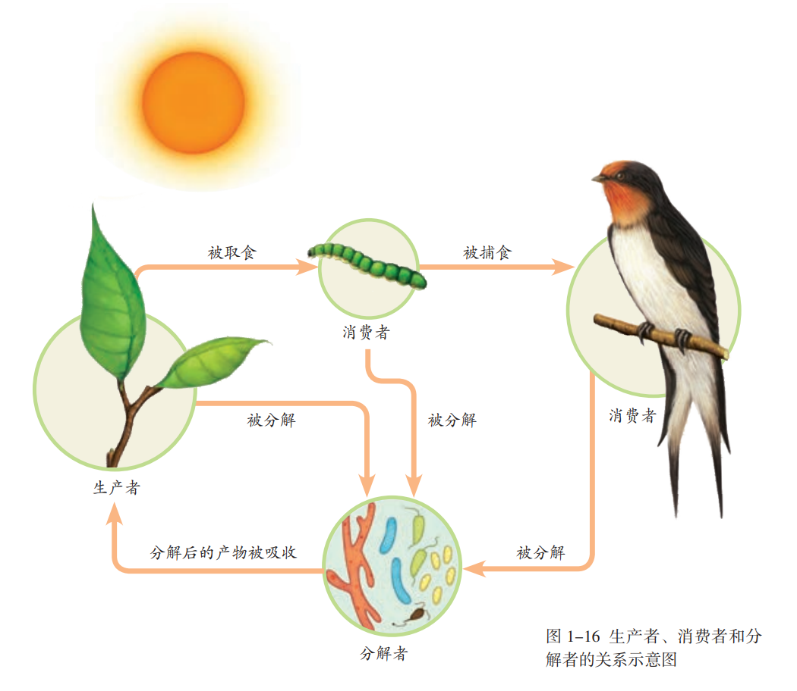

- 植物：生产者（制造有机物）
- 动物：消费者（不能自己制造有机物，直接或间接地以植物为食）
- 细菌和真菌：分解者（分解有机物）

###### 4.生态系统的自动调节能力

- 体现：在一般情况下，生态系统中各种生物的数量和所占的比例是相对稳定的

- 生态系统的成分越复杂，其自动调节能力就越强

- 限度：生态系统具有一定的自动调节能力，但这种调节能力是有一定限度的。如果外界干扰超过了这个限度，生态系统就会遭到破坏。

##### 二、食物链和食物网

###### 1.概念

- 食物链：在生态系统中，不同生物之间由于吃与被吃的关系而形成的链状结构
    - 起始环节：生产者
    - 箭头指向捕食者

- 食物网：在一个生态系统中，往往有很多条食物链，它们彼此交错连接，形成食物网

###### 2. 现象

- 生态系统中的物质和能量沿着食物链和食物网流动
- 富集：有毒物质可能会通过食物链不断积累，危害生态系统中的许多生物，最终威胁人类自身

#### 第3节 生物圈是最大的生态系统

##### 一、生物圈

###### 1. 范围

- 大气圈的底部、水圈的大部、岩石圈的表面

###### 2. 种类

- 草原生态系统：在水土保持和防风固沙等方面起着重要的作用
- 湿地生态系统：具有净化水质、蓄洪抗旱的作用，有“地球之肾”之称
- 海洋生态系统：辽阔的海平面能吸收大量二氧化碳，海洋中植物每年制造的氧气占地球每年产生氧气总量的 $70\%$
- 森林生态系统：在涵养水源、保持水土、防风固沙、调节气候、净化空气等方面起着重要作用，有“绿色水库”、“地球之肺”之称
- 淡水生态系统：不仅为人类提供饮用、灌溉及工业用水的水源，在调节气候等方面也有重要的作用
- 农田生态系统：抵抗旱、涝或病虫害的能力较差，需要在栽培和管理中投入大量的人力物力
- 城市生态系统：人类起着重要的支配作用；排放的污水、废气和固体废弃物多，容易产生环境问题

###### 3. 生物圈是一个统一的整体

- 生物圈是一个统一的整体，是地球上最大的生态系统，是所有生物共同的家园

## 第二单元 生物体的结构层次

### 第一章 细胞是生命活动的基本单位

#### 第1节 练习使用显微镜

#### 第2节 植物细胞 & 第3节动物细胞

##### 一、动物细胞和植物细胞

###### 1. 结构模式图

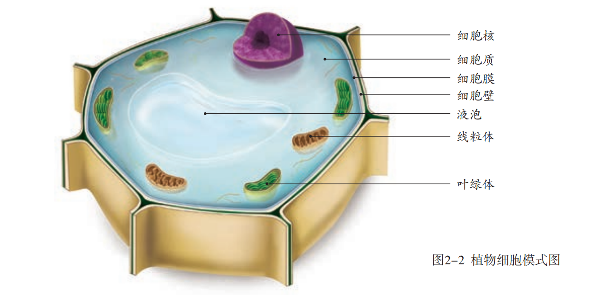
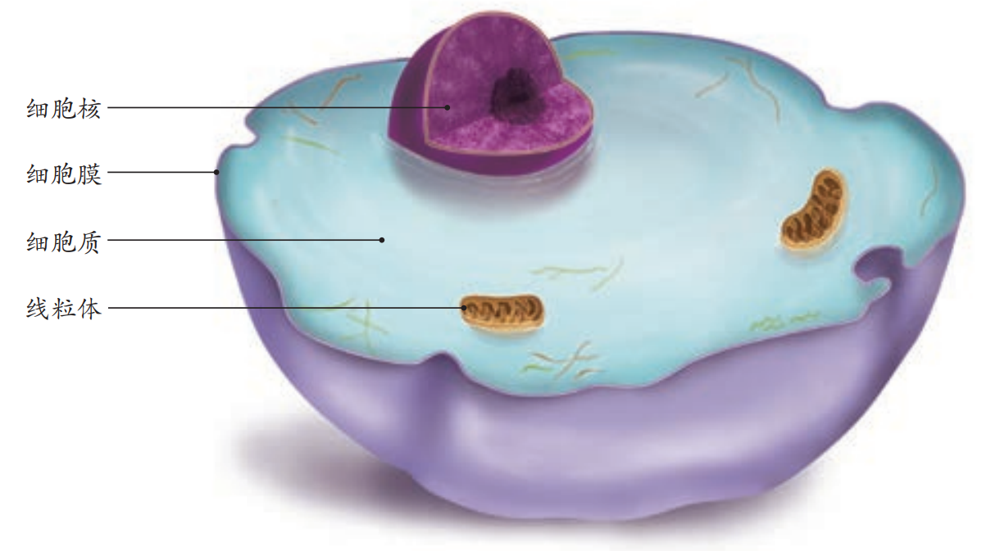

###### 2. 结构的异同

- 相同点：都有细胞核、线粒体、细胞膜
- 不同点：植物细胞有细胞壁、液泡、叶绿体；动物细胞没有

#### 第4节 细胞的生活

> 细胞的生活是物质、能量和信息变化的统一

##### 一、细胞中物质的分类

- 无机物：一般不含碳，分子较小；如：水、氧、无机盐
- 有机物：一般含碳，分子较大；如：糖类、脂质、蛋白质、核酸

##### 二、细胞各部分的功能

>  若不特殊标注即为植物细胞、动物细胞都有

$$
细胞
\begin{cases}
    \text{细胞壁（植物特有）：保护和支持细胞}\\
    \text{细胞膜：分隔细胞，控制物质的进出（选择透过性）}\\
    细胞质
    \begin{cases}
    	细胞器
    	\begin{cases}
    	\left. \begin{array}{lll}
    	\text{线粒体：呼吸作用，将有机物中的化学能释放出来，供细胞利用}	\\
    	\text{叶绿体（植物的叶肉、幼嫩的茎特有）：光合作用，光能} \to \text{化学能，} \text{二氧化碳、水} \to 有机物
    	\end{array} \right\} 细胞中的能量转换器\\
    	\text{液泡（成熟植物细胞特有）：充满细胞液，溶解多种物质，含有许多营养物质}
    	\end{cases}\\
    	其它
    \end{cases} \\
    \text{细胞核：含有遗传物质（DNA），控制生物的发育和遗传}
\end{cases}
$$

##### 三、细胞是构成生物体的基本单位

### 第三章 细胞怎么构成生命体

#### 第1节 细胞通过分裂产生新细胞

##### 一、染色体

- 染色体由 DNA 和蛋白质两种物质组成
- DNA 是遗传物质，染色体就是遗传物质的载体

##### 二、细胞的生长、分裂、分化

>  生物体由小长大，是与细胞的生长、分裂、分化分不开的
>
>  多细胞生物体通过细胞分裂增加细胞数目，经过细胞生长和分化形成生物体内多种多样的细胞

###### 1. 细胞的生长

- 概念：构成生物体的细胞要不断从周围环境中吸收营养物质，并且转变成组成自身的物质，体积会由小变大
- 限度：细胞不能无限制地长大，一部分细胞长到一定的大小，就会进行分裂

###### 2. 细胞的分裂

- 概念：一个细胞分成两个细胞

- 过程：

    1. 细胞核先由一个分成两个
    2. 细胞质分成两份，每份各含有一个细胞核
        - 如果是动物细胞，细胞膜从细胞的中部向内凹陷，缢裂为两个细胞
        - 若是植物细胞则在原来的细胞中央，形成新的细胞膜和新的细胞壁

    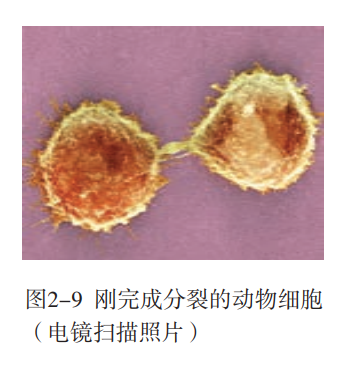

    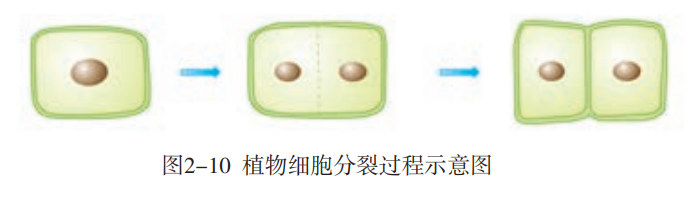

- 分裂过程中的染色体变化

    - 在细胞分裂时，染色体会进行复制；细胞分裂过程中，染色体均分成完全相同的两份，分别进入两个新细胞中
    - 两个新细胞的染色体形态和数目相同，新细胞与原细胞的染色体形态和数目也相同；新细胞与原细胞所含的遗传物质是一样的

###### 3. 细胞的分化

> 3、4应该是第2节内容，移至此处

- 在个体发育过程中，一个或一种细胞通过分裂产生的后代，在形态、结构和生理功能上发生差异性的变化

###### 4. 组织、器官、系统

- 组织：形态相似，结构、功能相同的细胞联合在一起形成的细胞群
- 器官：由不同的组织按照一定的次序结合在一起构成的行使一定功能的结构
- 系统：能够共同完成一种或几种生理功能的多个器官按照一定的次序组合在一起，构成系统

#### 第2节 动物体的结构层次

##### 一、动物体的结构层次

- 细胞 $\to$ 组织 $\to$ 器官 $\to$ 系统 $\to$ 动物体

##### 二、人体的组织、系统

- 人体的基本组织：上皮组织、肌肉组织、结缔组织、神经组织
- 人体的系统：消化系统、运动系统、呼吸系统、循环系统、泌尿系统、神经系统、内分泌系统、生殖系统

#### 第3节 植物体的结构层次

##### 一、植物体的结构层次

- 细胞 $\to$ 组织 $\to$ 器官 $\to$ 植物体

##### 二、植物体的组织、器官

###### 1. 植物的主要组织

| 组织     | 特点                                                         | 分布位置                 | 基本功能                                 |
| -------- | ------------------------------------------------------------ | ------------------------ | ---------------------------------------- |
| 分生组织 | 细胞小，细胞壁薄，细胞核大，细胞质浓，分裂能力强，细胞结合紧密 | 根尖、芽、子房等幼嫩部位 | 通过分裂和分化，形成组织                 |
| 保护组织 | 细胞结合紧密，胞间物质少                                     | 植物体表面               | 保护内部荣嫩部分                         |
| 机械组织 | 细胞壁增厚                                                   | 伴随输导组织分布         | 支撑和保护                               |
| 输导组织 | 由导管或筛管连接而成<br>导管腔贯通，筛管腔有筛板             | 贯穿在植物体中           | 导管向上运输水和无机盐<br>筛管运输有机物 |
| 营养组织 | 细胞壁薄，液泡较大，细胞质发达，胞间物质多，有的含叶绿体     | 植物体内广泛分布         | 储藏营养物质                             |

###### 2. 绿色开花植物的六大器官

> 注意只是通常情况，并不是所有

- 营养器官：根、茎、叶
- 生殖器官：花、果实、种子

#### 第4节 单细胞生物

>  大多数单细胞生物生活在水域或湿润的环境中，有些寄生在其他生物体上

##### 一、草履虫的结构和生活

>  单细胞生物种类繁多，结构和生活方式差异很大。以草履虫为例

###### 1. 草履虫的结构及其功能

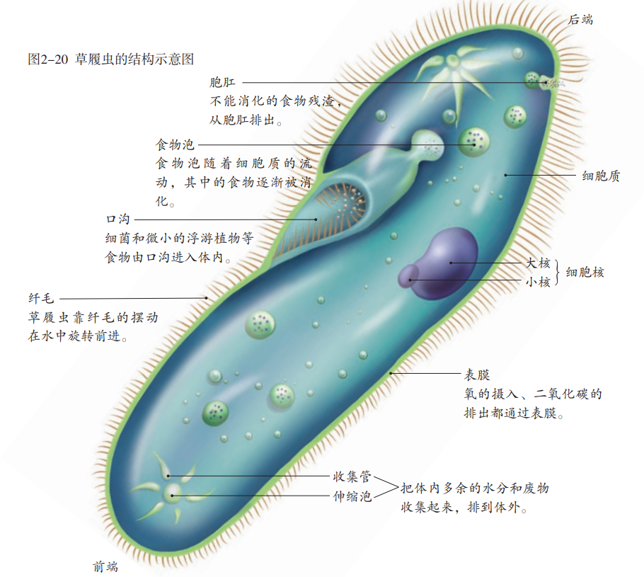

###### 2. 草履虫的生活

- 不停地游来游去
- 身体前端遇到阻碍时，会采取后退的方式，改变方向后，再试探着前进，直到避开阻挡物
- 通过分裂产生新的个体

##### 二、单细胞生物与人类的关系

###### 1. 有利

- 作鱼类饵料：水域中的浮游生物，有许多是单细胞生物，是鱼类的天然饵料
- 净化污水：草履虫对污水净化有一定作用

###### 2. 有害

- 侵入人体：疟原虫、痢疾内变形虫等，能侵入人体，危害健康
- 危害渔业：海水中某些单细胞生物大量繁殖时可形成赤潮，危害渔业

## 第三单元 生物圈中的绿色植物

### 第一章 生物圈中有哪些绿色植物

#### 第1节 藻类、苔藓和蕨类植物——孢子植物

| 植物种类 | 生活环境                               | 形态结构特点                                                 | 与人类关系                                                   | 举例                                             |
| -------- | -------------------------------------- | ------------------------------------------------------------ | ------------------------------------------------------------ | ------------------------------------------------ |
| 藻类植物 | 大多数水生，<br>少数生活在潮湿的陆地上 | 结构简单，没有根、茎、叶的分化<br>孢子繁殖                   | 光合作用释放氧气<br>制造有机物，为鱼类提供食物<br>食用、药用、工业原料 | 淡水生：水绵、衣藻<br>海洋生：紫菜、海带、裙带菜 |
| 苔藓植物 | 大多生活在陆地潮湿处                   | 一般很矮小<br>通常具有类似茎、叶的分化<br>茎中没有导管，叶片没有叶脉（无输导组织）<br>根非常简单，称为假根<br>许多苔藓植物的叶片只有一层细胞<br>孢子繁殖 | 促进岩石分解，形成土壤<br>监测空气污染程度<br>形成泥炭，作燃料 | 墙藓、葫芦藓                                     |
| 蕨类植物 | 阴湿的陆地上                           | 有根、茎、叶的分化<br>有疏导组织<br>叶片背面有褐色隆起——孢子囊群<br>孢子繁殖 | 食用、药用、绿化<br>作饲料、肥料<br>远古蕨类植物形成煤炭     | 里白、铁线蕨、鳞毛蕨、肾蕨                       |

#### 第2节 种子植物

##### 一、种子植物

###### 1. 概念

- 能结种子的植物

###### 2. 分类

| 类型                     | 形态结构特点     | 生活环境                           | 举例                                 |
| ------------------------ | ---------------- | ---------------------------------- | ------------------------------------ |
| 裸子植物                 | 种子裸露         | 陆地，能在干旱和土壤贫瘠的地方生长 | 苏铁、银杏、红豆杉、水杉、圆柏、侧柏 |
| 被子植物（绿色开花植物） | 种子外有果皮包被 | 陆地，分布最广泛，适应多种环境     | 椰子、毛白杨、桃、水稻、葡萄、菊     |

###### 3. 与人类的关系

- 工业原料、药用……

##### 二、种子的结构

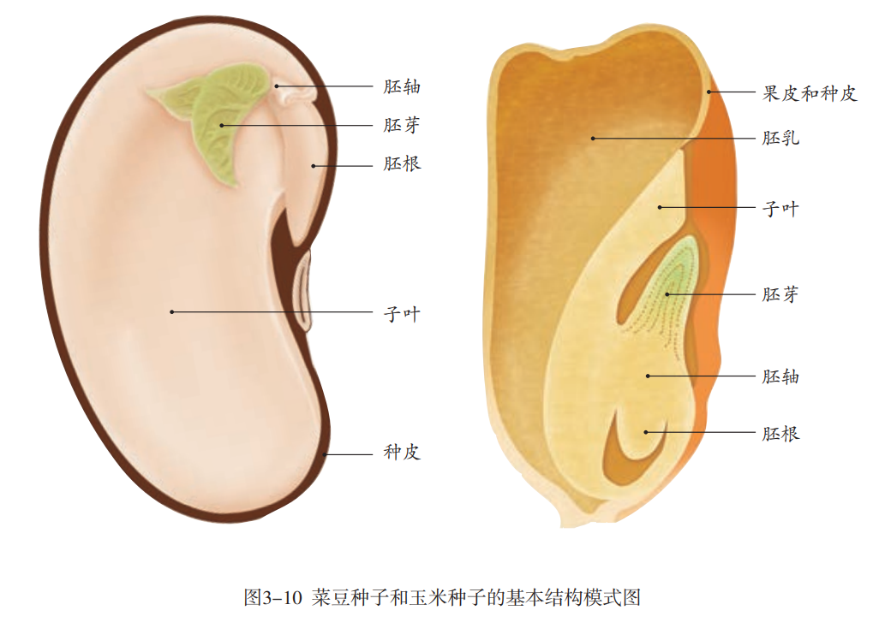

###### 1. 基本结构及功能

- 种皮：保护胚
- 胚：新植物的个体，由胚芽、胚轴、胚根、子叶组成
- 子叶或胚乳：含有丰富的淀粉等营养物质，供给胚发育成幼苗

###### 2. 分类

| 植物       | 种子结构相同点 | 种子结构不同点                              | 举例                                       |
| ---------- | -------------- | ------------------------------------------- | ------------------------------------------ |
| 双子叶植物 | 有种皮和胚     | 有 $2$ 片子叶；无胚乳，营养物质储存在子叶中 | 菜豆、花生、开心果、腰果、核桃、红豆、黄豆 |
| 单子叶植物 |                | 有 $1$ 片子叶；有胚乳，营养物质储存在胚乳中 | 玉米、高粱、小麦、竹子、葱、蒜、山药       |

### 第二章 被子植物的一生

#### 第1节 种子的萌发

##### 一、种子萌发的条件

###### 1. 环境条件

- 适宜的温度
- 一定的水分
- 充足的空气

###### 2. 自身条件

- 活着
- 胚完整
- 发育成熟
- 不在休眠期

##### 二、种子萌发的过程

1. 吸水膨胀
2. 转运营养：子叶或胚乳中的营养物质逐渐转运给胚根、胚芽、胚轴
3. 胚根发育：胚根发育，突破种皮，形成根
4. 胚轴、胚芽发育：胚轴伸长；胚芽发育成芽，芽进一步发育成茎和叶

#### 第2节 植株的生长

##### 一、幼根的生长

###### 1. 根尖

- 概念：从根的顶端到生有根毛的一小段
- 意义：是幼根生长最快的部位，对植株的生长非常重要

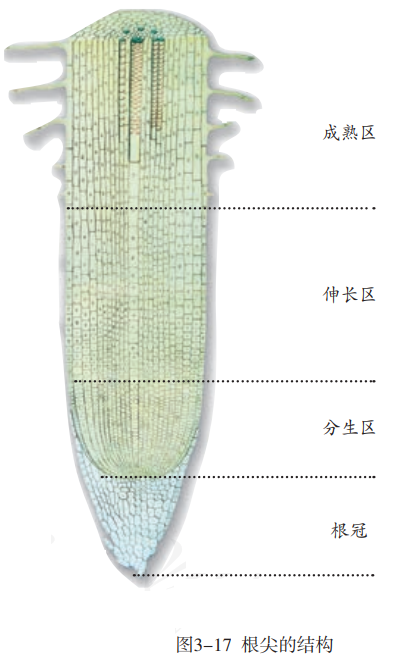

- 结构：包括成熟区、伸长区、分生区、根冠四部分

###### 2. 幼根的生长

| 结构   | 特点                                                     | 作用                                         |
| ------ | -------------------------------------------------------- | -------------------------------------------- |
| 根冠   | 细胞比较大，排列不够整齐                                 | 保护                                         |
| 分生区 | 细胞很小，排列紧密                                       | 通过分裂产生新细胞，不断扩充伸长区的细胞数量 |
| 伸长区 | 下部细胞较小，越往上细胞越大，最后成为成熟区细胞的一部分 |                                              |
| 成熟区 | 表皮细胞一部分向外突出，形成根毛                         | 吸收水和无机盐                               |

- 幼根的生长一方面要靠分生区细胞的分裂增加细胞的数量；另一方面要靠伸长区细胞的体积的增大

##### 二、枝条是由芽发育而成的

###### 1. 芽的分类

- 顶芽：着生在主干顶端或侧枝顶端的芽
- 侧芽：着生在主干侧面或侧枝侧面的芽

###### 2. 芽的发育

- 芽在发育时，分生组织的细胞分裂和分化，形成新的枝条

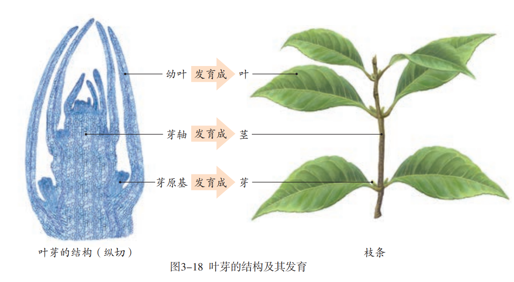

（书上小字）形成层（分生组织）$\to$  茎的加粗生长

##### 三、植株的生长需要营养物质

###### 1. 植株生长需要的营养物质

- 水、无机盐：根向下伸长，从土壤中吸收
- 有机物：茎向上生长，并长出绿叶，通过光合作用制造

|      | 运输物质   | 位置   | 特点                                                         | 细胞死活 |
| ---- | ---------- | ------ | ------------------------------------------------------------ | -------- |
| 导管 | 水、无机盐 | 木质部 | 细胞长，呈管状，没有细胞质和细胞核，上下细胞间的细胞壁消失，形成中空管道（见 3.3） | 死       |
| 筛管 | 有机物     | 韧皮部 | 两细胞间有筛板                                               | 活       |

###### 2. 无机盐

> 植物生长需要量最多的是含氮的、含磷的和含钾的无机盐
>
> 植物生长的不同时期，需要无机盐的量是不同的

- 缺氮：植株矮小瘦弱，叶片发黄
- 缺磷：植株特别矮小，叶片呈暗绿色，并出现紫色
- 缺钾：植株的茎秆软弱，容易倒伏，叶片边缘和尖端呈褐色，并逐渐焦枯

#### 第3节 开花和结果

##### 一、花的结构

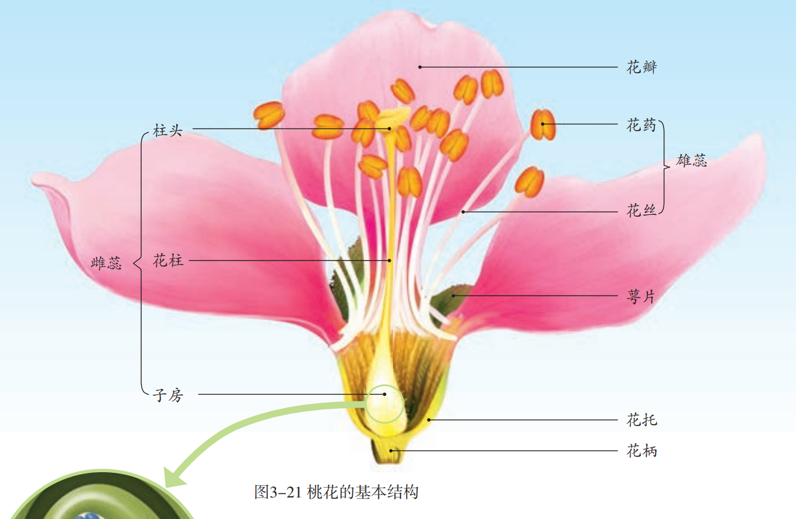
$$
花
\begin{cases}
    \text{花柄}\\
    \text{花托}\\
    \text{萼片}\\
    \text{花瓣}\\
    雄蕊
    \begin{cases}
    	\text{花药} \to \text{花粉} \\
    	\text{花丝}
    \end{cases}\\
    雌蕊
    \begin{cases}
    	\text{柱头} \\
    	\text{花柱} \\
    	子房
    	\begin{cases}
    		子房壁 \\
    		胚珠
    	\end{cases}
    \end{cases}
\end{cases}
$$


- 花的主要结构是雄蕊和雌蕊，雄蕊花药里面有花粉，雌蕊下部的子房里有胚珠

##### 二、绿色植物的有性生殖过程

> 四个过程：开花 $\to$ 传粉 $\to$ 受精 $\to$  果实与种子的形成

###### 1. 传粉

- 花药成熟后会自然裂开，散放出花粉
- 花粉从花药中散放而落到雌蕊柱头上的过程，称为**传粉**
- 传播方式
    - 自花传粉：一朵花的花粉，从花药散放出以后，落到同一朵花的柱头上的传粉现象
    - 异花传粉：花粉依靠外力落到另一朵花的柱头上的传粉方式
        - 虫媒：花大、颜色艳丽、有香味
        - 风媒：花粉多而轻

##### 2. 受精

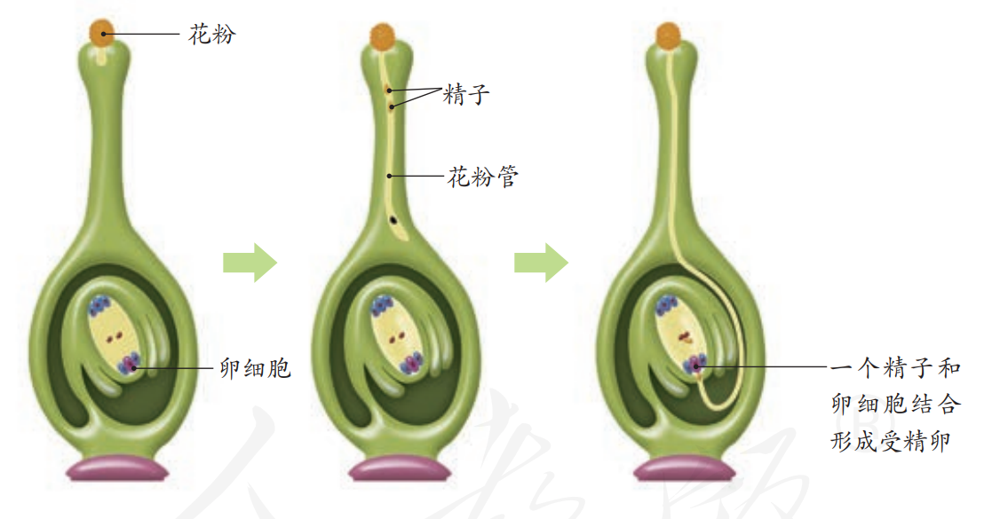

- 花粉落到柱头上以后，在柱头上黏液的刺激下开始萌发，长出花粉管
- 花粉管穿过花柱，进入子房，一直到达胚珠
- 花粉管中的精子随着花粉管的伸长而向下移动，最终进入胚珠内部
- 胚珠里面的卵细胞，与来自花粉管中的精子结合，形成受精卵的过程，称为**受精**

###### 3. 果实与种子的形成

$$
子房
\left\{\begin{array}{mmm}
\text{子房壁} \to \text{果皮}\\
胚珠
\left\{\begin{array}{mmm}
\text{珠被} \to \text{种皮} \\
\text{卵细胞} \times \text{精子} \to \text{受精卵} \to \text{胚} \\
\text{极核（2个）} \times \text{精子} \to \text{受精极核} \to \text{胚乳}
\end{array} \right\}种子
\end{array} \right\}果实
$$

- 受精完成后，除子房外的结构纷纷掉落

### 第三章 绿色植物与生物圈的水循环

##### 一、植物对水分的吸收和运输

- 吸收：吸收水的主要部位是根尖的成熟区
- 运输：土壤 $\to$ 根尖成熟区的根毛 $\to$ 根中导管 $\to$ 茎中导管 $\to$ 叶中导管 $\to$ 叶表皮的气孔 $\to$ 空气 ==（存疑）==
- 导管：向上运输水和无机盐
    - 由许多长形、管状的细胞所组成
    - 这些细胞没有细胞质和细胞核，上下细胞间的细胞壁已经消失，形成了一根中空的管道

##### 二、植物的蒸腾作用

###### 1. 蒸腾作用

- 水分从活的植物体表面以水蒸气状态散失到大气中的过程，叫做**蒸腾作用**

###### 2. 叶片的结构

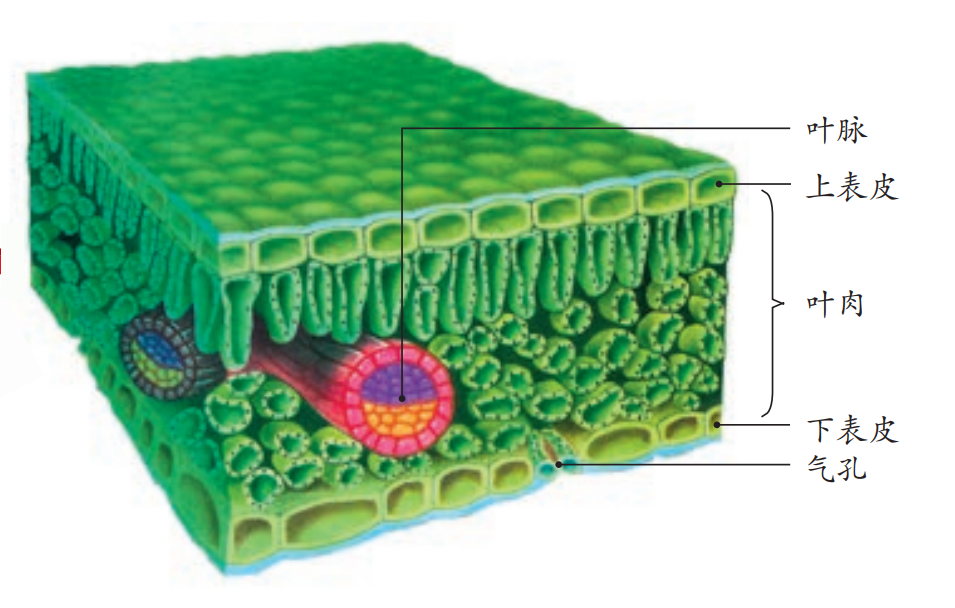

- 叶片由表皮、叶肉、叶脉三部分组成

###### 3. 气孔

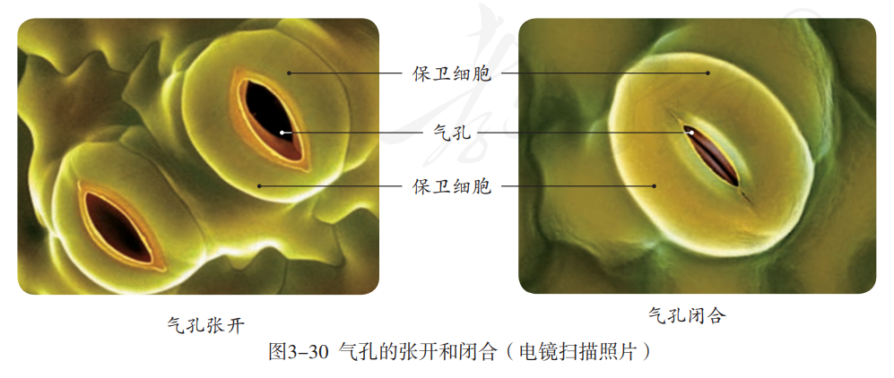

- 气孔分布在叶片的表皮上
- 气孔是植物蒸腾作用的“门户”，也是气体交换的“窗口”
    - 白天气孔张开，空气进入气孔，水分通过气孔散失
    - 晚上叶片的生产活动停止，大多数气孔缩小或闭合，蒸腾作用减弱
- 气孔是由一对半月形的细胞—— 保卫细胞围成的空腔
    - 保卫细胞内侧细胞壁厚，外侧细胞壁薄
    - 保卫细胞吸水时，气孔张开
    - 保卫细胞失水时，气孔闭合

###### 4. 植物蒸腾作用的意义

- 拉动水分与无机盐在体内的运输
- 降低叶片表面的温度，避免植物被灼伤
- 提高大气湿度，增加降水，促进生物圈的水循环

### 第四章 绿色植物是生物圈中有机物的制造者

##### 一、实验：绿叶在光下制造有机物

###### 1. 目的

- 检验绿叶在光下制造的有机物是不是淀粉
- 探究光是不是绿叶制造有机物不可缺少的条件

###### 2. 步骤

1. 暗处理：把植物提前放在黑暗中一昼夜
    - 把叶中原有的淀粉全部消耗、转运
2. 用黑纸片把叶片的一部分从上下两面遮盖起来，然后移到阳光下照射
3. 几小时以后，摘下叶片，去掉遮光的纸片
4. 脱色：把叶片放入盛有酒精的小烧杯中，水浴加热，使叶片含有的叶绿素溶解到酒精中，叶片变成黄白色
    - 脱色，溶解叶片中的叶绿素便于观察
5. 染色：用清水漂洗叶片，再把叶片放到培养皿里，向叶片滴加碘液

###### 3. 结论

- 叶片的见光部分变成蓝色 $\Rightarrow$ 产生淀粉 $\Rightarrow$ **淀粉是光合作用的产物**
- 叶片的见光部分产生了淀粉，不见光部分没有产生淀粉 $\Rightarrow$ **光是绿色植物制造有机物不可缺少的产物**

##### 二、光合作用

###### 1. 概念

- 绿色植物通过叶绿素捕获太阳光，利用**光**提供的能量，在**叶绿体**中合成**淀粉等有机物**，并且把**光能转变为化学能**，**储存在有机物**中的过程

###### 2. 过程

- $\ce{二氧化碳 + 水 ->[光能][叶绿体]} 有机物{\small(储存着能量)} + 氧气$

###### 3. 实质

- 合成有机物，储存能量

###### 4. 意义

- 满足自身生长、发育、繁殖的需要：为细胞的生命活动提供能量，参与构建植物细胞，进而构成各种组织、器官，直至整个植物体
- 给其他生物提供了生命活动的能量：为生物圈中的其他生物提供了基本的食物来源

###### 5. 在农业生产上的应用

- 合理密植；提升二氧化碳浓度；适当延长光照时间

### 第五章 绿色植物与生物圈中的碳-氧平衡

#### 第1节 光合作用吸收二氧化碳释放氧气

> 移至上一章光合作用处

#### 第2节 绿色植物的呼吸作用

##### 一、呼吸作用

###### 1. 概念

- 细胞**利用氧**，将有机物分解成**二氧化碳和水**，并且将**储存在有机物中的能量**释放出来，供给生命活动的需要的过程

###### 2. 过程

- $\ce{有机物{\small(储存着能量)} + 氧气 -> 二氧化碳 + 水 + 能量}$​
- 主要在线粒体内进行

###### 3. 实质

- 分解有机物，释放能量

###### 4. 与生产生活的关系

- 农田适时松土，遇到涝害时排水，都是为了使植物的根得到充分的氧气，保证呼吸作用的正常进行
- 贮藏粮食时，保持干燥和低温；贮藏水果、 蔬菜时，降低温度或氧浓度，降低呼吸作用的强度，减少有机物消耗

##### 二、绿色植物维持生物圈碳—氧平衡

- 绿色植物通过光合作用，不断消耗大气中的**二氧化碳**，又将**氧气**排放到大气中，对维持生物圈中**碳—氧平衡**（二氧化碳和氧气的相对平衡）起了重要作用

## 第四单元 生物圈中的人

### 第一章 人的由来

#### 第1节 人类的起源和发展

##### 一、森林古猿

###### 1. 人与类人猿的相似特征

- 外部形态、身体结构、面部表情、行为表现、氨基酸特征、基因特征……

###### 2. 人与类人猿的区别

| 物种       | 运动方式                   | 制造工具的能力                           | 脑发育程度              |
| ---------- | -------------------------- | ---------------------------------------- | ----------------------- |
| 人类       | ==直立行走==               | 可以==制造工具（根本）==                 | 脑容量较大（$1200$ mL） |
| 现代类人猿 | 攀援，半直立行走，靠臂行走 | 可以==使用==自然工具，但一般不会制造工具 | 脑容量较小（$400$ mL）  |

###### 3. 森林古猿

- 现代类人猿和人类的共同祖先
- 距今 $1200$ 多万年前，广泛分布于非洲、亚洲、欧洲地区
    - 直接证据：化石

##### 二、进化历程

森林古猿 $\large \xrightarrow[外因]{自然条件改变,雨林转草原}$ 下地生活 $\large \xrightarrow[内因]{自身形态结构的变化}$ ==直立行走== $\to$ ==制造和使用工具== $\to$ 使用火 $\to$ 大脑发达 $\to$ 产生语言 $\to$ 现代人类

#### 第2节 人的生殖

##### 一、生殖系统

###### 1. 男性生殖系统

| 结构     | 功能                       |
| -------- | -------------------------- |
| ==睾丸== | ==产生精子，分泌雄性激素== |
| 附睾     | 贮存和输送精子             |
| 阴囊     | 保护睾丸和附睾             |
| 输精管   | 输送精子                   |
| 精囊腺   | 分泌黏液                   |
| 前列腺   | 分泌黏液                   |
| 尿道     | 排出精液和尿液             |
| 阴茎     |                            |

###### 2. 女性生殖系统

> 注意：==“卵细胞”==不是“卵子”

| 结构     | 功能                         |
| -------- | ---------------------------- |
| ==卵巢== | ==产生卵细胞，分泌雌性激素== |
| 输卵管   | 输送卵细胞                   |
| 子宫     | 胚胎发育的场所               |
| 阴道     | 精子进入和胎儿产出的通道     |

##### 二、生殖过程

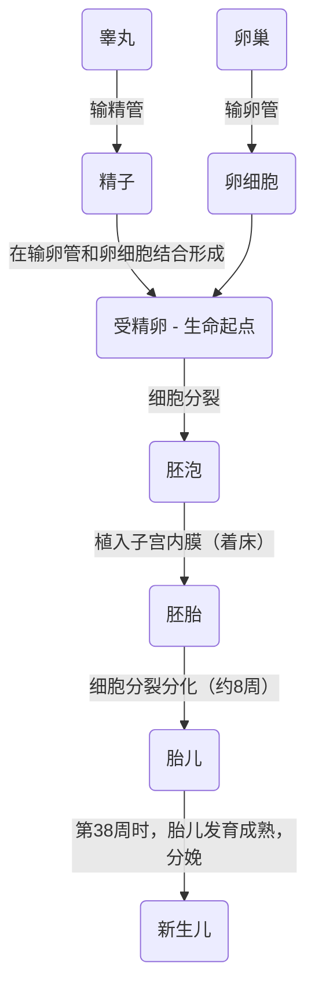
```mermaid
graph TD
    gaowan(睾丸) --输精管--> jingzi(精子)
    luanchao(卵巢) --输卵管--> luanxibao(卵细胞)
    jingzi --在输卵管和卵细胞结合形成--> shoujingluan(受精卵 - 生命起点)
    luanxibao --> shoujingluan
    shoujingluan --细胞分裂--> peipao(胚泡)
    peipao --植入子宫内膜（着床）--> peitai(胚胎)
    peitai --细胞分裂分化（约8周）--> taier(胎儿)
    taier --第38周时，胎儿发育成熟，分娩--> xinshenger(新生儿)
```

1. 受精
    - 精子 $\to$ 阴道 $\to$ 子宫 $\to$ ==输卵管== $\leftarrow$ 卵细胞

2. 着床
    - 受精卵 $\large \xrightarrow[输卵管]{细胞分裂}$ 胚泡 $\large \xrightarrow{植入子宫内膜}$ 胚胎 $\large \xrightarrow{分裂、分化(8周)}$ 胎儿

3. 胚胎发育
    - 场所：子宫的羊水中
    - 物质通道：==胎盘==、脐带
    - 母体 $\large \xrightleftharpoons[二氧化碳等废物]{营养物质和氧}$ 胎儿
4. 分娩
    - 第 $38$ 周时，胎儿发育成熟
    - 分娩：成熟的胎儿和胎盘从母体的阴道产出

#### 第3节 青春期

##### 一、认识青春期

##### 二、青春期的身体变化

- 身高突增
- 男孩和女孩的体形开始发生变化，区别也越来越明显
- 神经系统以及心脏和肺等器官的功能明显增强
- 身体发育和智力发展的黄金时期
- ==性器官/第二性征 迅速发育==，会发生一些生理现象
    - 男孩：遗精
    - 女孩：月经

##### 三、青春期的心理变化

### 第二章 人体的营养

#### 第1节 食物中的营养物质

##### 一、能源物质

1. 糖类：==主要的直接供能物质==
    - 也是构成细胞的重要成分
2. 脂肪：==备用能源物质==
    - 参与构成细胞膜
    - 其他功能：保暖、缓冲
3. 蛋白质：==建造和修复身体的重要原料==
    - 构成人体细胞的基本物质
    - 促进人体的生长以及受损细胞的修复和更新

| 营养物质 | 作用                     | 食物来源         |
| -------- | ------------------------ | ---------------- |
| 糖类     | 人体内主要能源物质       | 米饭、馒头等     |
| 脂肪     | 重要的备用能源物质       | 肥肉、花生等     |
| 蛋白质   | 建造和修复身体的重要原料 | 奶、蛋、鱼、肉等 |

##### 二、非能源物质

1. 水

    - 占体重的 $60\% \sim 70\%$
    - 人体内的营养物质以及尿素等废物，只有溶解在水中才能运输

2. 无机盐

    | 营养物质   | 缺乏时症状           | 食物来源     |
    | ---------- | -------------------- | ------------ |
    | 含钙无机盐 | 佝偻病、骨质疏松症   | 虾、蛋、奶等 |
    | 含铁无机盐 | 缺铁性贫血           | 菠菜、瘦肉等 |
    | 含碘无机盐 | 甲状腺肿（大脖子病） | 海带、紫菜等 |

3. 维生素 - 夜盲 A，脚气 B，坏血 C，佝偻 D。

    | 营养物质   | 缺乏时症状                 | 食物来源               |
    | ---------- | -------------------------- | ---------------------- |
    | 维生素A    | 皮肤粗糙、干眼症、夜盲症   | 肝脏、黄色玉米、胡萝卜 |
    | 维生素B~1~ | 消化不良、食欲不振、脚气病 | 猪肉、谷物等           |
    | 维生素C    | 抵抗力低下、坏血病         | 新鲜水果蔬菜           |
    | 维生素D    | 佝偻病、骨质疏松症         | 肝脏、蛋、奶等         |

**三、膳食纤维**（+1）

- 主要成分：纤维素
- 不能被人体消化吸收，不能为人体提供能量
- ==能促进胃肠的蠕动和排空==

#### 第2节 消化和吸收

##### 一、消化

###### 1. 概念

- 食物在消化道内分解成可以被细胞吸收的物质

###### 2. 消化系统的构成

- 消化道：口腔、咽、食道、胃、小肠、大肠、肛门
- 消化腺：唾液腺、肝脏、胃腺、胰腺、肠腺
    - 唾液腺、肝脏、胰腺在消化道外

| 消化道   | 功能               | 消化腺       | 消化液 | 消化酶     | 消化的物质           |
| -------- | ------------------ | ------------ | ------ | ---------- | -------------------- |
| 口腔     | 咀嚼搅拌、初步消化 | 唾液腺       | 唾液   | 唾液淀粉酶 | 淀粉（分解为麦芽糖） |
| 咽、食道 | 食物通道           |              |        |            |                      |
| 胃       | 蠕动搅拌、初步消化 | 胃腺         | 胃液   | 胃蛋白酶   | 蛋白质（分解为多肽） |
|          |                    | 肝脏（最大） | 胆汁   | 不含酶     | 分解脂肪为脂肪微粒   |
|          |                    | 胰腺         | 胰液   | 各种酶     | 各种物质             |
| 小肠     | 蠕动、消化、吸收   | 肠腺         | 肠液   | 各种酶     | 各种物质             |
| 大肠     | 蠕动、排出食物残渣 |              |        |            |                      |
| 肛门     | 食物残渣的出口     |              |        |            |                      |

###### 3. 营养物质的消化

- 淀粉：淀粉 $\large \xrightarrow[口腔]{唾液} \xrightarrow[小肠]{肠液、胰液}$ 麦芽糖 $\large \xrightarrow[小肠]{肠液、胰液}$ 葡萄糖
- 脂肪：脂肪 $\large \xrightarrow[小肠]{胆汁(乳化)}$ 脂肪微粒 $\large \xrightarrow[小肠]{肠液、胰液}$ 脂肪酸 + 甘油
- 蛋白质：蛋白质 $\large \xrightarrow[胃]{胃液}$ 多肽 $\large \xrightarrow[小肠]{肠液、胰液}$ 氨基酸

##### 二、吸收

###### 1. 概念

- 营养物质通过消化道进入循环系统的过程

###### 2. 各器官吸收的物质

- 胃：少量的水、酒精（非营养）
- 小肠（主要场所）：葡萄糖、氨基酸、甘油、大部分水、无机盐和维生素
- 大肠：少量水、无机盐和一部分维生素

##### ==三、小肠利于消化和吸收的特点==

###### 1. 利于消化 & 吸收的特点

- 长达 $5 \sim 6$ 米
- 内表面有皱襞
- 皱襞上有小肠绒毛（内表面积大）

###### 2. 利于消化的特点

- 有多种消化液

###### 3. 利于吸收的特点

- 小肠绒毛壁薄，由一层上皮细胞构成
- 有丰富的毛细血管

### 第三章 人体的呼吸

#### 第1节 呼吸道对空气的处理

##### 一、呼吸系统的组成

$$
呼吸系统
\begin{cases}
呼吸道(气体的通道) 
\begin{cases}
鼻 \\
咽 \\
喉 \\
气管 \\
支气管 
\end{cases} \\\\
肺(发生气体交换的场所)
\end{cases}
$$

##### 二、呼吸道的作用（结构和功能相适应）

1. ==保证气体顺畅通过==
    - 呼吸道都有骨或软骨做支架


2. 处理吸入的气体，使之==温暖、湿润、清洁==

    - 鼻腔前部有鼻毛，气管和支气管有纤毛 —— 清洁

    - 鼻腔和气管内有黏液 —— 湿润、清洁
        - 气管黏膜生成痰，有纤毛向咽摆动送出

    - 鼻腔内有丰富的毛细血管，气管黏膜上也有毛细血管 —— 温暖


##### 三、吞咽与呼吸的关系

- 呼吸时，喉口开放，空气进入气管
- 吞咽时，==会厌软骨==盖住喉口，以免食物进入气管
- 吃饭时不要说话（会噎到）

##### 四、发音与声带

- 声音由喉部的声带发出
- 呼吸时，两条声带是分开的
- 两条声带拉紧时，声带中间的空隙缩小，呼出气流振动声带，发出声音

#### 第2节 发生在肺内的气体交换

##### 一、肺的结构与位置

- 肺位于胸腔内
- 左右各有一个肺，==左肺有 2 叶，右肺有 3 叶==
- 胸廓：肋骨、胸骨、胸椎围成胸廓
- 胸腔：胸廓和膈围成胸腔
- 呼吸肌：肋间肌、膈肌

##### 二、肺与外界的气体交换（呼吸运动）

呼吸肌收缩 $\Rightarrow$ 胸廓体积变大 $\Rightarrow$ 肺容积变大 $\Rightarrow$ 气压减小 $\Rightarrow$ 吸气

呼吸肌舒张 $\Rightarrow$ 胸廓体积变小 $\Rightarrow$ 肺容积变小 $\Rightarrow$ 气压增大 $\Rightarrow$ 呼气

##### 三、肺泡与血液的气体交换

###### 1. ==肺泡适于气体交换的特点==

- 肺泡数量多，表面积大
- 有丰富的毛细血管
- 肺泡壁、毛细血管壁薄（一层上皮细胞）

###### 2. 发生的气体交换

外界 $\large \xrightleftharpoons[CO_2]{O_2}$ 肺泡 $\large \xrightleftharpoons[CO_2]{O_2}$ 毛细血管 $\large \xrightleftharpoons[CO_2]{O_2}$ 组织细胞（==呼吸作用==消耗氧气产生二氧化碳）

- 肺与外界的气体交换：==呼吸运动==
- 体内的气体交换：==扩散作用==，气体向浓度低的地方扩散

### 第四章 人体内物质的运输

#### 第1节 流动的组织——血液（==结缔组织==）

##### 一、血液的组成

$$
血液 
\begin{cases}
加抗凝剂(柠檬酸钠):血浆+血细胞 \\
不加抗凝剂:血清+血块
\end{cases}
$$

###### 1. 血浆——血液的液态部分

- 成分：$90\%$ 水、溶解在血浆中的各种物质
- 功能：运输（血细胞、营养物质、代谢废物）

###### 2. 血细胞

| 细胞   | 形状           | 数量 | 体积 | 细胞核         | 功能                 | 异常情况                     | 寿命       |
| ------ | -------------- | ---- | ---- | -------------- | -------------------- | ---------------------------- | ---------- |
| 红细胞 | 两面凹的圆盘状 | 最多 | 较大 | 成熟红细胞没有 | 运输氧               | 多：醉氧<br>少：贫血         | 120天左右  |
| 白细胞 | 球形（可变性） | 最少 | 最大 | 有             | 吞噬病菌；防御、保护 | 多：炎症<br>少：免疫力低     | 7-14天左右 |
| 血小板 | 不规则         | 较少 | 最小 | 无             | 止血、凝血           | 多：血栓<br>少：凝血功能异常 | 7-14天左右 |

- 红细胞富含血红蛋白，用来运输氧

##### 二、血液的作用

- 运输、防御、保护、调节体温

**三、造血干细胞**（+1）

- 存在于脐带、骨髓中
- 可以分化为血小板、白细胞、红细胞
- 可以治疗淋巴瘤、白血病、地中海贫血症等

#### 第2节 血流的管道——血管

| 血管     | 管壁特点                   | 管腔                   | 血流速度 | 分布位置                 | 功能                                 |
| -------- | -------------------------- | ---------------------- | -------- | ------------------------ | ------------------------------------ |
| 动脉     | 较厚，弹性大               | 小                     | 快       | 一般较深                 | 心脏 $\xrightarrow{血液}$ 身体各部分 |
| 静脉     | 较薄，弹性较小             | 大                     | 较慢     | 有深有浅                 | 身体各部分 $\xrightarrow{血液}$ 心脏 |
| 毛细血管 | 非常薄（==一层==上皮细胞） | 极小（仅==单行==通过） | 最慢     | 数量多，分布广，遍布各处 | 联通最小动静脉；物质交换             |

- ==四肢静脉的内表面==中有==静脉瓣==防止血液倒流
    - 静脉瓣受损会导致静脉曲张
- 脉搏——动脉

#### 第3节 输送血液的泵——心脏

##### 一、心脏的结构

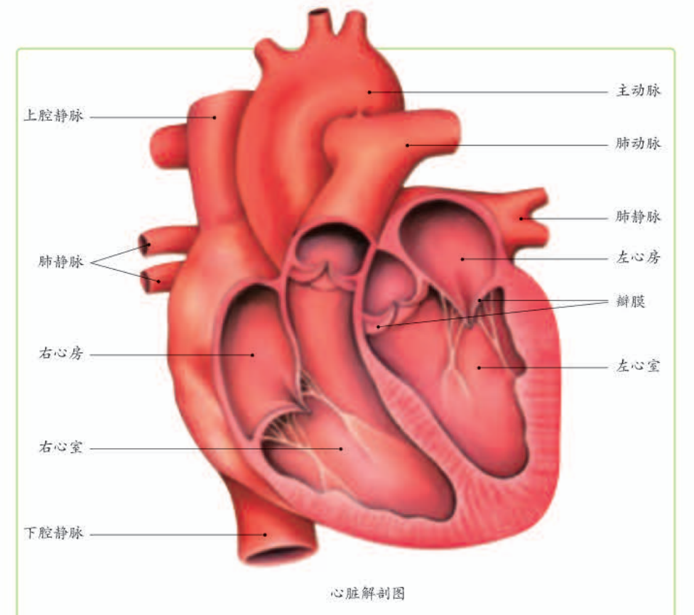

1. 心室壁（心肌细胞）

    - 心室壁比心房壁厚

    - 左心室壁比右心室壁厚

    - 心脏壁厚 $\Rightarrow$ 肌肉发达 $\Rightarrow$ 收缩、舒张有力 $\Rightarrow$ 使血流流动距离远

2. 四腔

    - 上房下室，左右不通

    - 房连静，室连动

| 腔     | 联通的血管   |
| ------ | ------------ |
| 左心房 | 肺静脉       |
| 左心室 | 主动脉       |
| 右心房 | 上、下腔静脉 |
| 右心室 | 肺动脉       |

3. 瓣膜

    - 房室瓣：心房和心室之间
    - 动脉瓣：心室和动脉之间

##### 二、心脏跳动的过程

1. 左右心房收缩
    - 房室瓣：打开；动脉瓣：关闭；血液：心房 $\to$ 心室

2. 左右心室收缩
    - 房室瓣：关闭；动脉瓣：打开；血液：心室 $\to$ 动脉
3. 心房和心室均舒张
    - 房室瓣：打开；动脉瓣：关闭；血液：静脉 $\to$ 心房、心室

##### 三、血液循环

###### 1. 体循环

- 过程：左心室 $\to$ 主动脉 $\to$ 各级动脉 $\to$  全身毛细血管网 $\large \xrightarrow{O_2、养料}$ 组织细胞 $\large \xrightarrow{CO_2、废料}$ 全身毛细血管网 $\to$ 各级静脉 $\to$ 上、下腔静脉 $\to$ 右心房 
- 血液：动脉血 $\to$ 静脉血
- 意义：为组织细胞运输营养物质、$O_2$，运走废物

###### 2. 肺循环

- 过程：右心室 $\to$ 肺动脉 $\to$ 肺部毛细血管 $\large \xrightarrow{CO_2}$ 肺泡 $\large \xrightarrow{O_2}$ 肺部毛细血管 $\to$ 肺静脉 $\to$ 左心房 

- 血液：静脉血 $\to$ 动脉血
- 意义：获得 $O_2$，排出 $CO_2$

##### 四、心率、脉搏和血压

###### 1. 心率和脉搏

- 一般情况下，脉搏和心率相等
- 脉搏：测量动脉的
- 正常范围（不运动时）：$60 \sim 100$

###### 2. 血压

- 血压：血液对血管壁的压强
- 收缩压：心脏收缩时，动脉血压所达到的最高数值
- 舒张压：心脏舒张时，动脉血压下降到的最低数值

#### 第4节 输血与血型

##### 一、血量与输血

###### 1. 血量

- 体重的 $7\% \sim 8\%$

###### 2. 输血

| 一次性失血量        | 对身体的影响                                                 | 是否需要输血 |
| ------------------- | ------------------------------------------------------------ | ------------ |
| $400$ mL            | 丧失的血浆成分和血细胞，可以在短时间内补充恢复正常，不影响健康 | 否           |
| $800 \sim 1000$ mL  | 头晕、心跳加快、眼前发黑、出冷汗                             | 是           |
| $1200 \sim 1500$ mL | 会发生生命危险                                               | 是           |

##### 二、血型

###### 1. 发现

- 1900年，卡尔·兰德斯坦纳，ABO 血型

###### 2. 分类

| 血型    | 红细胞             | 血清                     |
| ------- | ------------------ | ------------------------ |
| A 型血  | 凝集原 A           | 抗 B 凝集素              |
| B 型血  | 凝集原 B           | 抗 A 凝集素              |
| AB 型血 | 凝集原 A、凝集原 B | --                       |
| O 型血  | --                 | 抗 A 凝集素、抗 B 凝集素 |

- 凝集原 x + 抗 x 凝集素会发生凝集，可能会堵塞血管

###### 3. 输血原则

- ==输同型血==
- O 型血可以为 A、B、AB 血型少量缓慢输血
- AB 血型可以少量缓慢接受 A、B、O 型血 
- 异型输血前需进行==交叉配血试验==

###### 4. 义务献血

- ==$18 \sim 55$ 岁==健康成年人，一次 $200 \sim 400$ mL
- 两次献血间隔一般大于 $6$ 个月
- 适度献血，有益健康

### 第五章 人体内废物的排出

##### 一、排泄

###### 1. 概念

- 人体将代谢产物排出体外的过程
    - 代谢产物：$\ce{CO_2}$、尿素、$\ce{H_2O}$、无机盐

###### 2. 排泄方式

- 呼吸运动（呼吸系统）：$\ce{CO2}$、$\ce{H2O}$
- 排汗（皮肤——汗腺）：尿素、$\ce{H2O}$、无机盐
- 排尿（泌尿系统）（主要）：尿素、$\ce{H2O}$、无机盐

##### 二、泌尿系统


###### 1. 组成

| 结构           | 功能         |
| -------------- | ------------ |
| 肾脏（一对）   | 产生尿液     |
| 输尿管（一对） | 运输尿液     |
| 膀胱           | 暂时贮存尿液 |
| 尿道           | 排出尿液     |

###### 2. 肾脏（尿液的形成）

1. 概述

    - 位置：腹腔后壁，脊柱两侧（左高右低）

    - 形状：像蚕豆

    - 颜色：红褐色


2. 结构

    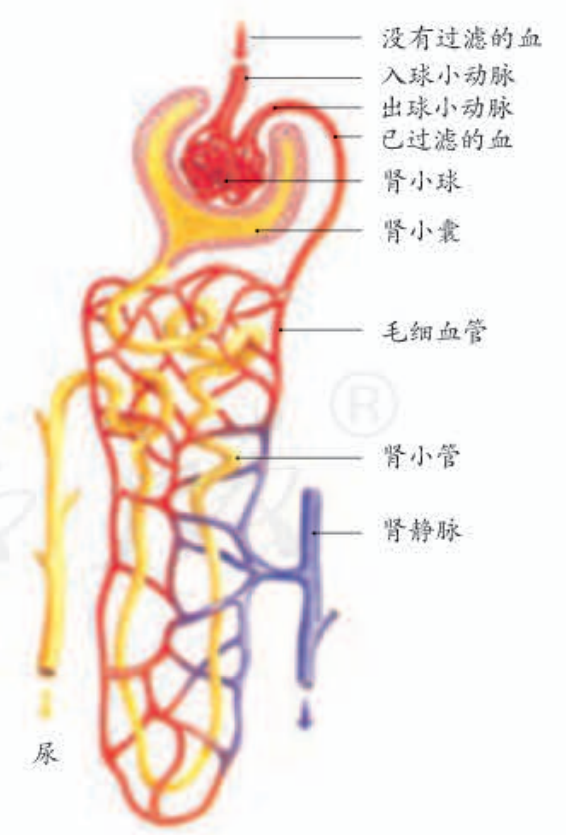


    - 由约 $100$ 万个肾单位组成

    - 肾单位：肾小球、肾小囊、肾小管
        - 肾小球：毛细血管球
        - 肾小囊：套在肾小球外面，外接肾小管
        - 肾小管：细长而曲折，周围缠绕大量毛细血管


3. 尿液的形成

    ```mermaid
    graph TD
        A(入球小动脉) --> B(肾小球)
        B --血细胞、蛋白质--> C(出球小动脉)
        B --水、葡萄糖、尿素、无机盐（过滤作用）--> D(肾小囊——原尿)
        C --> E(肾小管周围毛细血管)
        D --> F(肾小管——尿液)
        F --全部葡萄糖、大部分水、部分无机盐（重吸收作用）--> E
        F --尿素、部分无机盐、部分水--> G(输尿管)
        E --> H(肾静脉)
    ```

###### 3. 尿液的排出

- 肾脏 $\large \xrightarrow{输尿管}$ 膀胱 $\large \xrightarrow{尿道}$ 体外
- 膀胱中的尿液存储到一定量，产生尿意

### 第六章 人体生命活动的调节

#### 第1节 人体对外界环境的感知

##### 一、眼和视觉

###### 1. 眼球的结构

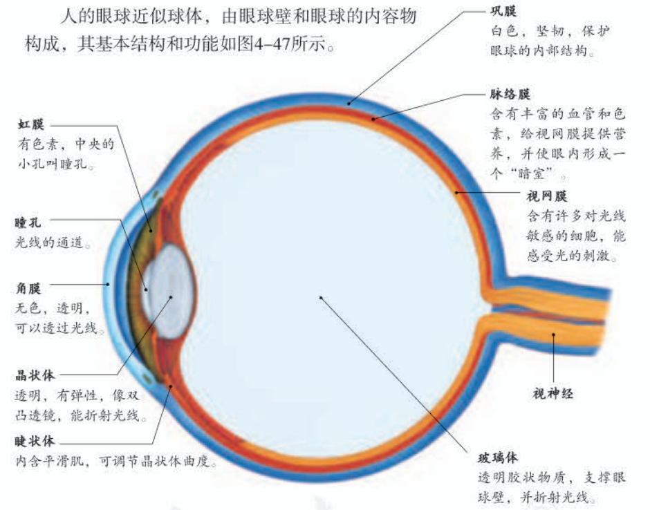
$$
眼球
\begin{cases}
眼球壁
\begin{cases}
外膜
\begin{cases}
角膜:无色透明,透过光线\\
巩膜:白色、坚韧,保护眼球 — 白眼球
\end{cases} \\
中膜
\begin{cases}
虹膜:有色素,中间有瞳孔(瞳孔可以控制光线通过量) — 黑眼球\\
脉络膜:有色素有血管, 为视网膜提供营养,形成暗室
\end{cases} \\
内膜 \quad 视网膜:有感光细胞,感受光的刺激,形成物像
\end{cases} \\ \\
内容物
\begin{cases}
晶状体:双凸透镜,调节光线,折射光线\\
玻璃体:支撑眼球壁,折射光线\\
房水:为外膜提供营养,运走代谢废物
\end{cases}
\end{cases}
$$

###### 2. 视觉的形成

- 外界 $\to$ 角膜（透光） $\to$ 瞳孔（透光） $\to$ 晶状体（折射） $\to$ 玻璃体（折射）$\to$ 视网膜（形成物像）

- 视网膜（形成物像）$\to$ 视神经（传递信号）$\to$ 大脑皮层上视觉中枢（形成视觉）

###### 3. 近视及其预防

- 近视：眼球的前后径过长，或者晶状体曲度过大且不易恢复原大小，导致物像落在视网膜的前方
    - 矫正：戴凹透镜
- 远视：眼球的前后径过短，或者晶状体曲度过小且不易恢复原大小，导致物像落在视网膜的后方
    - 矫正：戴凸透镜

##### 二、耳和听觉

###### 1. 耳的结构

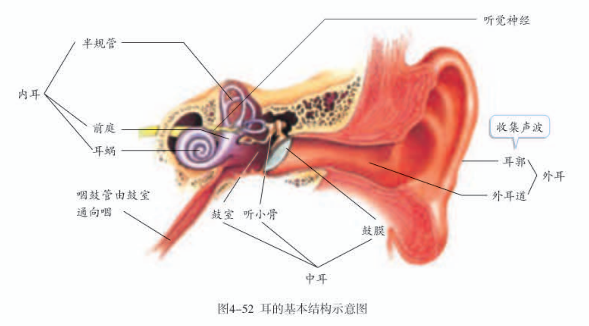
$$
耳
\begin{cases}
外耳
\begin{cases}
耳郭:收集声波 \\
外耳道:传导声波
\end{cases} \\
中耳
\begin{cases}
鼓膜:产生振动 \\
鼓室:维持内外气压平衡(由咽鼓管连接至咽,吞咽时咽鼓管口打开) \\
听小骨:传导振动
\end{cases} \\
内耳 
\begin{cases}
\left. \begin{array}{lll} 半规管 \\ 前庭 \end{array} \right\} 位觉感受器,维持身体平衡 \\
耳蜗:听觉感受器,感受刺激传导神经冲动
\end{cases}
\end{cases}
$$

###### 2. 听觉的形成

- 声波 $\to$ 外耳道 $\to$ 鼓膜 $\to$ 听小骨 $\to$ 耳蜗内听觉感受器
- 耳蜗内听觉感受器 $\to$ 听觉神经 $\to$ 大脑皮层内听觉中枢

###### 3. 用耳卫生

- 减少和消除噪声
- 避免长时间使用耳机
- 不用尖锐的东西挖耳朵

#### 第2节 神经系统的组成

##### 一、神经系统的组成和功能

###### 1. 神经系统的组成

$$
神经系统
\begin{cases}
中枢神经系统
\begin{cases}
脑
\begin{cases}
大脑:具有语言、运动、感觉等中枢 \\
小脑:协调运动,维持身体平衡 \\
脑干:生命中枢,有呼吸、心跳、血压等中枢 
\end{cases} \\
脊髓:反射、传导;脑、躯干、内脏间的联系通道
\end{cases} \\ \\
周围神经系统
\begin{cases}
\left. \begin{array}{lll} 脑神经 \\ 脊神经 \end{array} \right\} 传导神经冲动
\end{cases}
\end{cases}
$$

###### 2. 神经系统的功能

- 调节生命活动

##### 二、神经元（神经细胞）

###### 1. 神经元的结构

$$
神经元
\begin{cases}
细胞体(包含细胞核) \\ \\
突起
\begin{cases}
树突(短) — 输入\\
轴突(长) — 输出 + 髓鞘 \Rightarrow 神经纤维 \begin{cases} 末端细小分支 \Rightarrow 神经末梢 \\ 集结成束 + 外膜 \Rightarrow 神经 \end{cases}
\end{cases}
\end{cases}
$$

###### 2. 神经元的功能

- 接受刺激，产生并传导神经冲动

###### 3. 神经信号的传输

- 树突 $\to$ 细胞体 $\to$ 轴突

#### 第3节 神经调节的基本方式

##### 一、反射与反射弧

###### 1. 反射——神经调节的基本方式

- 人（或动物）通过神经系统，对外界或内部的各种刺激所发生的有规律的反应
    - 区别于应激性：所有生物，可能不通过神经系统，仅对外部刺激，可能无规律

###### 2. 反射弧——反射的结构基础

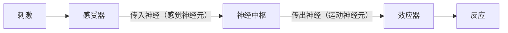
```mermaid
graph LR
刺激 --> 感受器
感受器 --传入神经（感觉神经元）--> 神经中枢
神经中枢 --传出神经（运动神经元）--> 效应器
效应器 --> 反应
```

（效应器：腺体或肌肉）

##### 二、反射的类型

$$
反射
\begin{cases}
简单反射(非条件反射) \space —— \space 人和动物共有\\
复杂反射(条件发射)
	\begin{cases}
		具体刺激引起 \space —— \space 人和动物共有 \\
		抽象刺激引起(语言、文字) \space —— \space 人类特有
	\end{cases}
\end{cases}
$$

| 反射类型 | 定义       | 形成 | 反射中枢（一般情况） | 意义               | 举例     |
| -------- | ---------- | ---- | -------------------- | ------------------ | -------- |
| 简单反射 | 先天性反射 | 遗传 | 脑干和脊髓           | 完成基本生命活动   | 膝跳反射 |
| 复杂反射 | 后天性反射 | 训练 | 大脑皮层             | 提高适应环境的能力 | 望梅止渴 |

（迁徙、繁殖相关的反射——简单反射）

#### 第4节 激素调节

##### 一、激素调节的发现

###### 二、分泌腺

###### 1. 概念

- 分泌：细胞合成与释放物质的过程
- 腺：由具有分泌功能的细胞构成的组织、器官

###### 2. 分类

| 腺体类型 | 有无导管 | 分泌物运输方式 | 举例         |
| -------- | -------- | -------------- | ------------ |
| 内分泌腺 | 无       | 经血液循环输送 | 垂腺、甲状腺 |
| 外分泌腺 | 有       | 经导管排出     | 汗腺、唾液腺 |

##### 三、人体内分泌系统

###### 1. 主要内分泌腺的位置

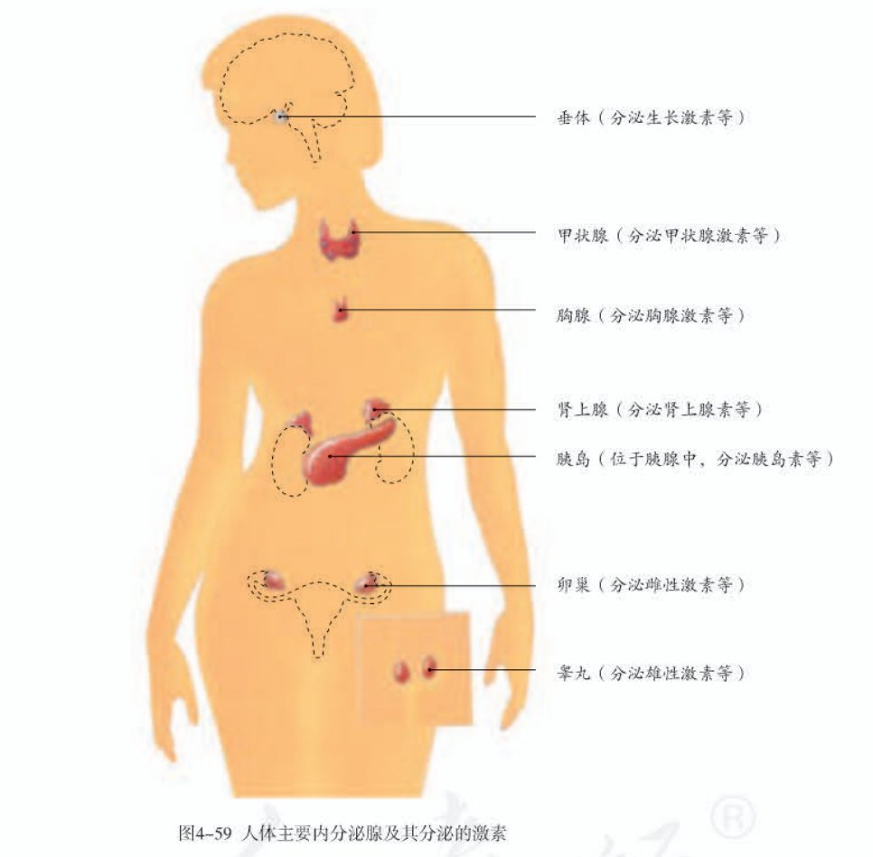

###### 2. 主要内分泌腺的作用

- 激素：由内分泌的腺细胞所分泌的、对身体具有特殊作用的化学物质，微量而高效

| 内分泌腺 | 分泌的激素 | 作用                                                         | 分泌失调后的病症（多、少指分泌量）                           |
| -------- | ---------- | ------------------------------------------------------------ | ------------------------------------------------------------ |
| 垂体     | 生长激素   | 促进生长                                                     | 巨人症（幼年，多）<br>侏儒症（幼年，少）<br>肢端肥大症（成年，多） |
| 甲状腺   | 甲状腺激素 | 促进新陈代谢、生长发育，提高神经系统兴奋性                   | 呆小症（幼年，少）<br>甲亢（成年，多）<br>地方性甲状腺肿（缺碘） |
| 胰岛     | 胰岛素     | 降低血糖                                                     | 糖尿病（少）<br>低血糖（多）                                 |
| 肾上腺   | 肾上腺素   | 促使心跳加快、血压升高，使皮肤血管扩张<br>增加中枢神经系统的兴奋性，使人体反应灵敏 |                                                              |

- 侏儒症：生长迟缓（生殖、智力正常）
- 呆小症：体型小、智力低下、生殖器官发育不完全

- 地方性甲状腺肿：缺碘造成体内甲状腺激素分泌不足，从而导致甲状腺补偿性增生

##### 四、神经调节与激素调节的联系

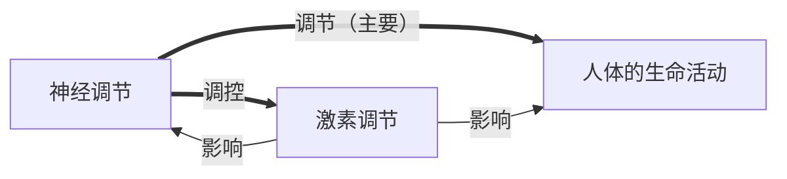
```mermaid
graph LR
	神经调节 ==调控==> 激素调节
	激素调节 --影响--> 神经调节
	神经调节 ==调节（主要）==> 人体的生命活动
	激素调节 --影响--> 人体的生命活动
```

### 第七章 人类活动对生物圈的影响

（略）

## 第五单元 生物圈中的其它生物

### 第一章 动物的主要类群

#### 第1节 腔肠动物和扁形动物


## 第七单元 生物圈中生物的延续和发展

### 第一章 植物的生殖和发育

- 生殖：产生新个体 —— 亲子代之间生命的延续
    - 无性生殖：不经过两性生殖细胞的结合，由母体直接发育成新个体的生殖方式
    - 有性生殖：由两性生殖细胞结合形成受精卵，再由受精卵发育成新个体的生殖方式
- 发育：新生命其实到成熟的变化过程 —— 子代个体自己生命的延续
    - 变态发育：在由受精卵发育成新个体的过程中，幼体与成体的形态结构和生活习性差异很大

#### 第1节 植物的生殖

##### 一、生殖方式的分类

1. 无性生殖：不经过两性生殖细胞的结合，由母体直接发育成新个体的生殖方式
2. 有性生殖：由两性生殖细胞结合形成受精卵，再由受精卵发育成新个体的生殖方式

| 生殖方式 | 有无两性生殖细胞的结合 | 新个体的产生       | 繁殖速度         | 与亲代的差异性                       |
| -------- | ---------------------- | ------------------ | ---------------- | ------------------------------------ |
| 无性生殖 | 无                     | 母体直接产生       | 快               | 小，保持母体的遗传特性               |
| 有性生殖 | 有                     | 受精卵发育成新个体 | 经过生殖周期，慢 | 大，具有双亲遗传特性（促进生物进化） |

##### 二、植物无性生殖的应用

1. 扦插
    - 快速大量繁殖
    - 举例：甘薯、葡萄、菊、月季
2. 嫁接
    - 接穗和砧木的形成层金木结合（使输导组织联通）
    - 接穗决定果实和种子
    - 用于改良果树
    - 举例：柿树、苹果、梨、桃
3. 压条
    - 举例：草莓
4. 分根
    - 举例：芦荟
5. 植物组织培养
    - 取材少、快速大量繁殖、培养脱毒苗

#### 第2节 昆虫的生殖和发育

###### 1. 特点

- 生殖：有性生殖、体内受精、卵生
- 发育：变态发育——在由受精卵发育成新个体的过程中，幼体与成体的形态结构和生活习性差异很大

###### 2. 昆虫发育的分类

1. 完全变态：卵 $\to$ 幼虫 $\to$ 蛹 $\to$ 成虫
    - 幼虫危害大
    - 举例：家蚕、蜜蜂、蝶、蛾、蝇、蚊
2. 不完全变态：卵 $\to$ 若虫 $\to$ 成虫
    - 成虫危害大
    - 若虫与成虫生殖器官差异最明显
    - 举例：蝗虫、蝉、蟋蟀、蝼蛄、螳螂、蜻蜓


#### 第3节 两栖动物的生殖和发育

###### 1. 特点

- 生殖：有性生殖、体外受精、卵生
- 发育：变态发育（不分完全/不完全）

###### 2. 过程

1. 求偶（鸣叫）
2. 抱对（提高受精率）
3. 产卵（体外受精）

#### 第4节 鸟的生殖和发育

##### 一、鸟卵的结构


$$
鸟卵
	\begin{cases}
	\left. \begin{array}{lll} 
	卵壳\\ 
	卵壳膜
		\begin{cases}
		内壳膜\\ 
		外壳膜 
		\end{cases} 
	\end{array} \right\} 保护、透气、保水\\
	气室:储存气体、缓冲\\
	卵白:保护、提供水分和营养\\
	卵细胞
		\begin{cases}
		卵黄:主要营养物质\\
		胚盘:含细胞核,发育成雏鸟\\
		卵黄膜:保护、物质交换
		\end{cases}\\
	系带:固定卵黄
	\end{cases}
$$

- 适应陆地生活的结构：卵壳、卵壳膜、卵白、卵黄
    - （补充：羊水——摆脱对外界水环境的依赖）

##### 二、鸟的生殖和发育

###### 1. 特点

- 生殖：有性生殖、体内受精、卵生
- 发育：直接发育

###### 2. 过程

- 求偶、交配、筑巢、产卵、孵卵、育雏
    - 必须经历：求偶、交配、产卵

### 第二章 生物的遗传与变异

- 性状：生物的形态结构、生理特性、行为习惯等所具有的各种特征
- 相对性状：同种生物同一性状的不同表现形式
- 遗传：亲子间性状的相似性
- 变异：亲代与子代和子代个体个体间性状的差异
- 基因：有遗传效应的 DNA 片段
- DNA：主要的遗传物质（呈双螺旋结构）
- 染色体：遗传物质的载体，由 DNA 和蛋白质组成

#### 第1节 基因控制生物的性状

###### 1. 相关概念

- 性状：生物的形态结构、生理特性、行为习惯等所具有的各种特征
- 相对性状：同种生物同一性状的不同表现形式
- 遗传：亲子间性状的相似性
- 变异：亲代与子代和子代个体个体间性状的差异

###### 2. 性状的影响因素

- 性状受基因控制，也受环境影响
    - 亲代传递给子代的不是性状，而是控制性状的基因

#### 第2节 基因在亲子代间的传递

###### 1. 相关概念

- 基因：有遗传效应的 DNA 片段
- DNA：主要的遗传物质（呈双螺旋结构）
- 染色体：遗传物质的载体，由 DNA 和蛋白质组成

###### 2. 基因的传递

- 基因经精子或卵细胞传递，精子和卵细胞是基因在亲子间传递的“桥梁”
- 人体内不同细胞染色体的数目
    - 体细胞：23对（46条）
    - 生殖细胞：23条
- 人生殖过程中染色体数目的变化：亲代 $2n$，生殖细胞 $n$，子代 $2n$

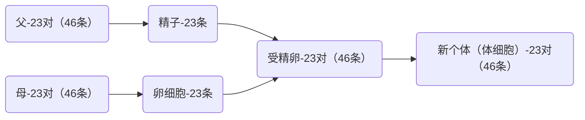
```mermaid
graph LR
	fu(父-23对（46条）)
	mu(母-23对（46条）)
	jing(精子-23条)
	luan(卵细胞-23条)
	shou(受精卵-23对（46条）)
	zi(新个体（体细胞）-23对（46条）)
	fu --> jing --> shou
	mu --> luan --> shou  --> zi
```

#### 第3节 基因的显性和隐性

##### 一、常用的遗传学符号

- 显性基因 $\text{D}$，隐形基因 $\text{d}$（任意字母都行）

- 纯和：$\text{DD/dd}$  纯种/纯合体

- 杂合：$\text{Dd}$         杂种/杂合体

- 亲本：$\text{P}$

    - 父本、雄性：♂
    - 母本、雌性：♀

- 杂交：$\times$，自交：$\otimes$

- 子一代：$\text{F}_1$，子二代：$\text{F}_2$

##### 二、孟德尔杂交实验分析

###### 1. 现象及原理

1. 高茎自交 $\to$ 高茎，矮茎自交 $\to$ 矮茎

    ```mermaid
    graph TB
        subgraph case2
        	direction TB
            subgraph case2-P
                D(dd)
                E(dd)
            end
            subgraph case2-F1
            	F(dd)
            end
            D --> F
            E --> F
        end
    	subgraph case1
    		direction TB
            subgraph case1-P
                A(DD)
                B(DD)
            end
            subgraph case1-F1
            	C(DD)
            end
            A --> C
            B --> C
        end
    ```

2. 高茎与矮茎杂交，子一代是高茎

    ```mermaid
    graph TB
    	subgraph P
    		A(DD)
    		B(dd)
    	end
    	subgraph F1
    		C(Dd)
    	end
    	A --> C
    	B --> C
    ```

3. 子一代杂合体自交，子二代高茎 $:$ 矮茎 $\approx 1:3$

    ```mermaid
    graph TB
    	subgraph F1
    		A(Dd)
    		B(Dd)
    	end
    	subgraph F2
    		C(DD)
    		D(Dd)
    		E(Dd)
    		F(dd)
    	end
    	A --> a(D) & b(d)
    	B --> c(D) & d(d)
    	a & c --> C
    	b & c --> D
    	a & d --> E
    	b & d --> F
    ```

    或使用表格

    |      | D    | d    |
    | ---- | ---- | ---- |
    | D    | DD   | Dd   |
    | d    | Dd   | dd   |

###### 2. 结论

- 相对性状有显性性状和隐性性状
- 显性纯合体和隐性纯合体杂交，子一代中表现的是显性性状
- 隐性性状基因组成为 $\text{dd}$，显性性状基因组成为 $\text{DD}$ 或 $\text{dd}$

##### 三、禁止近亲结婚

###### 1. 近亲的概念

- 直系血亲或三代以内旁系血亲

###### 2. 原因

- 亲缘关系越近 $\to$ 遗传物质越接近 $\to$ 携带相同的隐性致病基因概率越大 $\to$ 后代患有遗传病可能性越大

#### 第4节 人的性别遗传

##### 一、男女染色体的差别

###### 1. 染色体的分类

- 性染色体：决定人的性别
- 常染色体

###### 2. 人体细胞中染色体的组成

- 男性：22对常染色体 + XY
- 女性：22对常染色体 + XX

###### 3. 人生殖细胞中染色体的组成

- 卵细胞：22条常染色体 + X
- 精子：22条常染色体 + X 或 $22$条常染色体 + Y

##### 二、生男生女的机会均等

>性别决定于精子的类型，时间为受精卵形成时

###### 1. 原因

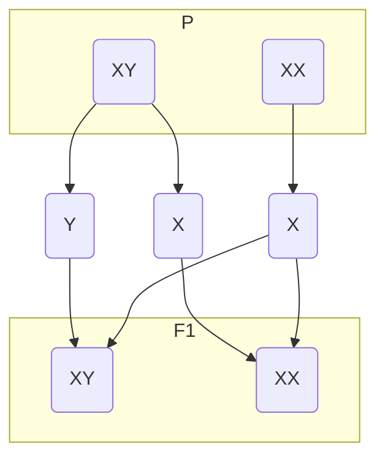
```mermaid
graph TB;
	subgraph P
		fa(XY)
		mo(XX)
	end
	subgraph F1
		zi1(XY)
		zi2(XX)
	end
	fa --> A(Y) & B(X)
	mo --> C(X)
	A & C --> zi1
	B & C --> zi2
```

#### 第5节 生物的变异

###### 一、生物的变异

> 生物性状的变异是普遍存在的

###### 1. 影响因素

- 遗传物质（主要）
- 环境（次要）

###### 2. 分类

- 可遗传变异：遗传物质发生改变
- 不可遗传变异：单纯由环境引起，遗传物质没有改变

###### 3. 与进化的关系

- 变异是不定向的
- 对适应环境有利的变异积累、变化、适应，得以留存
- 对适应环境不利的变异被淘汰

##### 二、遗传变异原理育种

> 遗传变异培育新物种的原理产生的都是可遗传变异

- 人工选择：选育高产奶牛新品种
- 杂交育种：杂交水稻
- 诱变育种：太空育种、太空甜椒
- 转基因育种：转基因抗虫棉···